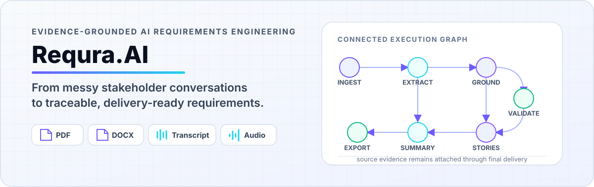
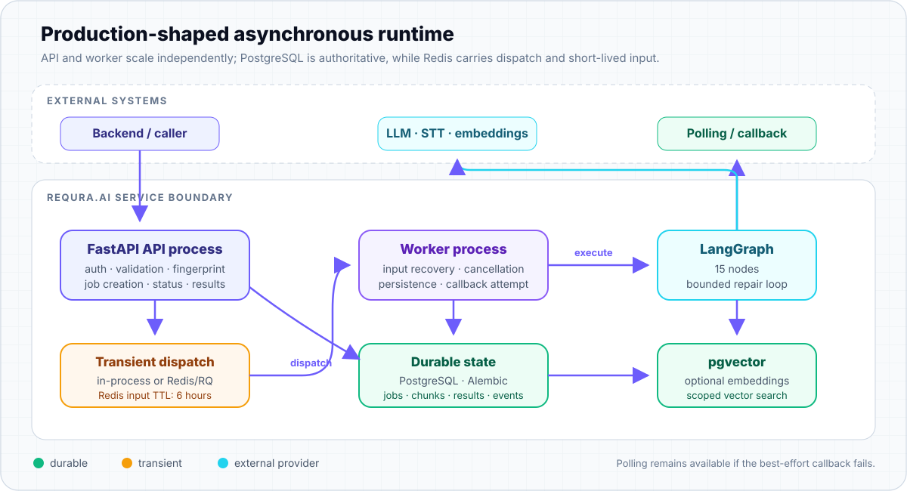
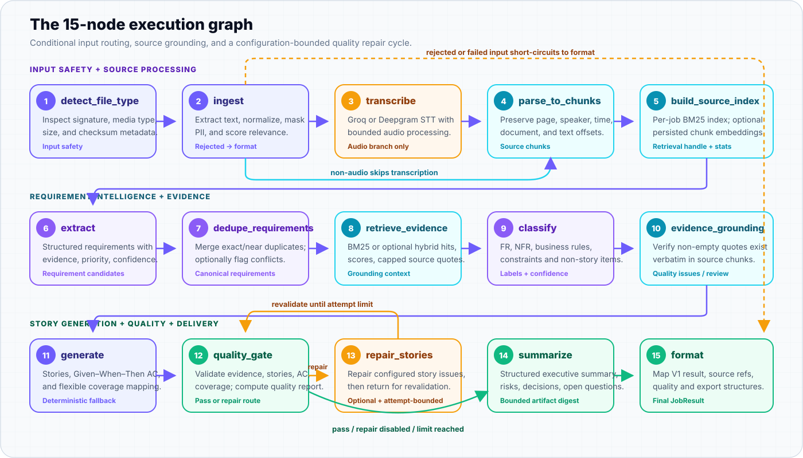
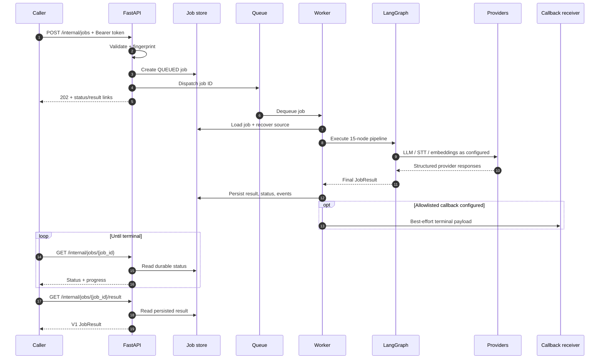

<picture>
  <source media="(prefers-color-scheme: dark)" srcset="docs/assets/readme/requra-hero-dark.svg">
  <source media="(prefers-color-scheme: light)" srcset="docs/assets/readme/requra-hero-light.svg">
  
</picture>

# Requra.AI AI Pipeline

> **From messy stakeholder conversations to traceable, delivery-ready requirements.**

Requra.AI is an evidence-grounded requirements engineering service that transforms project documents, transcripts, meeting audio, and notes into structured requirements, delivery-ready user stories, acceptance criteria, summaries, quality findings, and export data. Its production-shaped execution path separates request handling from asynchronous work, then keeps generated artifacts connected to the source statements that support them.

<p align="center">
  
  
  
  
  
  
</p>

<p align="center">
  <a href="docs/03-system-architecture.md">Architecture</a> ·
  <a href="docs/04-ai-pipeline.md">AI pipeline</a> ·
  <a href="docs/05-api-and-data-flow.md">API workflow</a> ·
  <a href="docs/02-local-development.md">Local setup</a> ·
  <a href="docs/07-testing-debugging-and-observability.md">Tests &amp; observability</a>
</p>

## Why Requra.AI?

Stakeholder knowledge rarely arrives as a clean backlog. It lives in meeting recordings, transcripts, briefs, PDFs, changing business rules, and informal notes. Turning that material into reviewable requirements by hand creates delay, inconsistent structure, ambiguous scope, and a broken chain between the final story and the conversation that justified it.

Requra.AI makes that transformation explicit:

```text
Unstructured project knowledge
            ↓
Evidence-grounded requirement intelligence
            ↓
Structured, reviewable delivery artifacts
```

The service does more than generate plausible prose. It extracts source-backed requirements, merges duplicates, retrieves and verifies supporting quotes, classifies requirement intent, maps requirements to stories, validates story quality, and exposes the result as a versioned contract.

## Input → intelligence → output

| Inputs | Intelligence | Outputs |
|---|---|---|
| Plain text and project notes | Signature, size, relevance, and source validation | Structured requirements with confidence and priority |
| PDF and DOCX documents | Parsing, normalization, and optional PII masking | Verbatim source references and retrieval signals |
| Backend transcripts | Requirement extraction and deduplication | User stories with flexible requirement coverage |
| Meeting audio | Groq or Deepgram speech-to-text, when configured | Given–When–Then acceptance criteria |
| Backend-owned document/audio references | BM25 evidence retrieval; optional embeddings and hybrid search | Quality issues, warnings, and aggregate quality report |
| Protected or demo-compatible multipart uploads | Classification, grounding, story validation, optional repair, summarization | Executive summary, Jira-compatible rows, and Excel-ready rows |

Backend transcripts enter the text path and **do not call speech-to-text**. Backend audio references and accepted audio uploads enter the transcription branch. Backend-owned sources are recovered by the worker from durable references when inline/transient input is unavailable.

The requirement model distinguishes functional requirements, non-functional requirements, business rules, constraints, assumptions, open questions, and out-of-scope items. Extraction carries inferred priority and confidence; exact and near duplicates can be merged; optional requirement embeddings help identify semantic conflict candidates; and coverage supports one-to-one, one-to-many, many-to-one, acceptance-criteria-only, non-story, and needs-review outcomes.

Generated stories normalize actors toward a singular agile persona and retain their source requirement IDs and evidence references. The validator checks a minimum-of-two acceptance-criteria rule, flags generic or missing criteria and weak story structure, detects duplicate story IDs, and feeds quality findings into the optional bounded repair-and-revalidate pass.

## Architecture at a glance



The API validates and fingerprints a request, creates its job record, and dispatches work. The worker reconstructs input, executes the graph, persists artifacts, updates durable status, and only then attempts an optional callback.

```text
API validation and job creation
             ↓
Queue dispatch
             ↓
Worker execution
             ↓
LangGraph pipeline
             ↓
Durable persistence
             ↓
Polling and optional callback
```

- **Separated execution:** FastAPI and the RQ worker are distinct Compose services, so request handling and graph execution can scale independently.
- **Durable path:** PostgreSQL stores jobs, attempts, events, source metadata/chunks, decomposed results, quality data, and the final result. pgvector stores optional chunk embeddings.
- **Transient path:** Redis/RQ dispatches jobs and caches inline input for six hours. Redis is not the source of truth; the in-process queue is a local/test fallback.
- **Result delivery:** callers poll durable status and result endpoints. A configured callback is best effort, origin-restricted, and attempted after persistence.

See [System architecture](docs/03-system-architecture.md) and [Database and storage](docs/06-database-and-storage.md).

## The 15-node pipeline



The active graph in [`app/graph/pipeline.py`](ai-service/app/graph/pipeline.py) registers all 15 nodes below. Its recursion limit of 60 is a LangGraph execution-step budget. It does not describe an uncontrolled recursive graph; the only cycle is the configuration- and attempt-bounded story repair path.

| # | Stage | Purpose | Primary output | Source |
|---:|---|---|---|---|
| 1 | `detect_file_type` | Inspect bytes, signatures, type, size, and source metadata | Validated file type | [`detect_file_type.py`](ai-service/app/nodes/detect_file_type.py) |
| 2 | `ingest` | Extract/normalize text, mask configured PII patterns, and test relevance | Accepted text or rejection | [`ingest.py`](ai-service/app/nodes/ingest.py) |
| 3 | `transcribe` | Process accepted audio through configured Groq or Deepgram STT | Transcript text/chunks | [`transcribe.py`](ai-service/app/nodes/transcribe.py) |
| 4 | `parse_to_chunks` | Split sources while retaining document/page/speaker/time offsets | Source chunks | [`parse_to_chunks.py`](ai-service/app/nodes/parse_to_chunks.py) |
| 5 | `build_source_index` | Build per-job BM25; optionally persist chunk embeddings | Index handle and stats | [`build_source_index.py`](ai-service/app/nodes/build_source_index.py) |
| 6 | `extract` | Parse structured requirement candidates with evidence and confidence | Extracted requirements | [`extract.py`](ai-service/app/nodes/extract.py) |
| 7 | `dedupe_requirements` | Merge exact/near duplicates; optionally detect semantic conflicts | Canonical requirements | [`dedupe_requirements.py`](ai-service/app/nodes/dedupe_requirements.py) |
| 8 | `retrieve_evidence` | Retrieve lexical or optional hybrid support and record scores | Enriched evidence | [`retrieve_evidence.py`](ai-service/app/nodes/retrieve_evidence.py) |
| 9 | `classify` | Assign functional, non-functional, business, and preserved special labels | Classified requirements | [`classify.py`](ai-service/app/nodes/classify.py) |
| 10 | `evidence_grounding` | Verify evidence quotes are non-empty and occur in source chunks | Grounding issues/review flags | [`evidence_grounding.py`](ai-service/app/nodes/evidence_grounding.py) |
| 11 | `generate` | Generate structured stories, acceptance criteria, and coverage mappings | User stories | [`generate.py`](ai-service/app/nodes/generate.py) |
| 12 | `quality_gate` | Validate requirements, stories, criteria, duplicates, and coverage | Quality issues/report | [`quality_gate.py`](ai-service/app/nodes/quality_gate.py) |
| 13 | `repair_stories` | Repair configured story-quality failures and return for revalidation | Repaired stories | [`repair_stories.py`](ai-service/app/nodes/repair_stories.py) |
| 14 | `summarize` | Produce a bounded structured digest of decisions, risks, and scope | Structured summary | [`summarize.py`](ai-service/app/nodes/summarize.py) |
| 15 | `format` | Map internal state to the public V1 result and export structures | `JobResult` | [`format.py`](ai-service/app/nodes/format.py) |

Routing is deliberate: rejected or failed input short-circuits from `ingest` to `format`; audio passes through `transcribe`; other accepted input goes directly to chunking. `quality_gate` routes to `repair_stories` only when repair is enabled, attempts remain, and a live story has a repairable issue. The repaired stories then pass through the gate again.

See the [full AI pipeline trace](docs/04-ai-pipeline.md).

## Requirements you can trace


Each source is divided into chunks that retain useful origin metadata. Extraction attaches evidence spans; retrieval adds relevant source snippets and scores; grounding then checks that quotes remain present in the original chunks. Requirements and generated stories carry those evidence spans into `source_refs` in the V1 result.

```text
Source document
    → source chunk
    → retrieved evidence quote
    → classified requirement
    → generated user story
    → acceptance criteria
    → source references in final output
```

Retrieval is not treated as proof by itself. BM25 and optional vector similarity improve recall, but the grounding node separately verifies quotes against the source text. The RAG layer is purpose-built for requirements traceability—not a general conversational chatbot.

## Engineering highlights

### Durable asynchronous jobs

Jobs have fingerprints, attempt history, lifecycle status, events, cancellation flags, persisted results, and status/result polling. PostgreSQL-backed status remains available across API and worker processes.

**Code:** [`app/api/service.py`](ai-service/app/api/service.py), [`app/worker/runner.py`](ai-service/app/worker/runner.py), [`app/store/`](ai-service/app/store/)

### Evidence-grounded retrieval

Requra.AI builds a deterministic per-job BM25 index, optionally merges tenant/project/job-scoped pgvector hits, records evidence scores, caps attached evidence, and verifies final quotes against source chunks.

**Code:** [`app/rag/`](ai-service/app/rag/), [`retrieve_evidence.py`](ai-service/app/nodes/retrieve_evidence.py), [`evidence_grounding.py`](ai-service/app/nodes/evidence_grounding.py)

### Resilient model integrations

The selected OpenRouter, OpenAI, or Groq chat provider can use a configured fallback chain with retryable-error handling. Nodes use structured parsing, Pydantic validation, JSON extraction/repair where implemented, and provider/model/latency/token metadata. STT supports Groq or Deepgram; embeddings support OpenAI-compatible OpenAI/OpenRouter configuration. A run calls only the providers its selected path and feature flags require.

**Code:** [`app/llm.py`](ai-service/app/llm.py), [`app/utils/json_parsing.py`](ai-service/app/utils/json_parsing.py), [`app/rag/embeddings.py`](ai-service/app/rag/embeddings.py)

### Quality scoring and bounded repair

Stories are checked for title and description shape, source mappings, duplicate IDs, evidence, specific acceptance criteria, and coverage integrity. The aggregate report derives traceability, groundedness, completeness, acceptance-criteria quality, duplicate risk, and overall scores from observed pipeline signals. Optional repair is followed by revalidation and stops at the configured attempt limit.

**Code:** [`story_validator.py`](ai-service/app/validators/story_validator.py), [`quality_scoring.py`](ai-service/app/services/quality_scoring.py), [`repair_stories.py`](ai-service/app/nodes/repair_stories.py)

### Idempotent backend integration

A stable request fingerprint distinguishes a true duplicate from a reused job ID with different input. Matching active requests are not enqueued twice; mismatched payloads return `409`; failed/cancelled jobs can create a new attempt under explicit retry rules.

**Code:** [`fingerprint.py`](ai-service/app/services/fingerprint.py), [`service.py`](ai-service/app/api/service.py), [`test_job_idempotency.py`](ai-service/tests/api/test_job_idempotency.py)

### Production-shaped local topology

Docker Compose connects pgvector/PostgreSQL, Redis, a one-shot Alembic migration job, FastAPI, and an RQ worker. Memory stores and the in-process queue keep ordinary development and tests fast without pretending to provide cross-process durability.

**Code:** [`docker-compose.yml`](docker-compose.yml), [`app/store/factory.py`](ai-service/app/store/factory.py), [`app/queue/factory.py`](ai-service/app/queue/factory.py)

## Illustrative contract example

This abbreviated example follows the actual Pydantic V1 contract; it is **illustrative**, not a claimed live-model result.

**Input**

```text
Customers keep forgetting their passwords.
They should be able to request a reset link by email.
The link must expire after 15 minutes.
```

**Abbreviated V1-shaped output**

```json
{
  "contract_version": "1.0",
  "job_id": "requirements-demo-001",
  "status": "completed",
  "is_useful": true,
  "relevance_score": 0.96,
  "requirements": [
    {
      "id": "REQ-001",
      "title": "Customer password reset",
      "description": "Customers can request an email password-reset link that expires after 15 minutes.",
      "type": "Functional",
      "priority": "High",
      "confidence_score": 0.91,
      "source_refs": [
        {
          "source_id": "SRC-001",
          "source_type": "document",
          "document_name": "password-reset-notes.txt",
          "chunk_id": "chunk-001",
          "quote": "They should be able to request a reset link by email.",
          "confidence_score": 0.91
        }
      ],
      "quality": {"score": 1.0, "issues": [], "warnings": []}
    }
  ],
  "user_stories": [
    {
      "id": "US-001",
      "requirement_id": "REQ-001",
      "title": "Request a password reset",
      "user_story": "As a customer, I want to request a password-reset link by email, so that I can regain access securely.",
      "acceptance_criteria": [
        {"id": "US-001_ac_1", "text": "Given a registered email, when the customer requests a reset, then the system sends a reset link.", "criterion_type": "Given-When-Then"},
        {"id": "US-001_ac_2", "text": "Given a reset link older than 15 minutes, when it is opened, then the system rejects it as expired.", "criterion_type": "Given-When-Then"}
      ],
      "source_refs": [{"source_id": "SRC-001", "document_name": "password-reset-notes.txt", "chunk_id": "chunk-001", "quote": "The link must expire after 15 minutes.", "confidence_score": 0.91}],
      "quality": {"score": 1.0, "issues": [], "warnings": []},
      "jira_fields": {"summary": "Request a password reset", "description": "As a customer, I want to request a password-reset link by email, so that I can regain access securely."}
    }
  ],
  "requirement_coverages": [
    {"requirement_id": "REQ-001", "coverage_type": "covered_by_story", "story_ids": ["US-001"]}
  ],
  "processing_time_ms": 1842
}
```

The complete schema also includes source documents, structured summary fields, quality findings, Excel/Jira export rows, artifacts, warnings, processing time, and structured pipeline errors. See [`app/schemas/items.py`](ai-service/app/schemas/items.py) and the checked-in [OpenAPI artifact](ai-service/docs/openapi/requra-ai-internal.openapi.json).

## API workflow

```text
POST /internal/jobs
        ↓
202 QUEUED
        ↓
GET /internal/jobs/{job_id}
        ↓
GET /internal/jobs/{job_id}/result
```



Minimal text job:

```bash
curl -X POST http://localhost:8000/internal/jobs \
  -H "Authorization: Bearer dev-internal-token" \
  -H "Content-Type: application/json" \
  -H "X-Request-Id: readme-example-001" \
  -d '{
    "job_id": "requirements-demo-001",
    "tenant_id": "tenant-demo",
    "project_id": "project-demo",
    "input_type": "text",
    "content": "The portal must let customers request a password reset by email. Reset links expire after 15 minutes.",
    "options": {
      "generate_user_stories": true,
      "generate_summary": true,
      "enable_embeddings": false,
      "enable_hybrid_retrieval": false,
      "language": "en"
    }
  }'
```

| Route group | Main routes | Purpose |
|---|---|---|
| Production job lifecycle | `POST /internal/jobs`, `GET /internal/jobs/{id}`, `GET .../result`, `POST .../cancel`, `POST .../retry` | Authenticated asynchronous job management |
| Protected compatibility | `POST /internal/process`, `POST /internal/process-json` | Authenticated multipart/text callers using the same graph |
| Story regeneration | `POST /internal/stories/regenerate` | Stateless single-story regeneration from feedback |
| Demo/development compatibility | `POST /process`, `POST /process-json`, `GET /status/{id}` | Unauthenticated local/legacy-compatible entry points |
| Health/readiness | `GET /health`, `GET /ready` | Liveness and safe configuration/infrastructure diagnostics |

All `/internal/*` routes share bearer-token protection. Job creation is idempotent by request fingerprint and job ID. Result reads return `409` until a persisted result is available; cancellation is cooperative between graph updates; callbacks are optional and do not replace polling.

See [API and data flow](docs/05-api-and-data-flow.md), [endpoint code interactions](docs/11-endpoint-code-interactions.md), and the [OpenAPI artifact](ai-service/docs/openapi/requra-ai-internal.openapi.json).

## Quick start

### Minimal local development

Requirements: Poetry and a Python version compatible with `^3.11`.

**PowerShell**

```powershell
cd ai-service
poetry install
Copy-Item .env.example .env
poetry run pytest -q
poetry run uvicorn app.main:app --reload --port 8000
```

**Bash**

```bash
cd ai-service
poetry install
cp .env.example .env
poetry run pytest -q
poetry run uvicorn app.main:app --reload --port 8000
```

The ordinary test suite forces memory stores and in-process execution, so PostgreSQL and Redis are not required. Starting the API for real model execution requires credentials for the selected provider; audio requires a configured STT provider and ffmpeg, while embeddings and hybrid retrieval require their corresponding provider credentials and feature options. Never commit `.env` or credentials.

### Production-shaped Docker topology

Create `ai-service/.env` from the example, configure the selected provider and internal service token, then run from the repository root:

```bash
docker compose up --build
```

Compose starts:

- PostgreSQL 16 with pgvector for durable state and optional embeddings
- Redis 7 for RQ dispatch and transient input caching
- a one-shot Alembic migration job
- the FastAPI API on port `8000`
- a separate RQ worker process

This is a production-shaped local topology, not a claim that deployment hardening, external contracts, backups, metrics, or callback delivery guarantees are complete. See [Local development](docs/02-local-development.md), [Deployment and operations](docs/08-deployment-and-operations.md), and [Security and configuration](docs/09-security-and-configuration.md).

## Runtime modes

| Mode | Store | Queue | Intended usage and guarantees |
|---|---|---|---|
| Tests / minimal local | Memory | In-process | Fast tests and development; single-process and non-durable |
| Production-shaped Compose | PostgreSQL / pgvector | Redis / RQ | Full local topology with separate API/worker and durable results |
| Partially configured | Memory or PostgreSQL | In-process or Redis / RQ | Supported in development, but guarantees depend on the configured combination |

Store and queue selection are independent: `DATABASE_URL` selects PostgreSQL versus memory, while `REDIS_URL` selects Redis/RQ versus in-process execution. Production validation requires the durable database path; operators who want a separate worker topology must configure Redis as well.

## Testing and quality evidence

Verified on `fix/prod-architecture` with the repository’s default, mocked/memory-backed test configuration:

```text
321 passed, 1 skipped, 66 warnings in 16.80s
```

The warnings were `httpx` deprecations from its test-client `app` shortcut. The run used Poetry’s Python `3.12.10` environment; the project declares Python `^3.11`. It did **not** exercise live LLM/STT/embedding providers, an external backend/frontend, a live callback receiver, or deployed PostgreSQL/Redis/RQ infrastructure.

| Test area | Representative tests | Evidence covered |
|---|---|---|
| API, auth, lifecycle | [`tests/api/`](ai-service/tests/api/) | Bearer auth, validation, create/poll/result, idempotency, cancel, retry, compatibility |
| Graph and nodes | [`tests/test_pipeline.py`](ai-service/tests/test_pipeline.py), [`tests/nodes/`](ai-service/tests/nodes/) | Routing, parsing, extraction, classification, grounding, generation, quality, repair, summary, format |
| Retrieval | [`tests/rag/`](ai-service/tests/rag/) | BM25 scoring, hybrid merge, vector augmentation behavior |
| Providers and fallbacks | [`test_llm_provider.py`](ai-service/tests/test_llm_provider.py), [`test_llm_fallback.py`](ai-service/tests/test_llm_fallback.py) | Provider selection, retry/fallback behavior, metadata, mocked STT paths |
| Contracts | [`test_contract_v1.py`](ai-service/tests/test_contract_v1.py), [`test_direct_contract.py`](ai-service/tests/test_direct_contract.py) | V1 completed/partial/failed shapes and compatibility contracts |
| Worker behavior | [`tests/worker/test_runner.py`](ai-service/tests/worker/test_runner.py) | Progress, persistence errors, cancellation, status mapping, callbacks |
| Persistence | [`tests/store/`](ai-service/tests/store/) | Memory stores and database repository behavior with external integration separated |
| Prompt snapshots | [`tests/prompts/`](ai-service/tests/prompts/) | Registry, UTF-8 loading, caching, and template snapshots |
| Security validation | [`test_internal_compatibility.py`](ai-service/tests/api/test_internal_compatibility.py), [`test_ready.py`](ai-service/tests/test_ready.py) | File/source guards, checksum/host behavior, safe readiness output |

Run the same checks from `ai-service`:

```bash
poetry run pytest -q
poetry run pytest tests/api tests/worker -q
poetry run pytest tests/nodes tests/rag -q
poetry run python -m compileall app
```

No coverage percentage is claimed because this repository does not publish a measured coverage result. See [Testing, debugging, and observability](docs/07-testing-debugging-and-observability.md).

## Repository structure

```text
ai-pipeline/
├── ai-service/
│   ├── app/
│   │   ├── api/          # internal and compatibility HTTP contracts
│   │   ├── graph/        # LangGraph construction and conditional routers
│   │   ├── nodes/        # the 15 executable pipeline stages
│   │   ├── rag/          # BM25, embeddings, hybrid retrieval, scoring
│   │   ├── queue/        # in-process and Redis/RQ dispatch adapters
│   │   ├── store/        # memory and PostgreSQL/pgvector repositories
│   │   ├── worker/       # input recovery, execution, persistence, callbacks
│   │   ├── prompts/      # versioned runtime prompt templates
│   │   └── schemas/      # pipeline state and public result contracts
│   ├── tests/            # API, graph, provider, RAG, store, worker, contract tests
│   ├── migrations/       # Alembic schema and idempotency migrations
│   └── docs/openapi/     # checked-in internal API artifact
├── docs/                 # canonical engineering documentation
├── test-documents/       # sample inputs for local/manual checks
└── docker-compose.yml    # pgvector, Redis, migration, API, and worker topology
```

## Documentation map

| Reader | Recommended path |
|---|---|
| New developer | [Codebase overview](docs/01-codebase-overview.md) → [Local development](docs/02-local-development.md) → [Contributor onboarding](docs/10-contributor-onboarding.md) |
| AI / pipeline reviewer | [AI pipeline](docs/04-ai-pipeline.md) → [Testing and observability](docs/07-testing-debugging-and-observability.md) |
| Backend integrator | [API and data flow](docs/05-api-and-data-flow.md) → [Endpoint interactions](docs/11-endpoint-code-interactions.md) → [OpenAPI](ai-service/docs/openapi/requra-ai-internal.openapi.json) |
| Platform / operator | [System architecture](docs/03-system-architecture.md) → [Database and storage](docs/06-database-and-storage.md) → [Deployment and operations](docs/08-deployment-and-operations.md) |
| Security reviewer | [Security and configuration](docs/09-security-and-configuration.md) → [Testing and observability](docs/07-testing-debugging-and-observability.md) |
| Contributor | [Contributor onboarding](docs/10-contributor-onboarding.md) → [Documentation index](docs/README.md) |

## Security and trust boundaries

- `/internal/*` uses a constant-time-checked bearer service token. Development may run without it; production configuration fails fast when it is missing.
- CORS origins are environment-controlled, with explicit production behavior.
- File handling checks signatures/media type and separate document/audio size limits; backend downloads can verify SHA-256 checksums.
- Backend source downloads enforce HTTP(S), approved hosts, unsafe-IP/SSRF checks, manual redirect validation, bounded streaming, and origin-scoped service credentials.
- Callback delivery is restricted to the configured backend origin.
- Ingest optionally masks detected emails, phone numbers, key-like secrets, and Luhn-valid card candidates before downstream LLM processing. This is pattern-based masking, not complete DLP.
- Request logging records method, path, status, duration, and request ID without bodies, query values, or headers. Raw LLM I/O is force-disabled in production.
- Tenant/project identifiers propagate into jobs, source records, chunks, embeddings, and scoped vector search; callers remain responsible for supplying the identifiers their isolation model requires.

## Current limitations

These are current implementation boundaries and the clearest next hardening opportunities:

- **Best-effort callbacks:** delivery has no durable outbox or automatic retry scheduler. Polling is the reliable fallback.
- **Transient input cache:** Redis input expires after six hours. Recovery can fail when cached input and backend source recovery are both unavailable.
- **Process-local lexical index:** the per-job BM25 registry is bounded and local to one worker process; it is not shared across workers.
- **External systems not included:** this repository contains only the AI service. Backend/frontend compatibility can be assessed from local schemas, tests, and OpenAPI, but not proven end to end here.
- **Caller-dependent tenant isolation:** `tenant_id` is optional in the request model, so isolation depends on integration callers providing the expected tenant/project identifiers.
- **Limited observability backend:** request IDs, logs, durable events, status, and readiness exist; there is no repository-wide metrics backend or distributed tracing exporter.
- **Conditional capabilities:** provider-backed features require their matching credentials; embeddings, hybrid retrieval, semantic conflict detection, and story repair additionally depend on feature flags or per-job options. Story repair is disabled by default. Not every provider is called on every run.
- **Configuration does not always skip graph nodes:** `generate_user_stories` and `generate_summary` are persisted/fingerprinted options, but the active graph does not currently use them to bypass `generate` or `summarize`.
- **Retention is not automated:** retention settings exist, but no scheduled cleanup job enforces them.
- **Export structures, not external writes:** the result contains Jira-compatible and Excel-ready data; it does not create Jira tickets, and the Excel file artifact is currently unavailable by default.
- **AI safety boundary:** structured parsing, evidence checks, quality gates, and deterministic fallbacks improve inspectability but do not guarantee factual correctness or provide a complete prompt-injection defense.

## Project ecosystem

This repository contains the **Requra.AI AI service**: API contracts, graph orchestration, model/STT/retrieval integrations, persistence adapters, worker execution, migrations, and tests. The calling backend and frontend are external systems and are not implemented in this source tree; no unverified external repository link is presented here.

---

**Requra.AI is designed to make AI-generated requirements inspectable, traceable, and useful to real software delivery teams—not merely plausible text.**
