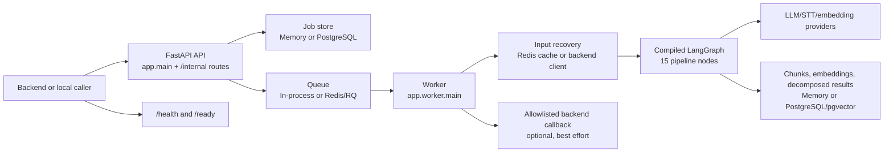
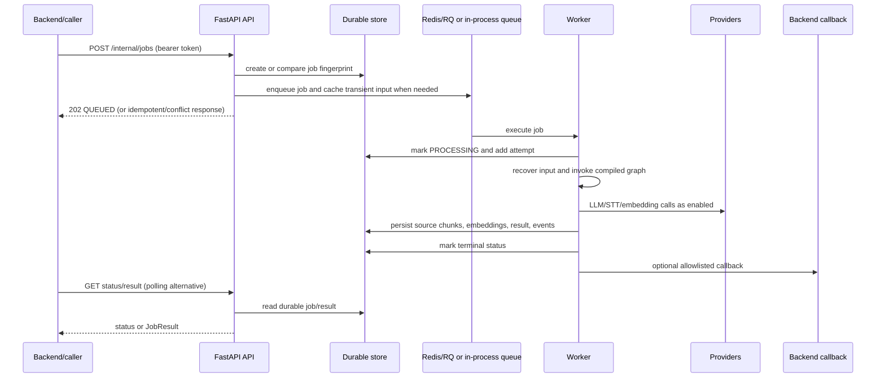

# System architecture

Purpose: describe the runtime components and boundaries that surround the AI pipeline. Audience: backend engineers, platform engineers, and technical reviewers.

## Runtime topology

## Component boundaries

| Component | Runs as | Source of truth / boundary |
|---|---|---|
| FastAPI API | API process | Validates requests, creates jobs, exposes status and results. It does not execute the production RQ job itself. |
| In-process queue | API process | Development/test fallback; runs `run_job_entry()` with a semaphore. Not durable. |
| Redis/RQ | Separate Redis and worker process | Redis dispatches jobs and temporarily caches inline input for six hours. It is not authoritative. |
| Worker | `python -m app.worker.main` | Reconstructs input, runs the graph, persists artifacts, updates status, and attempts callbacks. |
| Store bundle | API and worker | `app.store.factory` selects memory when `DATABASE_URL` is empty, PostgreSQL/pgvector otherwise. |
| Backend client | Worker | Fetches backend-owned sources and posts terminal callbacks. Host, redirect, size, and checksum checks are enforced. |
| External providers | Network services | Chat: OpenRouter/OpenAI/Groq through `ResilientLLMClient`; STT: Groq/Deepgram; embeddings: OpenAI/OpenRouter. |

## Request-to-result sequence

## Trust and ownership boundaries

- Backend-owned source bytes remain outside this repository except for transient request/cache handling and persisted parsed chunks.
- `/internal/*` is protected by `AI_INTERNAL_SERVICE_TOKEN`; demo routes are intentionally compatibility/dev routes and are not equivalent to the production contract.
- Tenant and project identifiers are carried into jobs, chunks, embeddings, and results. PostgreSQL vector search applies those filters; missing identifiers remain an integration risk and must be supplied by the backend.
- Provider calls leave the service boundary with prompt/context data. Raw LLM I/O logging is disabled in production by `Settings.debug_llm_io_enabled`.
- The worker callback sends the result only when the URL matches the configured backend origin; failed callback delivery does not fail an already-persisted job.

## Runtime modes

| Mode | `DATABASE_URL` | `REDIS_URL` | Use |
|---|---|---|---|
| Tests/local minimal | empty | empty | In-memory stores and in-process execution. |
| Compose/production-shaped | set | set | PostgreSQL/pgvector durability and Redis/RQ separation. |
| Partial infrastructure | one set | the other empty | Supported by factories, but the durability/dispatch guarantees differ; validate readiness before relying on it. |

For security and exact configuration, see [09-security-and-configuration.md](09-security-and-configuration.md). For the graph itself, see [04-ai-pipeline.md](04-ai-pipeline.md).
