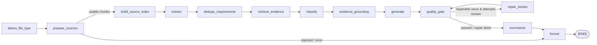
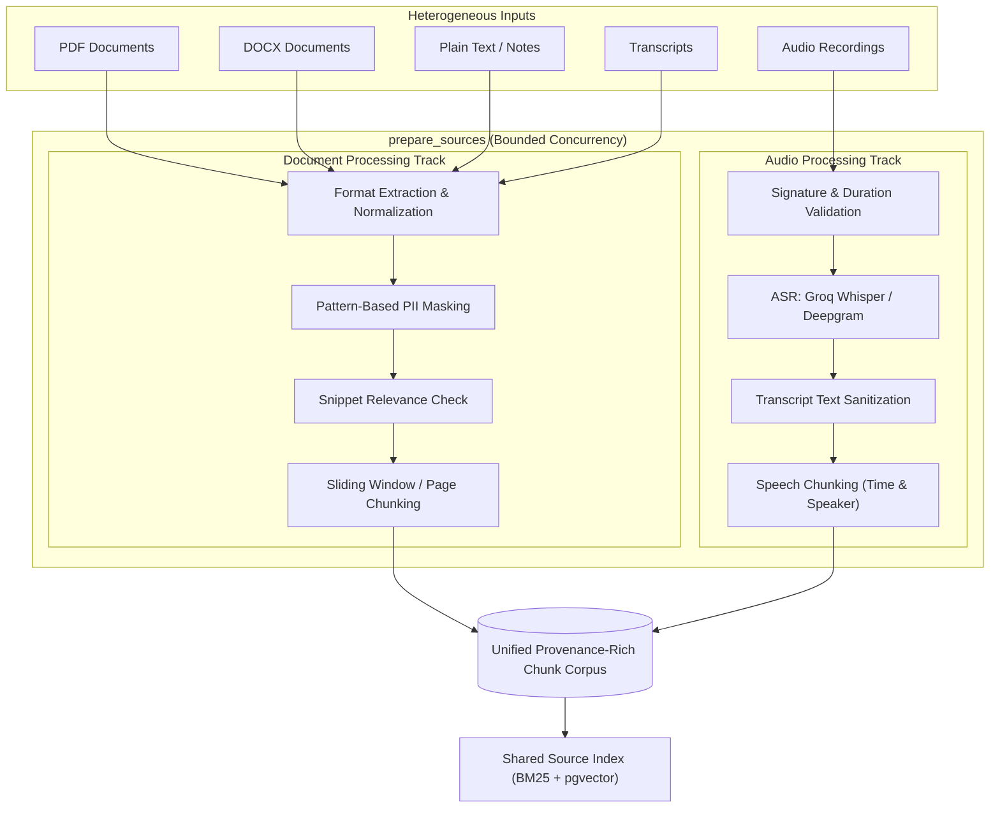

# AI Pipeline Architecture & Execution Trace

Purpose: Trace the implemented Requra.AI pipeline from request arrival to persisted output, including source preparation, graph topology, prompts, retrieval, evidence grounding, validation, quality repair, and error handling. Audience: AI engineers, backend engineers, reviewers, and platform contributors.

Code paths use the package shorthand `app/...` below; repository-relative, they are under `ai-service/app/...`.

## Implementation status legend

- **Implemented:** Reachable from the current active graph or worker/API code and covered by tests or direct source inspection.
- **Conditional:** Implemented but controlled by configuration or per-job options (e.g., embeddings, conflict detection, quality repair).
- **Compatibility:** Present for older callers or lower-level helpers, funneled into canonical paths.
- **Operational Gap:** External infrastructure or operational policy not directly enforced in-process (e.g., external cron for retention).

## Entry points and inputs

### Production-shaped job entry point

`POST /internal/jobs` in `ai-service/app/api/internal.py` accepts `CreateJobRequest` from `ai-service/app/api/schemas.py`. Every `/internal/*` route requires `require_internal_auth()` and expects the bearer token configured in `AI_INTERNAL_SERVICE_TOKEN`.

The primary input types are:

| Input type | Required input | Initial file type | Pipeline path |
|---|---|---|---|
| `text` | non-empty `content` | `text` | detect → prepare_sources → build_source_index |
| `backend_transcript` | non-empty `content` | `transcript` | detect → prepare_sources → build_source_index (no STT call) |
| `backend_document` | `source_documents` references | `document` | worker recovery → detect → prepare_sources → build_source_index |
| `backend_audio` | `source_documents` references | `audio` | worker recovery → detect → prepare_sources (duration check + STT) → build_source_index |
| `backend_sources` | mixed `source_documents` | `sources` | worker recovery → detect → prepare_sources (parallel docs + STT) → build_source_index |

`project_id` is required by the request schema; `tenant_id` provides cross-tenant isolation in persistent stores. The request fingerprint in `app/services/fingerprint.py` prevents duplicate processing by distinguishing identical requests from reused job IDs with changed payloads.

Compatibility entry points:

- `POST /process-json` and `POST /process` in `app/main.py` are unauthenticated demo/dev routes.
- `POST /internal/process-json` and `POST /internal/process` in `app/api/internal.py` are protected compatibility routes supporting multipart multi-document and mixed-source streaming.
- All routes funnel into the same worker dispatch and graph execution path.

## Active LangGraph Pipeline Topology

The active pipeline in `app/graph/pipeline.py` is compiled by `build_pipeline()` as a **13-node DAG** with a single bounded quality repair cycle. `PIPELINE_RECURSION_LIMIT = 60` is a LangGraph super-step execution budget.

## Source Preparation Subsystem (`prepare_sources`)

Modality-specific work is encapsulated behind `prepare_sources_node` (`app/nodes/prepare_sources.py`) and the service layer (`app/services/source_processing/`). Rather than placing separate `ingest`, `transcribe`, and `parse_to_chunks` nodes on the top-level graph, `prepare_sources` runs bounded concurrent extraction, transcription, PII masking, and chunking across heterogeneous sources, converging them into a single unified corpus before indexing.

### Source Processing Capabilities

1. **Document Track (`app/services/source_processing/document.py`):**
   - PDF: Page-aware text extraction (pypdf/pdfplumber), retaining page numbers.
   - DOCX: Paragraph and table XML parsing, retaining structural block references.
   - Text/Transcripts: UTF-8 normalization, preserving speaker labels if present.
   - PII Masking: Optional regex and Luhn-valid credit card masking before LLM exposure.
   - Relevance: Fast LLM snippet check (`ingest_relevance_v1`) or heuristic fallback.
   - Chunking: 3,000-character windows with 500-character overlap (or native PDF pages).

2. **Audio Track (`app/services/source_processing/audio.py`):**
   - Validation: Magic byte inspection, ffmpeg audio integrity, and duration limits (`MAX_AUDIO_DURATION_MINUTES`).
   - STT Engine: Primary Groq Whisper (`whisper-large-v3`) with configurable fallback to Deepgram (`nova-2`).
   - Concurrency: Limited by `STT_MAX_CONCURRENCY` to protect provider rate limits.
   - Chunking: Bounded semantic windows preserving utterance timestamps (`start_time_sec`, `end_time_sec`), speaker labels, and audio format.

3. **Error Isolation & Partial Failure:**
   - If one source fails (e.g. corrupt PDF or unparseable audio) while other sources succeed, the job completes as `PARTIAL` with specific warnings rather than failing the entire run.
   - If all sources are irrelevant, the job transitions to `REJECTED`.
   - If all sources fail technical extraction, the job fails with structured error codes.

## Detailed 13-Node Execution Trace

| # | Node | Input | Processing and Output | Primary Implementation |
|---:|---|---|---|---|
| 1 | `detect_file_type` | `raw_bytes`, `raw_inputs`, or declared type | Validates file signatures, media types, ZIP bomb limits, and size thresholds; outputs validated `file_type` and `source_metadata`. | `app/nodes/detect_file_type.py`, `app/services/file_inspection.py` |
| 2 | `prepare_sources` | Validated raw inputs / source references | Executes bounded parallel document extraction and STT transcription, applies PII masking, validates relevance, and produces unified `chunks`. | `app/nodes/prepare_sources.py`, `app/services/source_processing/` |
| 3 | `build_source_index` | `chunks` | Constructs an in-memory BM25 `LexicalRetriever`. If `enable_embeddings` is enabled, generates chunk vectors and persists to pgvector. | `app/nodes/build_source_index.py`, `app/rag/source_index.py` |
| 4 | `extract` | `chunks` and source text | Batches chunks to `extract_requirements_v2` prompt; parses structured requirements with initial evidence quotes, priority, and confidence. | `app/nodes/extract.py`, `app/prompts/templates/extract_requirements_v2.md` |
| 5 | `dedupe_requirements` | Extracted requirements | Deduplicates exact/near-duplicate requirements via normalized text & Jaccard similarity. If enabled, detects semantic conflict candidates via embeddings. | `app/nodes/dedupe_requirements.py`, `app/prompts/templates/detect_conflicts_v1.md` |
| 6 | `retrieve_evidence` | Deduplicated requirements, source index | Queries BM25 index (and optional pgvector vector index) for top supporting chunks per requirement; attaches candidate evidence spans and relevance scores. | `app/nodes/retrieve_evidence.py`, `app/rag/hybrid.py` |
| 7 | `classify` | Requirements with evidence | Groups requirements in batches of 5; prompts `classify_requirements_v1` to assign `Functional`, `Non-Functional`, `Business Rule`, constraints, and category labels. | `app/nodes/classify.py`, `app/prompts/templates/classify_requirements_v1.md` |
| 8 | `evidence_grounding` | Classified requirements, source chunks | Verifies verbatim occurrence of quotes in source chunks. Checks numeric constraints and 3-state polarity; flags unsupported claims for review. | `app/nodes/evidence_grounding.py` |
| 9 | `generate` | Actionable classified requirements | Formats actionable requirements; prompts `generate_user_stories_v2` to produce user stories, Given–When–Then acceptance criteria, and coverage mappings. | `app/nodes/generate.py`, `app/validators/story_validator.py` |
| 10 | `quality_gate` | Requirements, stories, criteria, coverage | Runs deterministic structural & semantic checks; computes aggregate `quality_report` (groundedness, completeness, traceability, duplicate risk). | `app/nodes/quality_gate.py`, `app/services/quality_scoring.py` |
| 11 | `repair_stories` | Failed stories & quality issues | If quality repair is enabled and repairable rule violations exist, invokes `repair_stories_v1` and loops back to `quality_gate` up to `MAX_REPAIR_ATTEMPTS`. | `app/nodes/repair_stories.py`, `app/prompts/templates/repair_stories_v1.md` |
| 12 | `summarize` | Artifact digest, requirements, stories | Prompts `summarize_structured_v1` with a bounded digest to extract executive summary, scope, risks, assumptions, and stakeholder roles. | `app/nodes/summarize.py`, `app/prompts/templates/summarize_structured_v1.md` |
| 13 | `format` | Final pipeline state | Assembles canonical `JobResult` contract (V1), populates Jira/Excel export rows, sets final lifecycle status (`completed`, `partial`, `rejected`, `failed`). | `app/nodes/format.py`, `app/schemas/items.py` |

### Conditional Routing Rules

1. **After Source Preparation (`route_after_prepare_sources`):**
   - If `state["error"]` is set, `is_useful == False` (all sources irrelevant), or `chunks` is empty: route directly to `format`.
   - Otherwise: continue to `build_source_index`.

2. **After Quality Gate (`route_after_quality_gate`):**
   - If `ENABLE_QUALITY_REPAIR` is true, `repair_attempts < MAX_REPAIR_ATTEMPTS`, and active story issues contain rules in `REPAIRABLE_RULES` (e.g., missing acceptance criteria, malformed story format): route to `repair_stories`.
   - Otherwise: proceed to `summarize`.

## Semantic Grounding & Quality Hardening Rules

1. **Candidate vs. Verified Evidence:** Retrieved chunks are candidate context. Evidence is published in `source_refs` only after verbatim quote presence and source chunk alignment are verified.
2. **Three-State Polarity:** Distinguishes omission from direct contradiction across explicit negative and numeric constraints.
3. **Weakest-Link Traceability:** Traceability coverage is calculated across requirement-to-story mappings, actionable coverage, and verified evidence coverage.
4. **Multi-Document Summarization:** Long multi-source summaries use bounded hierarchical digests to prevent truncation or middle-document omission.
5. **Agile Persona Normalization:** Generated stories normalize vague actors toward standardized agile personas while preserving underlying stakeholder constraints.

## Prompt Asset Registry

Runtime prompt templates are versioned markdown source assets loaded through `app/prompts/registry.py` with LRU caching:

| Prompt ID | Target Node | Output Schema / Purpose |
|---|---|---|
| `ingest_relevance_v1` | `prepare_sources` (relevance) | Structured relevance decision (`is_useful`, `score`, `reason`). |
| `extract_requirements_v2` | `extract` | Structured requirement candidates with evidence quotes and confidence. |
| `detect_conflicts_v1` | `dedupe_requirements` | Semantic conflict classification between candidate requirement pairs. |
| `classify_requirements_v1` | `classify` | FR / NFR / BR labels, confidence scores, and business categories. |
| `generate_user_stories_v2` | `generate` | User stories, Given–When–Then criteria, story points (Fibonacci). |
| `repair_stories_v1` | `repair_stories` | Repaired user stories targeting specific quality gate violations. |
| `summarize_structured_v1` | `summarize` | Executive summary, key decisions, risks, assumptions, scope. |
| `regenerate_story_v1` | `/internal/stories/regenerate` | Single-story regeneration incorporating user feedback. |

## Failure and Fallback Matrix

| Failure Mode | Detection Point | Fallback / Recovery Strategy | Public Result State |
|---|---|---|---|
| Unauthenticated request | `require_internal_auth` | None; request rejected immediately. | HTTP `401` / `403`. |
| Invalid file bytes / MIME spoofing | `detect_file_type` | Signature validation rejects non-matching payloads. | HTTP `415 Unsupported Media Type`. |
| Oversized payload | `detect_file_type` / API upload | Request bounded by 20MB document / 50MB audio limits. | HTTP `413 Payload Too Large`. |
| All sources irrelevant | `prepare_sources` relevance check | Short-circuit via router to `format`. | `REJECTED` (`is_useful: false`). |
| Partial source failure | `prepare_sources` worker | Valid sources continue; failed source recorded in warnings. | `PARTIAL` with warning details. |
| Primary LLM rate limit / timeout | `ResilientLLMClient` | Exponential backoff retry; failover to `LLM_FALLBACK_CHAIN`. | Continued execution or graceful degradation. |
| Primary STT provider failure | `process_audio_source` | Automatic failover from Groq Whisper to Deepgram Nova-2. | `COMPLETED` / `PARTIAL` with STT fallback warning. |
| Empty retrieval results | `retrieve_evidence` | Requirement marked with low confidence and review warning. | `COMPLETED` with review flags. |
| Story validation failure | `quality_gate` | Bounded repair loop (`repair_stories`) if enabled; else warnings. | `COMPLETED` with quality issues report. |
| Worker process crash | Worker supervisor / RQ | Durable job status reflects `FAILED` or is eligible for `/retry`. | `FAILED` (no silent hang). |
| Callback delivery failure | `send_callback` | Logged as event; does not affect persisted durable result. | Polling endpoint returns full result. |

## Concept-to-Code Map

| Architecture Concept | Primary Module | Key Function / Class |
|---|---|---|
| Pipeline Graph DAG | `app/graph/pipeline.py` | `build_pipeline()`, `graph` |
| Graph Routers | `app/graph/router.py` | `route_after_prepare_sources()`, `route_after_quality_gate()` |
| Source Processing & STT | `app/services/source_processing/` | `process_source_inputs()`, `process_audio_source()`, `process_document_source()` |
| Lexical & Vector RAG | `app/rag/` | `LexicalRetriever`, `source_index.py`, `hybrid.py` |
| Resilient LLM Engine | `app/llm.py` | `ResilientLLMClient`, `get_llm()` |
| Quality Gate & Scoring | `app/services/quality_scoring.py` | `compute_quality_report()`, `quality_gate_node` |
| Story Repair Engine | `app/nodes/repair_stories.py` | `repair_stories_node()`, `REPAIRABLE_RULES` |
| Job Lifecycle & Recovery | `app/worker/runner.py`, `app/worker/state.py` | `execute_job()`, `build_worker_initial_state()` |
| Public Contract Serialization | `app/nodes/format.py` | `format_node()`, `JobResult` |
