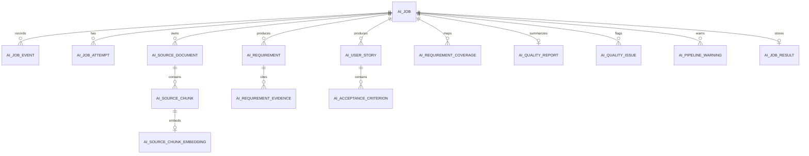

# Database and Storage

Purpose: Explain durable entities, storage adapters, vector data, cache behavior, connection pooling, and migrations. Audience: Backend, data, and operations engineers.

## Store selection

`app/store/factory.py` selects a `StoreBundle`:

- Empty `DATABASE_URL` → in-memory job, result, chunk, and embedding stores for tests/demo.
- Set `DATABASE_URL` → async PostgreSQL repositories with pgvector support and configurable connection pooling.

`app/queue/factory.py` independently selects the in-process queue or Redis/RQ from `REDIS_URL`. This separation matters: Redis can disappear without being the source of truth, but a queued Redis job also needs transient input or durable backend references to be recoverable.

## Entity relationships



The ORM definitions are in `ai-service/app/store/db/models.py`; repositories map them to storage-agnostic Pydantic records from `app/store/models.py`.

## Main entities

| Table/domain record | Lifecycle and purpose |
|---|---|
| `ai_jobs` / `AiJobRecord` | One logical job ID, request fingerprint, tenant/project, options, status, attempt, progress, errors, cancellation flag, and callback metadata. |
| `ai_job_attempts` | Attempt history and terminal error/status for retries. |
| `ai_job_events` | Node/job/callback observability events with safe metadata. |
| `ai_source_documents` | Backend references and source metadata; the AI service does not become long-term binary storage. |
| `ai_source_chunks` | Parsed text, source offsets/page/speaker/time, job and project scope. |
| `ai_source_chunk_embeddings` | Optional chunk vectors, provider model, and tenant/project scope for pgvector search. |
| `ai_requirements` / evidence | Decomposed extracted/classified requirements and source evidence quotes. |
| `ai_user_stories` / criteria | Generated stories and acceptance criteria. |
| `ai_requirement_coverage` | Maps each requirement to stories or non-story/needs-review outcomes. |
| `ai_quality_report`, issues, warnings | Aggregate quality scores and detailed findings. |
| `ai_job_results` | Serialized `JobResult`, exports/artifacts JSON, contract version, status, and processing time. |

The baseline schema is created by `migrations/versions/0001_initial_schema.py`, which enables `vector`, creates ORM metadata, and adds an IVFFLAT cosine index. `0002_job_idempotency_fields.py` adds request fingerprint and duplicate-request indexes/fields. The migration chain is run with `alembic upgrade head`.

## Database connection pooling

Production database engine pooling is configured in `app/store/db/session.py` and `app/config.py`:

- `DATABASE_POOL_SIZE` (default 5): Base persistent connection pool size.
- `DATABASE_MAX_OVERFLOW` (default 10): Maximum burst connections above pool size.
- `DATABASE_POOL_TIMEOUT` (default 30): Seconds to wait before timing out on connection pool exhaustion.
- `DATABASE_POOL_RECYCLE` (default 1800): Connection recycle lifetime in seconds.

## Vector and retrieval storage

Chunk embeddings are generated only when a job enables embeddings and the provider is available. They are persisted to `ai_source_chunk_embeddings`; vector queries in `PgEmbeddingStore.search()` are filtered by job/project/tenant inputs. Hybrid retrieval combines vector candidates with the in-memory per-job BM25 index. Requirement embeddings used for semantic conflict candidate detection are transient in-memory attributes and are not stored in the database or public response.

## Cache, deletion, and retention cleanup

`app/worker/state.py` stores inline text and demo file bytes in Redis under `aijob:input:{job_id}` for six hours (`CACHE_TTL_SECONDS = 21600`). `app/worker/runner.py` clears the process-local source index after execution.

Retention cleanup is implemented as a standalone maintenance command and service in `app/maintenance/cleanup.py`:

```bash
# Run retention cleanup for expired job results, chunks, and embeddings
python -m app.maintenance.cleanup
```

The command purges results older than `JOB_RESULT_RETENTION_DAYS` (default 30 days) and chunks/embeddings older than `CHUNK_RETENTION_DAYS` (default 7 days).

## Storage risks

- In-memory stores are non-durable and single-process.
- Redis input expiry can prevent retry recovery if the backend cannot supply source bytes/text.
- The source-index registry is process-local, so a worker rebuilds it for each job.
- PostgreSQL/pgvector behavior is covered by marked integration tests requiring `TEST_DATABASE_URL`.
