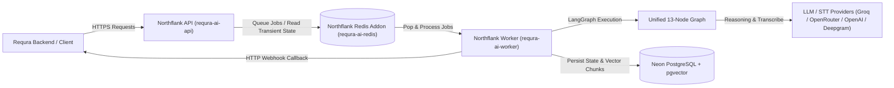

# Deployment and Operations

**Purpose**: Document the production Northflank architecture, local Docker Compose topology, operational behavior, CI gates, environment requirements, and maintenance routines.  
**Audience**: Platform engineers, DevOps, and release reviewers.

---

## 1. Verified Architecture & Production Topology

The Requra.AI pipeline is deployed as a decoupled, asynchronous multi-service topology on **Northflank** with external durable storage on **Neon PostgreSQL (with pgvector)**.

### Architecture Diagram



### Component Breakdown

| Service / Resource | Provider / Container | Entrypoint / Command | Network Visibility |
|---|---|---|---|
| **requra-ai-api** | Northflank Service (`combined`) | `uvicorn app.main:app --host 0.0.0.0 --port 8000` | Public HTTPS (`/health`, `/ready`, `/process/*`) |
| **requra-ai-worker** | Northflank Service (`deployment`) | `python -m app.worker.main` | Private (No HTTP exposure) |
| **requra-ai-redis** | Northflank Managed Addon | Redis 7.x instance | Private internal cluster network |
| **Database** | External Neon PostgreSQL | Managed Postgres + `pgvector` | Private SSL (`sslmode=require`) |
| **requra-ai-migrate** | Northflank Job (`manual`) | `alembic upgrade head` | Task container |
| **requra-ai-cleanup** | Northflank Job (`cron`) | `python -m app.maintenance.cleanup` | Scheduled daily task |

---

## 2. Production Environment Configuration

| Variable | Description | Default / Requirement |
|---|---|---|
| `ENV` | Environment mode | `production` (enforces strict security validation) |
| `ALLOWED_ORIGINS` | Permitted CORS origins | Explicit comma-separated URLs (e.g., `https://app.requra.ai`) |
| `DATABASE_URL` | Neon PostgreSQL DSN | `postgresql://...` (auto-normalized to `postgresql+asyncpg://`) |
| `REDIS_URL` | Northflank Redis DSN | `redis://requra-ai-redis.requra-ai.svc.cluster.local:6379` |
| `QUEUE_NAME` | RQ queue identifier | `ai_jobs` |
| `AI_INTERNAL_SERVICE_TOKEN` | Bearer token for `/internal/*` | Required 64-char secret token |
| `LLM_PROVIDER` | Primary reasoning LLM | `openrouter`, `groq`, or `openai` |
| `OPENROUTER_API_KEY` | OpenRouter API Key | Required if `LLM_PROVIDER=openrouter` |
| `GROQ_API_KEY` | Groq API Key | Required if `LLM_PROVIDER=groq` or `TRANSCRIBE_PROVIDER=groq` |
| `OPENAI_API_KEY` | OpenAI API Key | Required if `LLM_PROVIDER=openai` or `ENABLE_EMBEDDINGS=true` |
| `ENABLE_AUDIO` | Spoken audio processing flag | `true` |
| `TRANSCRIBE_PROVIDER` | Audio STT provider | `groq` or `deepgram` |
| `DB_POOL_SIZE` | Database connection pool size | `2` (Free-tier safe) |
| `DB_MAX_OVERFLOW` | Database max overflow | `2` (Free-tier safe) |
| `LLM_MAX_CONCURRENCY` | Shared reasoning concurrency | `1` (Free-tier safe) |

---

## 3. Release and Deployment Workflow

### Automated GitHub Actions Deployment

The workflow at `.github/workflows/deploy-northflank.yml` automatically triggers on push to `feat/doc-audio-processing` or `main`:

```bash
# Workflow stages:
1. Checkout code & set up Node.js / Northflank CLI
2. Authenticate using NORTHFLANK_API_TOKEN secret
3. Deploy API service manifest: deployment/northflank/api-service.json
4. Deploy Worker service manifest: deployment/northflank/worker-service.json
```

### Manual Deployment via Northflank Manifests

```bash
# 1. Login to Northflank
northflank login

# 2. Deploy Redis Addon
northflank create addon --project requra-ai -f deployment/northflank/redis-addon.json

# 3. Run Migration Job
northflank create job manual --project requra-ai -f deployment/northflank/migrate-job.json
northflank run job requra-ai-migrate --project requra-ai

# 4. Deploy API & Worker Services
northflank create service combined --project requra-ai -f deployment/northflank/api-service.json
northflank create service deployment --project requra-ai -f deployment/northflank/worker-service.json
```

---

## 4. Local Development Topology

For local debugging, `docker-compose.yml` provides a self-contained environment:

```powershell
docker compose build
docker compose up -d postgres redis
docker compose up migrate
docker compose up -d ai-service ai-worker
docker compose ps
```

---

## 5. Health, Readiness & Observability Probes

- `/health`: Liveness probe indicating the API process is running (`HTTP 200`).
- `/ready`: Deep readiness probe asserting:
  - Required environment flags and security tokens are present.
  - Redis queue connection is operational.
  - PostgreSQL database connection and migrations are active.
  - Configured LLM and STT provider API keys are verified.

If `/ready` returns `503 Service Unavailable`, inspect the diagnostic `issues` array in the response body.

---

## 6. Maintenance & Data Retention

Run database and chunk retention cleanup manually or via the `requra-ai-cleanup` cron job:

```bash
python -m app.maintenance.cleanup
```

This purge deletes expired raw text chunks and cached job artifacts past `JOB_RESULT_RETENTION_DAYS` (default 30 days).
