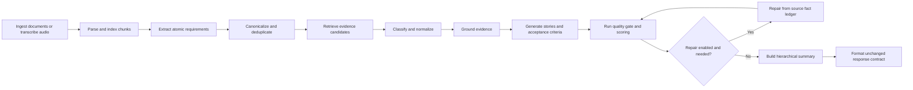

# Response Quality, Semantic Grounding, and Traceability

> **Audience:** AI engineers, backend engineers, QA engineers, and reviewers
>
> **Branch:** `feat/respone-enhancements`
>
> **Base branch:** `main`
>
> **Implementation status:** MVP implemented
>
> **Last verified:** 3 August 2026
>
> **Compatibility guarantee:** no API endpoint, request payload, or final response structure was changed

## 1. How to use this document

This is the current-state reference for the response-quality work on
`feat/respone-enhancements`. It replaces the previous chronology-first guide.

Choose the shortest reading path that fits your task:

- **Five-minute revision:** read Sections 2, 3, 4, and 6.
- **Code review:** read Sections 5 through 9.
- **Release review:** use Section 10.
- **Historical investigation:** use Appendix A.
- **Finding implementation or tests:** use Appendix B.

Historical changes appear only in the appendices. The main sections describe
what the pipeline does now.

## 2. Executive summary

This branch hardens the quality of generated requirements, evidence references,
user stories, acceptance criteria, classifications, estimates, summaries, and
quality scores.

The main outcomes are:

1. Requirements are normalized and deduplicated before stories are generated.
2. Retrieved chunks are candidates, not automatic citations.
3. Evidence is published only after provenance, quote, semantic, numeric, and
   polarity checks pass.
4. Ambiguous evidence is reported for review and is not exposed in
   `source_refs`.
5. Story mappings and acceptance criteria are validated against the complete
   linked requirement facts.
6. Omission is separated from contradiction through three-state polarity.
7. The quality score is component-owned and does not punish the same defect
   twice.
8. DOCX traceability is honest: `page` remains `null` when a rendered page is
   unavailable, while internal paragraph and section metadata is preserved.
9. Audio traceability preserves available language, speaker, timestamp, and ASR
   confidence metadata.
10. Long multi-document summaries use bounded hierarchical reduction instead
    of silently discarding the middle of the input.
11. Story points use the Fibonacci set, requirement priority and category are
    normalized from source facts, and conflict warnings include actionable
    resolution options.
12. Resolved extraction warnings are removed after authoritative grounding.
13. All reasoning-model calls share bounded concurrency, provider timeouts, and
    rate-limit-aware retries without removing any quality-generation step.
14. Decimal values, protocol versions, percentages, and similar dotted tokens
    remain intact during clause matching, preventing false evidence rejection.
15. Acceptance criteria favor source-specific testability over a fixed count;
    duplicate or boilerplate criteria are detected instead of rewarded.
16. Traceability is scored as a weakest-link measure across story mappings,
    actionable-requirement coverage, and verified evidence coverage.
17. Structured summaries receive a deterministic source-coverage pass so model
    omissions and null-like placeholders do not leak into the final response.
18. Already-canonical requirements keep one public story and export identity
    each; model-proposed many-to-one story merges fall back to source-bound
    stories instead of hiding secondary requirements.
19. Acceptance-criterion sanitation rejects unsupported presentation outcomes
    and profile-based authorization while distinguishing action verbs from
    nouns such as “asset list.”
20. Semantically equivalent user-role labels are consolidated in stakeholder
    summaries.
21. Exhausted credits or token quota skip futile backoff retries and move once
    to a configured fallback provider, substantially limiting quota-failure
    latency.
22. Public requirement confidence is calibrated after grounding from a 30%
    extraction prior and 70% strongest verified-evidence score; missing
    evidence and unresolved review states are capped conservatively.
23. Unsupported actions are removed from requirement titles, story titles,
    descriptions, and acceptance criteria—not only from citations.
24. Strong same-language evidence restores omitted explicit negative
    constraints as well as omitted numeric constraints.
25. Structured summary fields are source-bound, inferred assumptions and
    out-of-scope claims are removed, and verbose stakeholder descriptions are
    consolidated into canonical roles.
26. Measurable acceptance criteria must preserve every numeric value from the
    source clause; vague substitutions such as `specified time` or `multiple
    users` cannot satisfy coverage.
27. Numeric authorization limits are distinguished from performance workload
    envelopes, so an explicit business cap can produce an above-limit denial
    test while `up to 500 sessions` cannot invent rejection of session 501.

The branch uses deterministic semantic checks for the MVP. It does not require
an NLI service or an additional LLM call for evidence adjudication.

## 3. Compatibility guarantees

The following integration surfaces remain unchanged:

- Existing API endpoints
- Existing request payloads
- Existing final response object structure
- Existing `source_refs[].page` field and its nullable behavior
- Existing asynchronous job flow
- Existing pipeline nodes and graph topology

The implementation adds internal metadata, validation, reconciliation, and
normalization inside the existing flow. Consumers do not need a backend,
frontend, or contract migration.

## 4. Current pipeline flow



The important ownership boundary is:

- Retrieval finds candidates.
- Grounding decides which candidates are publishable citations.
- The quality gate diagnoses the final artifacts.
- Scoring measures components without double penalties.
- Formatting performs the last public-output safety checks.

## 5. Implemented feature catalog

### 5.1 Extraction, classification, priority, and category

| Feature | Current behavior |
|---|---|
| Atomic extraction | The prompts request atomic, source-grounded requirements with verbatim evidence. |
| Prompt-injection resistance | Source text is treated as untrusted data; embedded instructions must not be followed. |
| English normalization | Requirement text is normalized to English while the evidence quote remains in the source language. |
| Evidence diagnostics | Weak extraction evidence produces a diagnostic warning for later grounding, not a permanent final defect. |
| Priority inference | Explicit source labels and urgency terms can upgrade priority; absent support defaults conservatively. |
| Priority preservation | Classification does not overwrite a stronger valid priority already established by extraction. |
| Category normalization | Requirement categories are inferred from source-supported semantics rather than accepted blindly. |
| Label reconciliation | A generic `NFR` label is removed when the text has no measurable or recognized quality attribute; valid mixed labels remain supported. |
| Business-rule reconciliation | A model-added `BR` label is removed from ordinary capabilities unless the source contains a rule, limit, approval, exception, prohibition, or retention condition. |
| Public type precedence | A supported `NFR` or constraint takes precedence over `FR` in the single public `type` field; `BR` may coexist without overriding it. |
| Domain-independent category cues | Security, performance, reliability, availability, reporting, and dashboard intent use behavior-specific signals rather than document-specific phrases. |
| Confidence validation | Invalid or weak confidence values are detected by the quality gate. |
| Post-grounding confidence calibration | Public requirement confidence combines the extraction prior (`30%`) with the strongest verified citation support (`70%`). No verified citation caps confidence at `0.49`; unresolved review caps it at `0.79`. |

Primary implementation:

- [extract.py](file:///d:/ITI/GP/ai-pipeline/ai-service/app/nodes/extract.py)
- [classify.py](file:///d:/ITI/GP/ai-pipeline/ai-service/app/nodes/classify.py)
- [semantic_quality.py](file:///d:/ITI/GP/ai-pipeline/ai-service/app/services/semantic_quality.py)
- [extract_requirements_v1.md](file:///d:/ITI/GP/ai-pipeline/ai-service/app/prompts/templates/extract_requirements_v1.md)
- [extract_requirements_v2.md](file:///d:/ITI/GP/ai-pipeline/ai-service/app/prompts/templates/extract_requirements_v2.md)

### 5.2 Requirement canonicalization and conflict analysis

| Feature | Current behavior |
|---|---|
| Exact duplicate merging | Identical normalized requirements are merged. |
| Paraphrase merging | High-confidence semantic duplicates are merged at a threshold of `0.80`. |
| Composite handling | Equivalent atomic requirements contained in a composite requirement are merged conservatively. |
| Connected components | Transitive duplicate relationships form one canonical group instead of pairwise inconsistent merges. |
| Evidence union | Merged requirements retain the union of valid evidence and labels. |
| Stable IDs | Requirement IDs are reassigned before story generation. |
| Actor safety | Requirements with materially conflicting actors are not merged blindly. |
| Conflict types | Contradiction, constraint, permission, scope, priority, complementary, and duplicate relationships are supported. |
| Resolution guidance | Non-independent conflicts receive two or three dynamic, actionable resolution options. |
| Clarification questions | Conflict warnings can include questions that help a reviewer resolve ambiguity. |
| Informational complementary links | `COMPLEMENTARY` relationships do not reduce the score or create a score cap. |
| Orthogonal numeric constraints | Rules constraining different measurable dimensions of one workflow, such as monetary approval and item quantity, are treated as compatible. |

Canonicalization runs before story generation, so duplicate warnings are not
merely hidden from scoring; the duplicate requirements themselves are resolved.

Primary implementation:

- [dedupe_requirements.py](file:///d:/ITI/GP/ai-pipeline/ai-service/app/nodes/dedupe_requirements.py)
- [generate.py](file:///d:/ITI/GP/ai-pipeline/ai-service/app/nodes/generate.py)
- [detect_conflicts_v1.md](file:///d:/ITI/GP/ai-pipeline/ai-service/app/prompts/templates/detect_conflicts_v1.md)

### 5.3 Evidence retrieval, grounding, and traceability

| Feature | Current behavior |
|---|---|
| Retrieval is non-authoritative | A top-ranked chunk is only a candidate and cannot automatically become a citation. |
| Clause-level comparison | A requirement is compared with the best supporting clause or bounded sentence window in a chunk. |
| Decimal-safe segmentation | Sentence splitting preserves values such as `2.0`, `TLS 1.3`, `99.9%`, IP addresses, and version numbers. |
| Bullet-aware segmentation | Wrapped PDF and DOCX list items are isolated without section-heading or adjacent-requirement contamination. |
| Provenance validation | Document identity, source identity, and chunk identity must be valid. |
| Exact quote validation | The published quote must occur in the claimed source chunk or document. |
| Numeric validation | Unsupported or mismatched numeric facts reject the evidence. |
| Behavior validation | New unsupported permissions, deletion, retention, notification, timing, or other behavior blocks automatic acceptance. |
| Polarity validation | Explicit contradiction blocks acceptance; omission is handled separately. |
| Ambiguous evidence protection | Evidence in the review zone does not reach public `source_refs`. |
| Cross-language caution | Cross-language pairs are review-only without NLI. |
| Verified confidence calibration | Candidate origin does not cap confidence after provenance, quote, numeric, behavior, and polarity checks pass; low-ASR evidence remains capped conservatively. |
| Low-ASR caution | Semantically valid low-confidence transcript evidence is retained with a review diagnostic. |
| Final formatting defense | Any non-zero evidence support below `0.60` is filtered before output. |
| Reference deduplication | Duplicate document references with the same source and normalized quote are collapsed, retaining the strongest one. |
| Audio identity preservation | Audio references retain chunk identity because timestamps may distinguish otherwise similar quotes. |
| Warning reconciliation | `EXTRACT_WEAK_EVIDENCE` is removed when final grounding verifies the requirement; unresolved warnings are rebuilt with the exact remaining count. |
| Review-state cleanup | Evidence-only review markers are cleared after authoritative grounding succeeds, while unrelated review reasons are preserved. |
| Public issue consolidation | Evidence aliases are exposed as one readable defect per requirement and root cause. |
| Source-constraint completion | A strongly related same-language source clause can restore numeric constraints and explicit prohibitions omitted from extracted wording before story generation. |

The two public confidence values answer different questions without changing
the contract:

- `requirements[].confidence_score` estimates the reliability of the complete
  extracted requirement after grounding.
- `requirements[].source_refs[].confidence_score` measures how strongly that
  individual quote supports the requirement.

### 5.4 Semantic matching and three-state polarity

The semantic service uses these internal states:

- `ENTAILED`: the candidate is supported by the related source clause.
- `CONTRADICTED`: the candidate makes an explicit opposite claim.
- `NOT_COVERED`: the candidate is omitted, unrelated, or cannot be established.

Only `CONTRADICTED` creates an unsupported-fact contradiction. `NOT_COVERED`
reduces fact or clause coverage without being mislabeled as contradiction.

Additional semantic behavior includes:

- General synonym normalization, including alert/notify, record/capture/log,
  invite/invitation, administrator/admin, preserve/retain, and recover/reset.
- Morphology-safe normalization covers delete/deleted/deleting,
  include/included, update/updated, and authentication variants.
- Soft deletion, archival, and prohibitions on permanent deletion entail record
  retention without creating a false unsupported-behavior issue.
- Action-aware comparison so a shared noun alone does not prove a behavior.
- Exact and contained proposition entailment when negation agrees.
- Access-control entailment: “only administrators may retrieve” supports the
  logically equivalent denial of retrieval to non-administrators.
- Comparison with related clauses instead of unrelated full strings.
- Independent polarity adjudication for reordered positive and negative
  clauses, preventing one clause's negation from contaminating an adjacent
  supported clause.
- Numeric upper-bound entailment: an explicit permission or business limit
  such as `allowed to check out up to N` supports a boundary criterion that
  prevents operation `N+1` without inventing a message or notification.
- Workload-envelope separation: performance measurement conditions such as
  `under load of up to N sessions` do not entail denying session `N+1`.
- Unsupported numeric fact detection.
- Distinction between clear unsupported behavior and uncertain review terms.

Primary implementation:

- [semantic_quality.py](file:///d:/ITI/GP/ai-pipeline/ai-service/app/services/semantic_quality.py)
- [retrieve_evidence.py](file:///d:/ITI/GP/ai-pipeline/ai-service/app/nodes/retrieve_evidence.py)
- [evidence_grounding.py](file:///d:/ITI/GP/ai-pipeline/ai-service/app/nodes/evidence_grounding.py)

### 5.5 User-story generation and repair

| Feature | Current behavior |
|---|---|
| Canonical input | Stories are generated from canonical requirements after deduplication. |
| Actor normalization | User-story personas are normalized without inventing a human actor. |
| Pre-repair persona normalization | Technical personas such as `As the system` are converted to `As a system operator` before they can trigger an avoidable LLM repair call. |
| Source-bound wording | Story descriptions and criteria use only linked requirement facts and evidence. |
| No invented behavior | Prompts explicitly prohibit unsupported validation, permissions, notifications, retry, escalation, retention, timing, and negative cases. |
| Deterministic title and description sanitation | Unsupported goals, titles, scope claims such as `unlimited`/`without restrictions`, and invented story outcomes are replaced with source-bound wording. |
| Action-aware AC sanitation | Conjunct actions such as “prevents and informs” are checked independently; unsupported notifications or accessibility outcomes are removed before publication. |
| Deterministic fallback | If LLM generation fails or is malformed, source-bound fallback stories are produced. |
| Clause-owned fallback criteria | Fallback generation creates one specific criterion per independent source clause and never pads a story with boilerplate merely to reach a fixed count. |
| Numeric boundary criteria | Explicit source-defined business limits produce both the allowed boundary behavior and a source-entailed above-limit rejection criterion. Inflected denial verbs such as `prevents`, `blocks`, and `rejects` are recognized, so an existing valid boundary test is not duplicated. |
| Measurable-constraint preservation | A criterion covers a measurable clause only when it retains every source numeric value, independent of harmless formatting such as `2` versus `2.0`. Missing values trigger deterministic source-bound regeneration. |
| Workload-safe limits | Performance envelopes such as `up to 500 active sessions` remain test conditions and never become invented rejection behavior. |
| Valid story shape | Malformed wording such as `so that: The system shall...` is normalized. |
| Complete mappings | Mapping validation considers title, description, and all acceptance criteria. |
| Traceability-safe story identity | Each canonical requirement receives its own public story. Duplicate outputs are merged only when they refer to the same canonical requirement; similar stories with disjoint source IDs remain separate. |
| Lossless handling of model merges | A model-proposed story spanning multiple canonical requirements is replaced by one deterministic source-bound story per requirement, preserving descriptions, criteria, coverage, and export rows under the unchanged single-primary-ID contract. |
| Fibonacci estimates | Story points are normalized to `1`, `2`, `3`, `5`, or `8`. |
| Fact-ledger repair | Repair receives the linked source facts and removes unsupported additions. |
| Post-repair sanitation | Repaired stories pass through the same deterministic source, behavior, polarity, numeric, persona, and duplicate checks as initially generated stories. |
| Final coverage reconstruction | Requirement coverage and criterion IDs are rebuilt from the final repaired story objects, preventing stale relationships. |
| Bounded repair loop | Repair is optional and limited to prevent uncontrolled latency or loops. |

Configuration:

```text
ENABLE_QUALITY_REPAIR=true
MAX_REPAIR_ATTEMPTS=1
```

Repair is enabled for the MVP, but it runs only when the quality gate finds a
repairable story defect. The single-attempt limit prevents uncontrolled latency
or loops.

Primary implementation:

- [generate.py](file:///d:/ITI/GP/ai-pipeline/ai-service/app/nodes/generate.py)
- [repair_stories.py](file:///d:/ITI/GP/ai-pipeline/ai-service/app/nodes/repair_stories.py)
- [format.py](file:///d:/ITI/GP/ai-pipeline/ai-service/app/nodes/format.py)
- [generate_user_stories_v1.md](file:///d:/ITI/GP/ai-pipeline/ai-service/app/prompts/templates/generate_user_stories_v1.md)
- [generate_user_stories_v2.md](file:///d:/ITI/GP/ai-pipeline/ai-service/app/prompts/templates/generate_user_stories_v2.md)
- [repair_stories_v1.md](file:///d:/ITI/GP/ai-pipeline/ai-service/app/prompts/templates/repair_stories_v1.md)

### 5.6 Acceptance-criteria and mapping validation

The validator:

- Evaluates the combined `Given + When + Then` content, not one field alone.
- Measures coverage of distinct requirement clauses.
- Accepts logically entailed access-control negative cases.
- Detects unsupported numbers and clear new behavior.
- Uses Medium review for uncertain behavior instead of creating a false High
  issue from keyword presence.
- Creates a High mapping issue only when an independent clear mismatch exists.
- Uses the actual story index or ID rather than `item_id=0`.
- Detects near-duplicate stories.
- Flags generic, empty, malformed, untestable, or semantically duplicate
  criteria.
- Removes criteria containing unsupported observable actions before output and
  regenerates source-bound criteria when removal creates a coverage gap.
- Detects passive invented behavior such as a request being recorded or a user
  being informed, as well as unsupported absolute timing such as `without delay`.
- Treats observable outcomes such as an item appearing or being listed as
  presentation behavior that must exist in the linked source facts.
- Treats profile-based access grants as authorization behavior that must be
  source-supported.
- Uses syntax-aware checks so a noun such as `asset list` is not mistaken for
  the action `list`.
- Distinguishes access used as a noun from asserted access/retrieval behavior,
  while preserving valid exclusive-permission entailment.
- Treats `unlimited`, `unrestricted`, and `without restrictions/limits` as a
  contradiction when the source defines an explicit maximum.
- Accepts one specific criterion for a truly atomic one-clause requirement;
  multi-clause requirements must cover each independent fact.
- Requires every numeric value in a measurable source clause to appear in its
  covering criterion; vague placeholders do not count as coverage.
- Keeps opposite boundary cases distinct, such as authorized access versus
  denied unauthorized access.
- Recognizes inflected denial forms, preventing duplicate deterministic
  boundary criteria when the model already supplied an equivalent test.

Primary implementation:

- [story_validator.py](file:///d:/ITI/GP/ai-pipeline/ai-service/app/validators/story_validator.py)
- [quality_gate.py](file:///d:/ITI/GP/ai-pipeline/ai-service/app/nodes/quality_gate.py)

### 5.7 Quality scoring and issue ownership

The overall score is a weighted component score:

```text
overall =
    groundedness              * 0.30
  + traceability              * 0.25
  + story_completeness        * 0.15
  + acceptance_criteria       * 0.20
  + (1 - duplicate_risk)      * 0.10
  - unique_unowned_penalties
```

Component ownership prevents double punishment:

| Root-cause family | Owned by |
|---|---|
| `EVIDENCE_NOT_GROUNDED` | Groundedness |
| `DUPLICATE_CONTENT` | Duplicate risk |
| `AC_QUALITY` | Acceptance-criteria quality |
| `STORY_TRACEABILITY` | Traceability |
| `STORY_COMPLETENESS` | Story completeness |

Evidence aliases such as `missing_evidence`,
`missing_verified_evidence`, and `evidence_semantic_mismatch` normalize to one
root cause. Duplicate aliases normalize to `DUPLICATE_CONTENT`. Issues are
grouped by stable item and root cause.

Rules:

- Component-owned defects are not subtracted again and do not apply a second
  severity cap.
- Diagnostics and informational relationships do not affect the score.
- `COMPLEMENTARY` never affects penalties or caps.
- Unique, unowned defects use additive penalties: High `0.15`, Medium `0.05`,
  Low `0.01`, with a maximum additive penalty of `0.70`.
- A genuine unowned High defect can cap the final score below `0.60`.
- A genuine unowned Medium defect can cap it below `0.80`.
- Traceability is the minimum of valid story-mapping precision, actionable
  requirement coverage, and verified evidence coverage. A high mapping rate
  therefore cannot hide missing citations.
- Story quality inherits missing-evidence risk from its linked requirement,
  preventing a story from reporting perfect quality when its source is not
  verified.
- Acceptance-criteria quality includes criterion uniqueness as well as
  precision and clause coverage.
- Final scoring uses the same source-aware duplicate adjudication as the final
  quality gate, so a reported duplicate cannot coexist with perfect AC quality.

Primary implementation:

- [quality_scoring.py](file:///d:/ITI/GP/ai-pipeline/ai-service/app/services/quality_scoring.py)
- [quality_gate.py](file:///d:/ITI/GP/ai-pipeline/ai-service/app/nodes/quality_gate.py)

### 5.8 Long-document and multi-document summaries

Summarization no longer relies on one blind truncation window.

Current behavior:

1. Build source-aware summary units.
2. Split oversized content into bounded chunks.
3. Summarize each chunk.
4. Reduce partial summaries hierarchically.
5. Synthesize across documents while preserving their separate scopes.
6. Append pipeline questions and artifact digest information.
7. Remove null-like values such as `None`, `N/A`, and `null` from list fields.
8. Reconcile every canonical source requirement against all summary sections
   and restore omitted facts to scope, assumptions, out-of-scope, or open
   questions as appropriate.
9. Recover explicit human actors as stakeholders while excluding technical
   components such as the system or database.
10. Consolidate equivalent role names such as user, standard user, end user,
    authorized user, and registered user into one `Users` stakeholder entry.
11. Collapse verbose descriptions such as `Users requesting checkout` and the
    canonical `Users` entry into one stakeholder role.
12. Remove assumptions, out-of-scope claims, action items, risks, and decisions
    that cannot be supported by canonical requirement facts; assumption,
    out-of-scope, and question fields require their corresponding source label.
13. Append omitted security, performance, availability, and measurable quality
    constraints to the executive summary using canonical source text.

The configured input bound is `12,000` characters per summarization unit. The
middle of long documents is not silently discarded.

Primary implementation:

- [summarize.py](file:///d:/ITI/GP/ai-pipeline/ai-service/app/nodes/summarize.py)
- [summarize_structured_v1.md](file:///d:/ITI/GP/ai-pipeline/ai-service/app/prompts/templates/summarize_structured_v1.md)

### 5.9 DOCX, PDF, text, and audio metadata

| Format | Public page | Internal traceability |
|---|---:|---|
| PDF | Extracted page number | Document, source, chunk, page, exact quote |
| DOCX | `null` unless reliably rendered | Paragraph index, heading, section, document, source, chunk, exact quote |
| Text | `null` | Document, source, chunk, exact quote |
| Audio | `null` | Language, speaker when available, timestamps, ASR confidence, source, chunk, exact quote |

Backend document and audio retrieval validates HTTP(S) URLs, credentials,
allowlisted hosts, resolved addresses, redirects, payload size, and integrity.
The text-fetch path uses the same validated URL parser as binary retrieval,
preventing a runtime parser failure before ingestion.

DOCX pages are not fabricated. The ingestion layer can attempt controlled
headless rendering where supported, but paragraph-based extraction is the safe
MVP fallback and preserves document identity.

For recordings:

- Deepgram mixed-language processing can evaluate Arabic Egyptian (`ar-EG`) and
  English (`en-US`) transcripts and select using confidence and keyword signals.
- Groq metadata is preserved when available.
- Speaker metadata is provider-dependent.
- Low-confidence or cross-language evidence is marked for review.

Primary implementation:

- [ingest.py](file:///d:/ITI/GP/ai-pipeline/ai-service/app/nodes/ingest.py)
- [parse_to_chunks.py](file:///d:/ITI/GP/ai-pipeline/ai-service/app/nodes/parse_to_chunks.py)
- [transcribe.py](file:///d:/ITI/GP/ai-pipeline/ai-service/app/nodes/transcribe.py)
- [items.py](file:///d:/ITI/GP/ai-pipeline/ai-service/app/schemas/items.py)
- [backend.py](file:///d:/ITI/GP/ai-pipeline/ai-service/app/clients/backend.py)

### 5.10 Final formatting and status

The formatter preserves the existing response contract and computes status
conservatively:

| Status | Meaning |
|---|---|
| `rejected` | The input did not produce useful supported artifacts. |
| `failed` | A processing error occurred and there are no useful requirements or stories. |
| `partial` | Required artifacts are missing, a genuine High issue remains, or an actionable warning requires review. |
| `completed` | Useful artifacts are present and no actionable blocker remains. |

Informational warnings do not force `partial`. Examples include merged duplicate
notifications, complementary relationships, and retrieval-limit diagnostics.
`EXTRACT_WEAK_EVIDENCE` is actionable only when it remains unresolved after
grounding.

Before publishing, formatting also consolidates duplicate public issues by
stable item and root cause, filters complementary relationships from quality
defects, and derives concise requirement titles from the actual goal rather
than exposing mechanical actor-prefixed wording.

Primary implementation:

- [format.py](file:///d:/ITI/GP/ai-pipeline/ai-service/app/nodes/format.py)
- [evidence_grounding.py](file:///d:/ITI/GP/ai-pipeline/ai-service/app/nodes/evidence_grounding.py)

### 5.11 Developer verification utility

[verify_fixture_results.py](file:///d:/ITI/GP/ai-pipeline/ai-service/scripts/verify_fixture_results.py) fetches an internal job result and
prints:

- Requirement IDs and priorities
- Story IDs, priorities, and points
- Conflict warnings and resolution guidance

It is a developer utility and does not affect the API or pipeline result.

### 5.12 LLM request reliability

All existing reasoning-model calls now pass through one resilient internal
client, even when no fallback provider is configured.

| Control | MVP default | Behavior |
|---|---:|---|
| `LLM_MAX_CONCURRENCY` | `2` | Limits simultaneous LLM requests per service process. |
| `LLM_MAX_RETRIES` | `2` | Allows two retries after the initial request. |
| `LLM_RETRY_BASE_SECONDS` | `1.0` | Starts exponential retry delay at one second. |
| `LLM_RETRY_MAX_SECONDS` | `30.0` | Bounds retry delay and provider `Retry-After` handling. |
| `PROVIDER_TIMEOUT_SECONDS` | `120` | Applies a timeout to every reasoning-provider request. |
| `LLM_QUOTA_COOLDOWN_SECONDS` | `300` | Temporarily opens a process-wide circuit for a provider/model after confirmed token or credit exhaustion. |

Retry delays use exponential backoff with jitter and honor a valid
`Retry-After` header up to the configured maximum. The underlying provider
client has its own retries disabled so requests are not multiplied by nested
retry layers.

Quota and credit exhaustion are handled differently from transient rate
limits. HTTP `402` responses and provider messages indicating exhausted
credits, daily/monthly quota, or no remaining tokens are not retried on the
same provider. A shared provider/model circuit also prevents later pipeline
nodes and jobs in the same service process from repeating the known-failing
call during the configured cooldown. The client attempts each configured
fallback provider once and then fails promptly. Ordinary transient `429`
responses continue to use the bounded retry policy. This prevents token
exhaustion from turning a predictable failure into several minutes of repeated
calls.

This change controls request bursts from parallel extraction chunks and
concurrent jobs. It does not skip extraction, classification, generation,
summarization, grounding, validation, or scoring, and it does not change the
public API contract.

Local Docker development uses a bind mount for `./ai-service`. The API command
includes Uvicorn `--reload`, so API-process Python changes reload automatically.
The separate `ai-worker` process does not use a file watcher and must be
restarted after pipeline-code changes. Rebuilding is unnecessary for ordinary
Python edits because of the bind mount; dependency or Dockerfile changes still
require a rebuild.

Conflict detection and quality repair are enabled for the MVP:

```text
ENABLE_CONFLICT_DETECTION=true
ENABLE_QUALITY_REPAIR=true
```

Conflict adjudication calls the LLM only when deterministic candidate selection
finds related requirement pairs. Repair calls the LLM only when a repairable
story defect remains after the quality gate, and it is limited to one attempt.

Primary implementation:

- [llm.py](file:///d:/ITI/GP/ai-pipeline/ai-service/app/llm.py)
- [config.py](file:///d:/ITI/GP/ai-pipeline/ai-service/app/config.py)
- [.env.example](file:///d:/ITI/GP/ai-pipeline/ai-service/.env.example)

## 6. Decision rules and thresholds

### 6.1 Evidence publication matrix

| Condition | Decision | Public citation? |
|---|---|---:|
| Support `>= 0.60` and all safety checks pass | Accept | Yes |
| Support `< 0.25` in the same language | Reject | No |
| Support from `0.25` to `< 0.60` | Review/partial | No |
| Requirement and source are in different languages | Review/partial | No |
| Provenance or quote is invalid | Reject | No |
| Number, behavior, or polarity check fails | Reject | No |

The support score alone cannot override provenance, numeric, behavior, or
polarity failures.

### 6.2 Story and requirement matching

| Rule | Value |
|---|---:|
| Minimum story alignment | `0.40` |
| Near-duplicate requirement threshold | `0.80` |
| Allowed story points | `1, 2, 3, 5, 8` |
| Maximum repair attempts | `1` |

Low lexical alignment alone is not enough to create a High mapping defect. A
High issue requires a clear semantic mismatch independent of the low score.

### 6.3 Groundedness behavior

Groundedness uses the strongest verified evidence for each requirement.
Review-only evidence receives reduced credit. Legacy unscored evidence uses a
conservative fallback rather than being treated as fully grounded.

### 6.4 Acceptance-criteria behavior

Acceptance-criteria quality combines:

- Criterion precision: each criterion is relevant and supported.
- Clause fact coverage: all distinct source facts are represented.
- Criterion uniqueness: repeated paraphrases do not increase quality.

This avoids a misleading 100% result from many criteria that repeat only one
source fact. There is no universal requirement for two criteria: an atomic
single-clause requirement may have one specific, testable criterion, while a
multi-clause requirement needs enough distinct criteria to cover its facts.

## 7. Warning and issue lifecycle

Warnings have an owner and a lifecycle:

1. Extraction may emit an early diagnostic.
2. Retrieval may add candidate-level diagnostics.
3. Grounding resolves, removes, or rewrites evidence diagnostics.
4. The quality gate emits artifact-level defects.
5. Scoring normalizes issues into root causes.
6. Formatting decides whether remaining warnings are actionable.

Example:

```text
Extraction: 8 requirements have weak direct evidence
Grounding:   all 8 receive verified fallback evidence
Final:       EXTRACT_WEAK_EVIDENCE is removed
```

If two remain unresolved, the final warning reports two—not the original eight.

This prevents resolved upstream diagnostics from incorrectly changing final
status or lowering user confidence.

## 8. Security and reliability controls

The response-quality changes also improve production safety:

- Prompts treat uploaded content and intermediate summaries as untrusted.
- Evidence must resolve to a known source and chunk.
- Verbatim quote validation prevents fabricated traceability.
- Numeric and permission checks reduce high-impact hallucinations.
- Repair loops are bounded.
- Summary input sizes are bounded.
- Model failures have deterministic fallbacks.
- Parallel LLM calls are bounded by one shared per-process concurrency gate.
- Retryable provider errors use bounded exponential backoff with jitter.
- Valid provider `Retry-After` guidance is used when calculating retry delay.
- Permanent token/credit exhaustion skips retries and tries a configured
  fallback once.
- Every reasoning request uses the configured provider timeout.
- Ambiguity degrades to review/partial rather than failing the whole pipeline.
- No external NLI dependency or per-pair LLM adjudication cost is required.

These controls improve semantic reliability but do not replace service-level
controls such as rate limits, authentication, provider timeouts, resource
budgets, metrics, tracing, and deployment health checks.

## 9. Known MVP limitations

1. **No NLI adjudicator:** semantically equivalent cross-language or heavily
   paraphrased evidence may be sent to review.
2. **DOCX pages:** `page=null` is expected without reliable rendering.
3. **Provider-dependent audio metadata:** speaker and confidence fields may not
   be available from every transcription provider.
4. **Lexical semantic layer:** deterministic aliases must be maintained as new
   domain vocabulary appears.
5. **LLM variability:** free or changing providers may affect extraction count,
   latency, and structure despite normalization and fallbacks.
6. **Conditional conflict and repair cost:** both features are enabled, but
   their LLM calls occur only when conflict candidates or repairable story
   defects exist.
7. **Operational latency:** semantic quality is improved, but provider response
   time and large-document processing still require production SLO monitoring.
8. **Per-process concurrency:** the LLM concurrency gate is shared inside one
   service process. Multiple worker processes multiply the effective provider
   concurrency and must be sized together.

Recommended post-MVP work:

- Build a multilingual golden dataset from real documents and recordings.
- Measure false acceptance and false rejection separately.
- Add NLI behind `ENABLE_NLI_ADJUDICATION=false` only if golden results show a
  material paraphrase or cross-language rejection problem.
- Add controlled DOCX-to-PDF rendering when page-level references are a product
  requirement.
- Add node latency, provider retry, fallback, warning, and score-component
  metrics.

## 10. Verification and release checklist

### Automated verification

The branch was last verified with:

- `430 passed`
- `1 skipped`
- `1 existing Starlette/httpx deprecation warning`
- Ruff critical checks passed
- `git diff --check` passed

Important suites include:

```powershell
cd ai-service
python -m pytest tests/services/test_semantic_quality_hardening.py
python -m pytest tests/services/test_quality_scoring.py
python -m pytest tests/nodes/test_evidence_grounding.py
python -m pytest tests/nodes/test_retrieve_evidence.py
python -m pytest tests/nodes/test_quality_gate.py
python -m pytest tests/nodes/test_generate_quality.py
python -m pytest tests/nodes/test_docx_traceability.py
python -m pytest tests/validators/test_story_validator.py
python -m pytest
```

### Response-level release checks

Before promoting a model or prompt version, verify:

- [ ] Every published source reference passes the `0.60` support threshold and
      all safety checks.
- [ ] No review-zone evidence appears in `source_refs`.
- [ ] Exact quotes exist in the claimed source.
- [ ] DOCX pages remain `null` unless a renderer produced them reliably.
- [ ] Requirement IDs are unique and stable after canonicalization.
- [ ] Stories map only to valid requirement IDs.
- [ ] Every actionable requirement is represented by a story.
- [ ] Acceptance criteria cover all distinct source clauses.
- [ ] Unsupported numbers, permissions, retention, and negative cases are absent.
- [ ] `COMPLEMENTARY` and diagnostics do not reduce the score.
- [ ] Resolved `EXTRACT_WEAK_EVIDENCE` warnings are absent.
- [ ] The status matches remaining actionable defects.
- [ ] Overall score movement can be explained by its five components.
- [ ] Latency and provider behavior meet the MVP SLO.

### Golden-data policy

Do not tune thresholds only against the two original fixture documents. The
golden set should include:

- PDF, DOCX, text, and audio
- English, Arabic, and mixed-language recordings
- Exact wording and paraphrases
- Positive, negative, and omitted requirements
- Conflicting permissions and numeric constraints
- Duplicate and composite requirements
- Low-confidence ASR segments
- Irrelevant retrieval candidates

## 11. How to revise this document

When adding an enhancement:

1. Update the relevant current-state subsection in Section 5.
2. Update a threshold or decision table in Section 6 if behavior changed.
3. Add or update the limitation in Section 9.
4. Add the verification command or acceptance check in Section 10.
5. Add one commit entry to Appendix A.
6. Update the file/test map in Appendix B only if a new responsibility exists.

Do not add another full dated narrative to the main document. The main document
must always describe the current behavior.

---

## Appendix A. Complete branch commit map

All commits on `feat/respone-enhancements` after its merge base with `main` are
represented below.

| Commit | Enhancement |
|---|---|
| `9c3c632` | Added keyword-based requirement priority upgrades during extraction. |
| `2e0d6b1` | Preserved existing requirement priority during classification. |
| `f31c632` | Added dynamic Fibonacci story-point estimation, schemas, prompt rules, and tests. |
| `121ae1e` | Added dynamic conflict-resolution suggestions to warnings. |
| `7be5230` | Moved fixture-result verification into `ai-service/scripts`. |
| `ae48aef` | Established the semantic-quality and RAG traceability baseline. |
| `bc62c35` | Added shared semantic-quality utilities and helpers. |
| `2dc7c99` | Added connected-component requirement canonicalization. |
| `67515ff` | Strengthened prompt enforcement for Fibonacci estimates. |
| `0d4e43f` | Added source-based priority and category normalization. |
| `782b9f2` | Added near-duplicate story detection. |
| `ef83351` | Hardened the quality gate and scoring behavior. |
| `69b6e08` | Added source fact-ledger story repair. |
| `45adcbb` | Added hierarchical long-document and multi-document summary reduction. |
| `5abb8d3` | Expanded end-to-end, formatting, and prompt tests. |
| `b3e6634` | Added the first consolidated hardening documentation. |
| `ab5703c` | Added three-state polarity and corrected score double punishment. |
| `a9d5a2b` | Normalized issue root causes and penalty ownership. |
| `ab51697` | Added clause-level polarity comparison. |
| `4a618a5` | Added the deterministic evidence-validation decision flow. |
| `1a77e55` | Aligned node behavior, schemas, and scoring. |
| `f0ff78c` | Added internal DOCX metadata and controlled headless extraction support. |
| `f958fdf` | Added paragraph-based DOCX chunking and traceability fallback. |
| `75de31a` | Added comprehensive quality and DOCX tests. |
| `47e9543` | Documented score, evidence, polarity, and DOCX behavior. |
| `fcf9526` | Added clause matching, semantic aliases, and access-control entailment. |
| `d1417a3` | Integrated semantic matching into generation, validation, and the quality gate. |
| `29970fe` | Added clause-level grounding/retrieval and upstream-warning reconciliation. |
| `f3b26eb` | Deduplicated final references and filtered weak or informational evidence warnings. |

Current verified working-tree enhancements (3 August 2026), pending their
final commit hash: traceability-safe one-story-per-canonical-requirement
generation, unsupported presentation/authorization outcome filtering,
stakeholder alias consolidation, and permanent quota-exhaustion fail-fast
routing. The same working tree now also includes post-grounding requirement
confidence calibration, negative-constraint completion, whole-story claim
sanitation, strict structured-summary source binding, and grammar-safe fallback
criteria.

## Appendix B. Implementation and test map

| Responsibility | Implementation | Main tests |
|---|---|---|
| Extraction and evidence diagnostics | [extract.py](file:///d:/ITI/GP/ai-pipeline/ai-service/app/nodes/extract.py) | [test_extract.py](file:///d:/ITI/GP/ai-pipeline/ai-service/tests/nodes/test_extract.py), [test_extract_grounding.py](file:///d:/ITI/GP/ai-pipeline/ai-service/tests/nodes/test_extract_grounding.py), [test_extract_normalization.py](file:///d:/ITI/GP/ai-pipeline/ai-service/tests/nodes/test_extract_normalization.py) |
| Priority and category | [classify.py](file:///d:/ITI/GP/ai-pipeline/ai-service/app/nodes/classify.py), [semantic_quality.py](file:///d:/ITI/GP/ai-pipeline/ai-service/app/services/semantic_quality.py) | [test_classify.py](file:///d:/ITI/GP/ai-pipeline/ai-service/tests/nodes/test_classify.py) |
| Requirement canonicalization and conflicts | [dedupe_requirements.py](file:///d:/ITI/GP/ai-pipeline/ai-service/app/nodes/dedupe_requirements.py) | [test_dedupe_requirements.py](file:///d:/ITI/GP/ai-pipeline/ai-service/tests/nodes/test_dedupe_requirements.py), [test_semantic_conflict.py](file:///d:/ITI/GP/ai-pipeline/ai-service/tests/nodes/test_semantic_conflict.py) |
| Retrieval candidates | [retrieve_evidence.py](file:///d:/ITI/GP/ai-pipeline/ai-service/app/nodes/retrieve_evidence.py) | [test_retrieve_evidence.py](file:///d:/ITI/GP/ai-pipeline/ai-service/tests/nodes/test_retrieve_evidence.py) |
| Authoritative grounding and warning reconciliation | [evidence_grounding.py](file:///d:/ITI/GP/ai-pipeline/ai-service/app/nodes/evidence_grounding.py) | [test_evidence_grounding.py](file:///d:/ITI/GP/ai-pipeline/ai-service/tests/nodes/test_evidence_grounding.py) |
| Shared semantic decisions | [semantic_quality.py](file:///d:/ITI/GP/ai-pipeline/ai-service/app/services/semantic_quality.py) | [test_semantic_quality_hardening.py](file:///d:/ITI/GP/ai-pipeline/ai-service/tests/services/test_semantic_quality_hardening.py) |
| Story generation and fallback | [generate.py](file:///d:/ITI/GP/ai-pipeline/ai-service/app/nodes/generate.py) | [test_generate_quality.py](file:///d:/ITI/GP/ai-pipeline/ai-service/tests/nodes/test_generate_quality.py), [test_generate_normalization.py](file:///d:/ITI/GP/ai-pipeline/ai-service/tests/nodes/test_generate_normalization.py) |
| Story repair | [repair_stories.py](file:///d:/ITI/GP/ai-pipeline/ai-service/app/nodes/repair_stories.py) | [test_repair_stories.py](file:///d:/ITI/GP/ai-pipeline/ai-service/tests/nodes/test_repair_stories.py) |
| Story validation | [story_validator.py](file:///d:/ITI/GP/ai-pipeline/ai-service/app/validators/story_validator.py) | [test_story_validator.py](file:///d:/ITI/GP/ai-pipeline/ai-service/tests/validators/test_story_validator.py) |
| Quality gate | [quality_gate.py](file:///d:/ITI/GP/ai-pipeline/ai-service/app/nodes/quality_gate.py) | [test_quality_gate.py](file:///d:/ITI/GP/ai-pipeline/ai-service/tests/nodes/test_quality_gate.py) |
| Quality scoring | [quality_scoring.py](file:///d:/ITI/GP/ai-pipeline/ai-service/app/services/quality_scoring.py) | [test_quality_scoring.py](file:///d:/ITI/GP/ai-pipeline/ai-service/tests/services/test_quality_scoring.py) |
| Hierarchical summary | [summarize.py](file:///d:/ITI/GP/ai-pipeline/ai-service/app/nodes/summarize.py) | [test_summarize.py](file:///d:/ITI/GP/ai-pipeline/ai-service/tests/nodes/test_summarize.py), [test_summarize_digest.py](file:///d:/ITI/GP/ai-pipeline/ai-service/tests/nodes/test_summarize_digest.py) |
| DOCX ingestion and chunking | [ingest.py](file:///d:/ITI/GP/ai-pipeline/ai-service/app/nodes/ingest.py), [parse_to_chunks.py](file:///d:/ITI/GP/ai-pipeline/ai-service/app/nodes/parse_to_chunks.py) | [test_docx_traceability.py](file:///d:/ITI/GP/ai-pipeline/ai-service/tests/nodes/test_docx_traceability.py), [test_ingest.py](file:///d:/ITI/GP/ai-pipeline/ai-service/tests/nodes/test_ingest.py) |
| Audio metadata | [transcribe.py](file:///d:/ITI/GP/ai-pipeline/ai-service/app/nodes/transcribe.py) | [test_transcribe.py](file:///d:/ITI/GP/ai-pipeline/ai-service/tests/nodes/test_transcribe.py) |
| Final output and status | [format.py](file:///d:/ITI/GP/ai-pipeline/ai-service/app/nodes/format.py) | [test_format.py](file:///d:/ITI/GP/ai-pipeline/ai-service/tests/nodes/test_format.py), [test_format_exports.py](file:///d:/ITI/GP/ai-pipeline/ai-service/tests/nodes/test_format_exports.py) |
| Contract compatibility | API and schema layers | [test_contract_v1.py](file:///d:/ITI/GP/ai-pipeline/ai-service/tests/test_contract_v1.py), [test_direct_contract.py](file:///d:/ITI/GP/ai-pipeline/ai-service/tests/test_direct_contract.py) |
| Full MVP behavior | Complete graph | [test_mvp_quality.py](file:///d:/ITI/GP/ai-pipeline/ai-service/tests/test_mvp_quality.py), [test_e2e_mocked.py](file:///d:/ITI/GP/ai-pipeline/ai-service/tests/test_e2e_mocked.py), [test_pipeline.py](file:///d:/ITI/GP/ai-pipeline/ai-service/tests/test_pipeline.py) |
| LLM concurrency, retry, timeout, and fallback | `app/llm.py`, `app/config.py` | `tests/test_llm_fallback.py`, `tests/test_llm_provider.py` |

Paths in this appendix are absolute IDE URLs mapping to local codebase paths.

## Appendix C. Reviewer glossary

| Term | Meaning |
|---|---|
| Candidate evidence | A retrieved chunk that has not yet passed grounding. |
| Verified evidence | Evidence that passed provenance, quote, semantic, numeric, behavior, and polarity checks. |
| Review evidence | A plausible but insufficiently certain match that is not published as a citation. |
| Clause coverage | The portion of distinct source requirement facts represented by a story or its criteria. |
| Component-owned defect | A defect already represented by one of the five score components. |
| Diagnostic event | Internal processing information that helps debugging but is not a user-facing quality defect. |
| Informational relationship | A valid relationship such as `COMPLEMENTARY` that does not indicate poor quality. |
| Fact ledger | The set of source-supported facts supplied to generation or repair. |
| Canonical requirement | The stable requirement produced after exact, paraphrase, and composite duplicate merging. |
