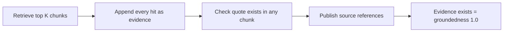
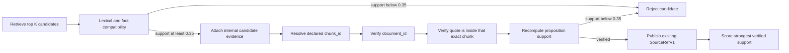

# Semantic Quality and Traceability Hardening

Status: Implemented  
Last updated: 2026-07-22  
Owners: AI Pipeline Team

## 1. Purpose

This is the living implementation guide for semantic-quality enhancements in the Requra AI pipeline. Add future quality, grounding, traceability, or hallucination-control work to this document so teammates can understand why each change exists, where it is implemented, how it is tested, and whether it affects the public contract.

The first implementation addresses two production-readiness problems:

1. Quality scores could report `1.0` even when requirements contained duplicate stories, unrelated citations, incorrect requirement-to-story mappings, or invented acceptance-criteria facts.
2. Retrieved chunks were appended directly to evidence. A quote only needed to exist somewhere in the corpus to pass grounding, even when it belonged to another chunk or did not support the requirement.

## 2. Compatibility constraints

The following integration surfaces remain unchanged:

- API endpoint paths and methods.
- Request payloads and multipart behavior.
- Final `JobResult` structure.
- `RequirementV1`, `UserStoryV1`, `SourceRefV1`, and `QualityReportV1` public fields.
- Existing LangGraph node topology; no new graph nodes were added.

The implementation adds internal evidence metadata. `format_node` consumes this metadata and maps it into existing public fields, especially `SourceRefV1.confidence_score`.

## 3. Previous behavior

The previous evidence flow was effectively:



This produced several false-positive signals:

- A high-ranked but unrelated chunk became a public citation.
- A quote could declare one `chunk_id` but pass because it occurred in a different chunk.
- A source reference inherited requirement extraction confidence rather than citation-support confidence.
- A story counted as traceable when it contained any valid requirement ID, even if its content described another requirement.
- Acceptance-criteria quality mostly checked for boilerplate phrases, not source support.
- Medium and low quality issues did not reduce the aggregate quality score.
- Duplicate detection required the same title and description, missing stories with different titles but identical descriptions.

## 4. New behavior

The hardened flow is:



Retrieval is candidate generation. `evidence_grounding` is the authority that decides which evidence is allowed into the public response.

## 5. Internal evidence metadata

`EvidenceSpan` now includes these internal fields:

| Field | Meaning |
|---|---|
| `origin` | `extracted`, `retrieved`, or `fallback` |
| `lexical_score` | Deterministic requirement-to-quote overlap score |
| `entailment_score` | Reserved support signal; currently the deterministic support score |
| `support_score` | Final internal confidence that the quote supports the requirement |

These fields are not added to the final response structure.

Fallback snippets are capped at `0.70`. This permits a layout- or punctuation-normalized source snippet to remain useful while preventing it from looking as reliable as a clean exact quote. An unrelated fallback still fails because it has insufficient domain-token overlap.

## 6. Deterministic semantic-quality service

File: `ai-service/app/services/semantic_quality.py`

This module centralizes pure, provider-independent checks:

### `meaningful_tokens(text)`

Tokenizes text and removes generic requirements language such as `system`, `shall`, `user`, `given`, `when`, and `then`. This prevents unrelated sentences from appearing similar merely because they share common specification vocabulary.

### `normalized_numbers(text)`

Extracts digit-based numeric claims with optional units, including seconds, hours, days, percentages, and storage sizes.

### `lexical_support(requirement, evidence)`

Computes:

```text
support = 0.75 * requirement_token_recall + 0.25 * evidence_token_precision
```

Recall has the larger weight because a short exact quote can legitimately support a longer normalized requirement.

If both sides contain numeric facts and the evidence introduces incompatible values, support is zero.

### `story_alignment(requirement_texts, story_text)`

Returns the best support score between a story and its linked requirements.

### `unsupported_numeric_claims(text, sources)`

Returns digit-based numeric facts introduced by a story or acceptance criterion but absent from all linked requirement text and evidence quotes.

## 7. Node and service changes

### 7.1 Extraction

File: `ai-service/app/nodes/extract.py`

- Evidence created because the model omitted a quote is marked `origin="fallback"`.
- Evidence whose proposed quote cannot be aligned and is replaced with a source snippet is also marked as fallback.
- This provenance is later used to limit confidence.

### 7.2 Evidence retrieval

File: `ai-service/app/nodes/retrieve_evidence.py`

- `MIN_RETRIEVAL_SUPPORT = 0.35`.
- Original evidence is scored only against its declared chunk.
- Top retrieval results remain candidates until they pass `lexical_support`.
- The node no longer fills the evidence list just to reach the evidence cap.
- Only qualified hits update `evidence_match_score`.
- `quote_support_score` is the strongest verified evidence score, not the fraction of quotes found somewhere in the corpus.
- Requirements with neither valid original evidence nor a qualified retrieval hit receive a weak-evidence warning and confidence penalty.

### 7.3 Evidence grounding

File: `ai-service/app/nodes/evidence_grounding.py`

For each citation, grounding now verifies:

1. The quote is non-empty.
2. The declared `chunk_id` exists.
3. The quote occurs inside that exact chunk.
4. The evidence `document_id`, when supplied, matches the chunk document.
5. The quote supports the requirement with a score of at least `0.35`.

Invalid evidence is removed from the requirement before formatting. If all candidates are removed, the requirement receives a high-severity `missing_verified_evidence` issue.

New or strengthened issue rules include:

- `evidence_chunk_mismatch`
- `evidence_not_grounded`
- `evidence_document_mismatch`
- `evidence_semantic_mismatch`
- `missing_verified_evidence`

### 7.4 Story duplicate detection

File: `ai-service/app/validators/story_validator.py`

Duplicate detection still catches identical title-and-description pairs. It now also compares meaningful description-token sets and flags similarity at or above `0.90`. This catches semantically identical stories whose generated titles differ.

### 7.5 Quality gate

File: `ai-service/app/nodes/quality_gate.py`

The existing quality node now adds semantic checks without changing graph topology:

- A story with linked IDs but alignment below `0.25` receives high-severity `incorrect_story_requirement_mapping`.
- Acceptance criteria introducing numeric facts absent from requirements and evidence receive high-severity `acceptance_criterion_unsupported_fact`.
- Acceptance criteria with insufficient alignment to all linked source facts receive medium-severity `acceptance_criterion_not_source_aligned`.
- Existing generic-criteria, missing-evidence, coverage, confidence, and duplicate checks remain active.

### 7.6 Quality scoring

File: `ai-service/app/services/quality_scoring.py`

Groundedness now uses the strongest verified evidence support for each requirement. Evidence presence alone no longer produces a perfect groundedness score.

Traceability now requires both:

- A valid linked requirement ID.
- Semantic alignment of at least `0.25` for substantive source text.

Acceptance-criteria quality requires criteria to be:

- Non-generic.
- Free from unsupported digit-based numeric facts.
- Aligned with linked requirement text or evidence.

The overall score is now weighted as follows:

```text
overall =
    groundedness * 0.30
  + traceability * 0.25
  + story_completeness * 0.15
  + acceptance_criteria_quality * 0.20
  + uniqueness * 0.10
```

Issue penalty:

```text
penalty = min(
    0.70,
    high_count * 0.15
  + medium_count * 0.05
  + low_count * 0.01
)
```

Severity caps prevent misleading scores:

- Any high-severity issue caps `overall_score` at `0.59`.
- Otherwise, any medium-severity issue caps it at `0.79`.

### 7.7 Final formatting

File: `ai-service/app/nodes/format.py`

The public `SourceRefV1.confidence_score` now uses `EvidenceSpan.support_score`. Legacy evidence without a calculated score is limited to a conservative fallback confidence instead of inheriting the requirement's extraction confidence.

The final response schema is unchanged.

## 8. Threshold summary

| Threshold | Value | Purpose |
|---|---:|---|
| Retrieval support | `0.35` | Minimum score before a retrieved chunk becomes candidate evidence |
| Grounding support | `0.35` | Minimum score before evidence may be publicly cited |
| Story mapping alignment | `0.25` | Minimum story-to-requirement alignment |
| Acceptance-criterion alignment | `0.15` | Minimum criterion-to-source alignment |
| Near-duplicate story similarity | `0.90` | Description-token Jaccard threshold |
| Fallback evidence cap | `0.70` | Maximum confidence for substituted source snippets |
| High-issue overall cap | `0.59` | Prevents high-risk output from appearing production-ready |
| Medium-issue overall cap | `0.79` | Prevents review-required output from appearing perfect |

Threshold changes must be accompanied by fixture evidence and regression tests. Do not tune a threshold solely to make a failing test green.

## 9. Tests

New regression file: `ai-service/tests/services/test_semantic_quality_hardening.py`

Coverage includes:

- Unrelated top retrieval hits are not appended.
- A quote found in another chunk does not validate the declared chunk reference.
- Document-ID mismatch removes evidence.
- Evidence presence with zero support does not produce full groundedness.
- Incorrect story-to-requirement mappings are high severity and reduce traceability.
- Unsupported numeric acceptance facts are detected.
- A medium issue prevents an overall score of `1.0`.

Existing retrieval, grounding, scoring, contract, node, API, worker, and end-to-end tests remain active.

Verification result on 2026-07-22:

```text
340 passed, 1 skipped, 1 warning
```

The warning is an existing Starlette/TestClient deprecation warning regarding `httpx2`; it is unrelated to this implementation.

## 10. Operational behavior and interpretation

- A requirement can remain in the output with no public source references, but it must be marked for review and receive a reduced groundedness score.
- Zero trustworthy citations is preferable to several unrelated citations.
- `relevance_score` answers whether the input is software-related. It must not be interpreted as output correctness.
- `confidence_score` on a requirement remains extraction/classification confidence.
- `confidence_score` on a source reference now means evidence support confidence.
- `traceability_coverage` now means semantically credible requirement linkage, not merely populated IDs.
- An output with high-severity quality issues cannot score above `0.59`.

## 11. Known limitations and next improvements

The current implementation is intentionally deterministic and inexpensive, but it is not a complete natural-language inference engine.

Known limitations:

- Token overlap can miss valid paraphrases with different vocabulary.
- It can overestimate statements that reuse the same nouns but reverse meaning.
- Digit-based numeric detection does not yet normalize number words such as `two`, `twenty-four`, or Arabic numerals written as words.
- The tokenization and generic-term list are currently English-oriented.
- Negation, permission reversal, and temporal-condition reasoning need stronger checks.
- The existing checked-in `response.json` was used as the motivating example but was not regenerated by this code change.

Recommended next enhancements:

1. Add batched LLM or local-NLI adjudication only for ambiguous pairs with deterministic support between approximately `0.25` and `0.60`.
2. Normalize number words, units, dates, percentages, currencies, and durations.
3. Add explicit negation and permission-conflict detection.
4. Add multilingual tokenization and cross-language entailment.
5. Create a golden evaluation for the multipart DOCX/PDF fixture with expected canonical requirements and allowed citations.
6. Measure citation precision and recall separately; do not optimize only for citation coverage.
7. Add dashboards for rejected-evidence rate, fallback-evidence rate, semantic mapping failures, unsupported-fact rate, and quality-score distribution.

## 12. Response-enhancement commits from 2026-07-18

These four commits were made by `HassanAbdelhamed22`. They improve priority propagation, story estimation, and conflict guidance without adding graph nodes or changing the existing API endpoints, request payloads, or final response structure.

| Commit | Enhancement | Main result |
|---|---|---|
| `9c3c632` | Keyword-based priority upgrade | Upgrades a default Medium requirement to High when its text contains configured obligation or urgency terms |
| `2e0d6b1` | Preserve priority during classification | Stops classification from silently resetting an extracted requirement's priority |
| `f31c632` | Dynamic Fibonacci story points | Requests an LLM-generated estimate and carries it into the existing Jira `story_points` field |
| `121ae1e` | Dynamic conflict resolution suggestions | Adds actionable resolution choices to semantic-conflict warnings when the model supplies them |

### 12.1 Keyword-based requirement priority upgrade

Commit: `9c3c632` — `feat(nodes): implement keyword-based priority upgrade heuristic for requirements`

Problem:
- Requirements whose extracted priority was absent defaulted to Medium, even when the text used strong obligation or urgency language.

Implementation:
- Updated `ai-service/app/nodes/extract.py`.
- Normalizes unsupported priority values to Medium.
- If the normalized priority is Medium, upgrades it to High when the requirement contains any of: `shall`, `must`, `mandatory`, `critical`, `essential`, `has to`, or `immediately`.
- Explicit Low, High, and Critical values are preserved.

Data flow:

```text
LLM priority -> normalize allowed value -> apply keyword upgrade when Medium -> extracted requirement
```

Contract impact:
- None. The existing `priority` field and allowed output values are reused.

Tests:
- No dedicated automated regression test was added in this commit.

Operational notes and limitation:
- This is deterministic and inexpensive, but `shall` and `must` commonly express specification modality rather than business urgency. In formal requirements documents, this can upgrade nearly every requirement to High and flatten the priority distribution.
- A future version should prefer explicit source priority, stakeholder/business-impact signals, dependency/critical-path information, and risk. Generic obligation words should have a lower weight or act only as one feature in a multi-signal rule.

### 12.2 Preserve priority through classification

Commit: `2e0d6b1` — `fix(nodes): preserve requirement priority field in classification node`

Problem:
- The classification node reconstructs `ClassifiedRequirement` objects. Because `priority` was not copied, an extracted priority could be lost and replaced by the schema default.

Implementation:
- Updated `ai-service/app/nodes/classify.py`.
- Added `priority` to the shared constructor arguments used by normal classification, special-label handling, and the per-item fallback.
- Added the same propagation to the hard LLM-failure fallback.

Data flow:

```text
extracted priority -> classified requirement -> generated story priority -> final requirement/story/Jira fields
```

Contract impact:
- None. This corrects internal field propagation only.

Tests:
- No dedicated automated regression test was added in this commit.

Recommended regression:
- Create Low, Medium, High, and Critical extracted requirements; exercise successful classification, missing classification, special labels, and LLM failure; assert that every output retains its input priority.

### 12.3 Dynamic Fibonacci story-point estimation

Commit: `f31c632` — `feat(prompts): implement dynamic Fibonacci story points estimation`

Problem:
- Final Jira exports always set `story_points` to `0`, so generated stories did not contain useful relative-effort estimates.

Implementation:
- Updated both `generate_user_stories_v1.md` and `generate_user_stories_v2.md` to require a Fibonacci estimate from `1`, `2`, `3`, `5`, or `8`.
- Added optional `story_points` to the structured LLM response in `ai-service/app/nodes/generate.py`.
- Added `story_points` to the internal `UserStory` schema in `ai-service/app/schemas/items.py`.
- Propagated the generated value into the existing `jira_fields.story_points` field in `ai-service/app/nodes/format.py`.
- Updated prompt snapshot hashes to protect the intentional prompt changes.
- A missing or falsey model value falls back to `0`.

Contract impact:
- No response-shape change. The existing Jira `story_points` field now receives a generated value instead of always receiving zero.

Tests:
- Prompt snapshot expectations were updated.
- No behavioral test was added to enforce the Fibonacci set or validate propagation through the complete pipeline.

Operational notes and limitation:
- The structured schema describes the Fibonacci set but does not strictly constrain it, so a provider may still return another integer.
- Story points are team-relative, not universal hours. For consistent estimates, prompts should include an agreed baseline and examples, and code should validate allowed values before formatting.
- Recommended fallback behavior is to coerce an invalid value to the nearest approved value or `0` with a review warning; this can be implemented internally without changing the response contract.

### 12.4 Dynamic conflict-resolution suggestions

Commit: `121ae1e` — `feat(prompts): generate dynamic conflict resolution suggestions in warnings`

Problem:
- Conflict warnings described the conflict and asked a clarification question but did not give stakeholders actionable choices for resolving it.

Implementation:
- Updated `detect_conflicts_v1.md` to require two or three short resolution options for classifications other than Independent or Duplicate.
- Updated `ai-service/app/nodes/dedupe_requirements.py` to read `resolution_options` and append numbered choices under `Proposed Resolutions` in the existing warning and quality-issue text.
- Updated the prompt snapshot hash.
- Added `ai-service/verify_fixture_results.py`, a command-line helper that fetches an existing job result and displays priorities, story points, warnings, and proposed resolutions for manual verification.

Contract impact:
- None. Resolution options are embedded in the existing warning `message` and quality-issue `details` strings; no new public response field was introduced.

Tests:
- Prompt snapshot expectations were updated.
- The fixture helper supports manual inspection.
- No automated behavioral test was added for missing, malformed, excessive, or unsafe resolution options.

Operational notes and limitation:
- Suggestions are advisory and should not silently modify requirements.
- Because `resolution_options` is parsed from an untyped dictionary, absent or malformed model output can result in no displayed options or undesirable formatting.
- Add normalization that accepts only a list of two or three non-empty strings, limits each option's length, and removes duplicates. Add a warning when a confirmed conflict has no usable suggestion.
- Do not expose secrets or untrusted document instructions through generated suggestions; retain standard prompt-injection defenses and output sanitization.

### 12.5 Combined production-readiness assessment

The four commits correctly reuse existing nodes and fields, so no new graph nodes are required. Their main remaining gaps are validation and regression coverage:

1. Replace the broad priority keyword rule with a calibrated multi-signal heuristic and measure the resulting priority distribution.
2. Add end-to-end tests proving priority survives every classification path.
3. Strictly validate generated story points against `{1, 2, 3, 5, 8}` and record invalid/fallback counts.
4. Validate conflict resolution options and test both valid and missing model output.
5. Add observability for priority upgrades, story-point fallback rate, conflict candidates, confirmed conflicts, and conflicts without usable resolutions.

## 13. How to add the next enhancement

For every future enhancement, append a changelog entry using this template:

```markdown
### YYYY-MM-DD - Enhancement name

Problem:
- What failure or production risk was observed?

Decision:
- What behavior changed and why?

Implementation:
- Files changed.
- Algorithms, thresholds, or prompts added.

Contract impact:
- None, or explicitly describe the approved change.

Tests:
- Regression cases added.
- Full-suite result.

Operational notes:
- Metrics, alerts, rollout flags, or rollback instructions.

Known limitations:
- What remains intentionally unsolved?
```

## 14. Changelog

### 2026-07-22 - Evidence and quality-score hardening

Problem:
- Retrieval hits contaminated public traceability.
- Grounding accepted quotes found in any chunk.
- Evidence presence could produce perfect groundedness.
- Story IDs counted as traceability without content alignment.
- Unsupported acceptance-criteria numbers and near-duplicate stories were missed.

Decision:
- Keep the existing graph and API contract.
- Introduce internal evidence provenance and deterministic support scoring.
- Make grounding authoritative and remove invalid evidence before formatting.
- Penalize semantic problems in the existing quality report.

Implementation:
- Added `semantic_quality.py`.
- Hardened extraction provenance, retrieval, grounding, story validation, quality gate, scoring, and formatting.
- Added focused semantic-quality regressions.

Contract impact:
- None.

Tests:
- `340 passed, 1 skipped, 1 warning`.

Known limitations:
- Deterministic lexical support is not full entailment; ambiguous cases should later use batched NLI adjudication.

### 2026-07-18 - Priority, story-point, and conflict-guidance enhancements

Commits:
- `9c3c632` added keyword-based priority upgrades during extraction.
- `2e0d6b1` preserved priority through all classification paths.
- `f31c632` generated and propagated Fibonacci story points into existing Jira fields.
- `121ae1e` generated actionable conflict-resolution choices inside existing warnings.

Contract impact:
- None. Existing nodes, endpoints, request payloads, and final response structure were retained.

Details and follow-up recommendations:
- See Section 12.
