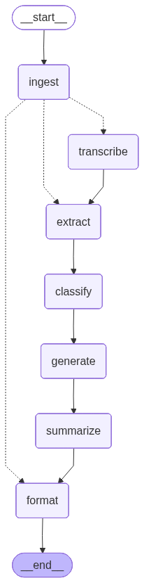

# 🧬 AI Pipeline Architecture

This document explains the technical flow and logic behind the AI requirement extraction and processing pipeline, as visualized in the node diagram below.

## 🗺️ Visual Flow

---

## 🏗️ Node Descriptions

The pipeline is built using **LangGraph** and follows a directed acyclic graph (DAG) structure with conditional routing.

### 1. Ingest Node (`ingest`)
The entry point of the pipeline. It accepts raw file bytes or text input.
- **Responsibility**: Validates input, determines `file_type` (e.g., PDF, Audio), and extracts basic metadata.
- **Routing**: Decisions are made based on the file type. If the input is audio, it routes to `transcribe`.

### 2. Transcribe Node (`transcribe`)
Specialized node for handling audio meeting recordings.
- **Responsibility**: Converts speech to text/transcription.
- **Model**: Utilizes high-performance transcription models (e.g., Whisper) to output raw text for the next stage.

### 3. Extract Node (`extract`)
The "Brain" of the extraction process.
- **Responsibility**: Uses LLM (Gemini) to perform **Entity Extraction**. It scans the raw text specifically for **Functional Requirements**.
- **Output**: Returns a structured list of requirements with assigned IDs, actors, and goals.

### 4. Classify Node (`classify`)
Categorizes the requirements extracted previously.
- **Responsibility**: Labels each requirement (e.g., UI, Backend, Security, Performance) and assigns a confidence score.

### 5. Generate Node (`generate`)
The transformation layer for product development.
- **Responsibility**: Converts each classified requirement into a full-featured **User Story**.
- **Context**: Includes **Acceptance Criteria** in Given-When-Then format where applicable.

### 6. Summarize Node (`summarize`)
Generates high-level executive insights.
- **Responsibility**: Compiles the entire transaction into a short, meaningful summary that highlights the main scope of the document.

### 7. Format Node (`format`)
The finalization layer.
- **Responsibility**: Ensures all states are cleaned up, IDs are sequential, and errors are captured for the final response.

---

## 🚦 Error Handling & Routing
- **Conditional Edges**: After `ingest`, the graph uses a router to determine if a transcription step is necessary.
- **Short-circuiting**: If a critical failure occurs in any early node, the graph can route directly to `format` to provide a consistent (though partial) JSON response.
