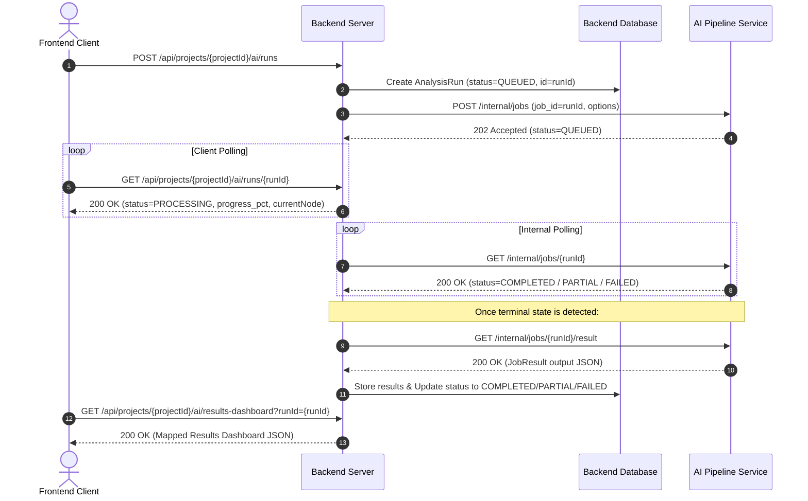

# MVP AI Results Dashboard API Contract & Production Migration Guide

This document defines the unified API contract for the **MVP AI Results Dashboard** and maps the end-to-end integration flow between the **Client (Frontend)**, **Backend Server**, and the **AI Pipeline** (internal service).

It also serves as a migration guide for the backend team to transition from the old/dev endpoints (`/process-json`, `/status/{job_id}`) to the secure, database-backed internal production endpoints (`/internal/jobs`).

---

## 🗺️ Architectural Context & Execution Flow

To ensure high availability, multi-tenant isolation, and resilient processing, the AI analysis pipeline is database-backed and operates asynchronously.



---

## 📱 Client ↔ Backend Server Contract (Aligned with APIDog)

All client-facing endpoints return the standard backend response envelope: `{ "isSuccess": bool, "data": Any, "message": str, "statusCode": int, "errors": [] }`.

> [!NOTE]
> **NO CHANGES REQUIRED:** The Client ↔ Backend Server Contract remains exactly as already specified in APIDog and implemented by the frontend team. The backend team does **not** need to modify any client-facing route logic. All integration adjustments are restricted to the **internal endpoints** (Backend ↔ AI Pipeline) detailed in the sections below.

### 1. Start AI Analysis Run
`POST /api/projects/{projectId}/ai/runs`

Creates an AI analysis run for a project and starts backend-to-AI-pipeline processing. Frontend stores `response.data.id` as `runId`.

#### Request Parameters & Headers
* **Auth**: Bearer Token required (`Authorization: Bearer <JWT>`)
* **Headers**: `X-Request-Id` (optional tracing UUID)
* **Path Parameter**: `projectId` (string, UUID, required)

#### Request Body
```json
{
  "documentIds": [
    "5cdd281c-d2a2-4803-9f2e-4d3804d34ccc"
  ],
  "meetingId": null,
  "analysisType": "project_results_dashboard",
  "language": 0
}
```

#### Request Fields
| Field | Type | Required | Description |
| :--- | :--- | :---: | :--- |
| `documentIds` | array&lt;string&gt; | No | Optional. If empty or omitted, backend uses all ready project documents. |
| `meetingId` | string/null | No | Optional meeting ID when the run is based on a meeting transcript. |
| `analysisType` | string | Yes | MVP supports `project_results_dashboard` only. |
| `language` | integer | No | Existing language enum: `0 = English`, `1 = Arabic`. |

#### Success Response (HTTP `202 Accepted`)
```json
{
  "isSuccess": true,
  "data": {
    "id": "7fa85f64-5717-4562-b3fc-2c963f66afa6",
    "projectId": "73ffe66c-750f-42aa-9bda-0834007caf02",
    "status": "QUEUED",
    "progress": 0,
    "currentNode": "queued",
    "currentNodeLabel": "Queued for AI analysis",
    "message": "AI analysis run created successfully",
    "errorMessage": null,
    "aiJobId": "7fa85f64-5717-4562-b3fc-2c963f66afa6",
    "documentIds": [
      "5cdd281c-d2a2-4803-9f2e-4d3804d34ccc"
    ],
    "meetingId": null,
    "startedAt": null,
    "completedAt": null,
    "createdAt": "2026-06-22T00:00:00Z",
    "updatedAt": "2026-06-22T00:00:00Z"
  },
  "message": "AI analysis run created successfully",
  "statusCode": 202,
  "errors": []
}
```

---

### 2. Get AI Analysis Run Status
`GET /api/projects/{projectId}/ai/runs/{runId}`

Returns processing status for one AI analysis run. Frontend polls this endpoint and never polls AI Pipeline directly.

#### Request Parameters & Headers
* **Auth**: Bearer Token required (`Authorization: Bearer <JWT>`)
* **Path Parameters**:
  * `projectId` (string, UUID, required)
  * `runId` (string, UUID, required)

#### Success Response (HTTP `200 OK`)
```json
{
  "isSuccess": true,
  "data": {
    "id": "7fa85f64-5717-4562-b3fc-2c963f66afa6",
    "projectId": "73ffe66c-750f-42aa-9bda-0834007caf02",
    "status": "PROCESSING",
    "progress": 60,
    "currentNode": "evidence_grounding",
    "currentNodeLabel": "Grounding requirements in source evidence",
    "message": "Grounding requirements in source evidence",
    "errorMessage": null,
    "aiJobId": "7fa85f64-5717-4562-b3fc-2c963f66afa6",
    "documentIds": [
      "5cdd281c-d2a2-4803-9f2e-4d3804d34ccc"
    ],
    "meetingId": null,
    "startedAt": "2026-06-22T00:01:00Z",
    "completedAt": null,
    "createdAt": "2026-06-22T00:00:00Z",
    "updatedAt": "2026-06-22T00:02:00Z"
  },
  "message": "AI analysis run status retrieved successfully",
  "statusCode": 200,
  "errors": []
}
```

---

### 3. Get Results Dashboard
`GET /api/projects/{projectId}/ai/results-dashboard`

Returns the AI findings needed by the Results Dashboard. If `runId` is omitted, backend returns the latest completed run for the project.

#### Request Parameters & Headers
* **Auth**: Bearer Token required (`Authorization: Bearer <JWT>`)
* **Path Parameter**: `projectId` (string, UUID, required)
* **Query Parameter**: `runId` (string, UUID, optional)

#### Success Response (HTTP `200 OK`)
```json
{
  "isSuccess": true,
  "data": {
    "projectId": "73ffe66c-750f-42aa-9bda-0834007caf02",
    "analysisRunId": "7fa85f64-5717-4562-b3fc-2c963f66afa6",
    "status": "COMPLETED",
    "generatedAt": "2026-06-22T00:05:00Z",
    "contractVersion": "1.0",
    "isUseful": true,
    "relevanceScore": 0.95,
    "sourceDocuments": [
      {
        "id": "SRC-001",
        "backendDocumentId": "5cdd281c-d2a2-4803-9f2e-4d3804d34ccc",
        "title": "Requirements Document",
        "type": 0,
        "language": 0,
        "mimeType": "application/pdf"
      }
    ],
    "summary": {
      "executiveSummary": "Short project summary.",
      "keyDecisions": [
        "Use email OTP for account confirmation."
      ],
      "openQuestions": [
        {
          "id": "Q-001",
          "question": "Which payment provider should be used?",
          "sourceDocumentIds": [
            "497f6eca-6276-4993-bfeb-53cbbbba6f08"
          ],
          "sourceRefs": [
            {
              "sourceDocumentId": "SRC-001",
              "backendDocumentId": "5cdd281c-d2a2-4803-9f2e-4d3804d34ccc",
              "page": 3,
              "chunkId": "chunk-001",
              "quote": "The system should allow users to create and track orders."
            }
          ]
        }
      ],
      "risks": [
        {
          "id": "RISK-001",
          "title": "Missing payment provider details",
          "severity": "Low",
          "description": "Payment integration details were not specified.",
          "sourceRefs": [
            {
              "sourceDocumentId": "SRC-001",
              "backendDocumentId": "5cdd281c-d2a2-4803-9f2e-4d3804d34ccc",
              "page": 3,
              "chunkId": "chunk-001",
              "quote": "The system should allow users to create and track orders."
            }
          ]
        }
      ],
      "assumptions": [],
      "actionItems": [
        {
          "id": "ACT-001",
          "title": "Confirm payment provider",
          "owner": null,
          "priority": "Low",
          "sourceRefs": [
            {
              "sourceDocumentId": "SRC-001",
              "backendDocumentId": "5cdd281c-d2a2-4803-9f2e-4d3804d34ccc",
              "page": 3,
              "chunkId": "chunk-001",
              "quote": "The system should allow users to create and track orders."
            }
          ]
        }
      ],
      "stakeholders": [
        "Customer",
        "Admin"
      ],
      "scope": [
        "Order management"
      ],
      "outOfScope": []
    },
    "metrics": {
      "totalRequirements": 12,
      "functionalRequirements": 9,
      "nonFunctionalRequirements": 2,
      "businessRequirements": 1,
      "userStories": 12,
      "highPriorityItems": 4,
      "risksCount": 2,
      "openQuestionsCount": 3,
      "warningsCount": 1,
      "qualityIssuesCount": 0
    },
    "requirements": [
      {
        "id": "REQ-001",
        "title": "Manage orders",
        "description": "The system should allow users to create and track orders.",
        "type": "Functional",
        "priority": "Low",
        "confidenceScore": 0.91,
        "sourceDocumentIds": [
          "5cdd281c-d2a2-4803-9f2e-4d3804d34ccc"
        ],
        "sourceRefs": [
          {
            "sourceDocumentId": "SRC-001",
            "backendDocumentId": "5cdd281c-d2a2-4803-9f2e-4d3804d34ccc",
            "page": 3,
            "chunkId": "chunk-001",
            "quote": "The system should allow users to create and track orders."
          }
        ]
      }
    ],
    "userStories": [
      {
        "id": "US-001",
        "title": "Create order",
        "description": "As a customer, I want to create an order so that I can buy products.",
        "userStory": "As a customer, I want to create an order so that I can buy products.",
        "acceptanceCriteria": [
          {
            "id": "AC-001",
            "text": "Given valid order data, when I submit the order, then the order is created.",
            "format": "given_when_then"
          }
        ],
        "priority": "Low",
        "requirementId": "REQ-001",
        "sourceRefs": [
          {
            "sourceDocumentId": "SRC-001",
            "backendDocumentId": "5cdd281c-d2a2-4803-9f2e-4d3804d34ccc",
            "page": 3,
            "chunkId": "chunk-001",
            "quote": "The system should allow users to create and track orders."
          }
        ]
      }
    ],
    "requirementCoverages": [
      {
        "requirementId": "REQ-001",
        "userStoryIds": [
          "US-001"
        ],
        "coverageStatus": "covered"
      }
    ],
    "exports": {
      "excel": {
        "available": true,
        "columns": [
          "id",
          "title",
          "description",
          "priority"
        ],
        "rows": [
          {
            "id": "US-001",
            "title": "Create order"
          }
        ]
      },
      "jira": {
        "available": false,
        "issueType": "Story",
        "rows": [
          {
            "property1": "string",
            "property2": "string"
          }
        ]
      }
    },
    "artifacts": {
      "excelFile": {
        "available": false,
        "fileUrl": "",
        "fileName": "",
        "mimeType": "application/vnd.openxmlformats-officedocument.spreadsheetml.sheet"
      }
    },
    "qualityIssues": [
      {
        "id": "QI-001",
        "severity": "Low",
        "message": "Some requirements have low confidence.",
        "targetId": "REQ-003"
      }
    ],
    "warnings": [
      {
        "code": "LOW_CONFIDENCE",
        "message": "Some extracted items may require manual review."
      }
    ],
    "error": {
      "code": "PROCESSING_FAILED",
      "message": "Failed to process input.",
      "details": {
        "property1": "string",
        "property2": "string"
      }
    },
    "processingTimeMs": 125
  },
  "message": "AI results dashboard retrieved successfully",
  "statusCode": 200,
  "errors": []
}
```

---

### 4. Export Results Dashboard
`GET /api/projects/{projectId}/ai/results-dashboard/export`

Exports dashboard findings as xlsx or csv. If runId is omitted, backend exports the latest completed run for the project.

#### Request Parameters & Headers
* **Auth**: Bearer Token required (`Authorization: Bearer <JWT>`)
* **Path Parameter**: `projectId` (string, UUID, required)
* **Query Parameters**:
  * `runId` (string, UUID, optional. If omitted, backend returns the latest completed run for the project)
  * `format` (enum string, required: `xlsx` or `csv`)

#### Success Response (HTTP `200 OK`)
```json
{
  "isSuccess": true,
  "data": {
    "fileName": "project-results-dashboard.xlsx",
    "fileUrl": "https://storage.requra.ai/exports/project-results-dashboard.xlsx",
    "format": "xlsx",
    "expiresAt": "2026-06-14T10:00:00Z"
  },
  "message": "Results dashboard exported successfully",
  "statusCode": 200,
  "errors": []
}
```

---

## ⚙️ Backend ↔ AI Pipeline Production Contract (`/internal/*`)

All internal endpoints require authorization. The backend must pass `Authorization: Bearer <AI_INTERNAL_SERVICE_TOKEN>`.

### 1. Create/Enqueue Job
`POST /internal/jobs`

Initializes and dispatches a background job. It is idempotent based on `job_id`.

#### Request Body
```json
{
  "job_id": "analysis-run-uuid",
  "tenant_id": "tenant-uuid-1",
  "project_id": "project-uuid-1",
  "requested_by": "user-uuid-1",
  "input_type": "text",
  "content": "Combined extracted requirements document text...",
  "source_documents": [
    {
      "document_id": "doc-uuid-1",
      "file_type": "pdf",
      "mime_type": "application/pdf",
      "storage_key": "s3://requra-docs/doc-1.pdf",
      "file_url": "https://storage.requra.ai/doc-1.pdf"
    }
  ],
  "options": {
    "generate_user_stories": true,
    "generate_summary": true,
    "enable_embeddings": false,
    "enable_hybrid_retrieval": false,
    "language": "en"
  },
  "reprocess": false
}
```

#### Request Payload Field Reference & Data Sources

| Field | Type | Required | Description | Source (Where the Backend gets it) |
| :--- | :--- | :---: | :--- | :--- |
| `job_id` | string | Yes | Unique identifier for the job (`^[A-Za-z0-9._-]{1,128}$`). | Generated by the backend when starting the run; maps to `runId`. |
| `tenant_id` | string | No | Tenant ID for logical data partitioning (optional). | Retrieved from the backend database/tenant session context (can be omitted/null). |
| `project_id` | string | Yes | Project ID for grouping documents. **Must not be null or omitted.** | Extracted from the URL parameters `{projectId}`. |
| `requested_by` | string | No | User ID initiating the request. | Extracted from the authenticated user JWT session token. |
| `input_type` | string | Yes | Type of input being sent: `text`, `backend_document`, `backend_transcript`, `backend_audio`. | Hardcoded depending on what is being analyzed (files = `backend_document`; text = `text`). |
| `content` | string | No | Inline text content (required for `text` or `backend_transcript`). | Extracted from the combined text content of the project sources (if text). |
| `source_documents` | array | No | Reference documents to parse (required for `backend_document` or `backend_audio`). | Query the project's uploaded documents in the backend database. |
| `options` | object | No | Run-time execution options. **Optional (defaults applied if omitted). Must not be null if provided.** | Hardcoded/configured application defaults. |
| `reprocess` | boolean | No | Force a rerun of an existing job as a new attempt instead of returning the cached result. | Set to `true` if client requests a rebuild/retry, otherwise `false`. |

#### `source_documents` Array Object Structure

| Field | Type | Required | Description | Source (Where the Backend gets it) |
| :--- | :--- | :---: | :--- | :--- |
| `document_id` | string | Yes | Stable unique identifier of the document. | Retrieved from the backend document database record. |
| `file_type` | string | No | File extension (e.g. `"pdf"`, `"docx"`, `"txt"`). | Extracted from document file extension or MIME type mapping. |
| `mime_type` | string | No | Standard MIME type (e.g. `"application/pdf"`). | Stored in the backend database during file upload. |
| `storage_key` | string | No | Cloud storage key (e.g. `"s3://requra-docs/file.pdf"`). | From backend file upload record. |
| `file_url` | string | No | Direct access URL for downloading the file. **(Read Note below regarding file formats)** | Generated as a temporary pre-signed URL by the backend's cloud storage service. |

> [!IMPORTANT]
> **MVP File Ingestion & Future Compatibility:**
> * **Option A (Payload Content)**: The backend can extract the plain text of documents or audio recordings on their side and pass the merged text directly in the top-level `"content"` field (setting `"input_type": "text"`). This is the simplest option for the MVP.
> * **Option B (Text URLs)**: The backend can upload the pre-extracted text or transcript file to Cloudinary as a `.txt` file and supply the address in `"file_url"` (setting `"input_type": "backend_document"`).
> * **Future Upgrade**: In a future pipeline update, the AI Pipeline will natively handle raw binary downloads (PDF/Audio) directly from this same `"file_url"` parameter. 
> * **Zero API Impact**: When this future update is deployed, **the request payload structure will remain 100% identical**. The backend team will simply swap the `.txt` URLs in `file_url` with the raw `.pdf`/`.mp3` URLs. No backend integration code changes will be required.

#### `options` Object Structure

| Field | Type | Default | Description | Source (Where the Backend gets it) |
| :--- | :--- | :---: | :--- | :--- |
| `generate_user_stories` | boolean | `true` | If `true`, generates Given-When-Then criteria. | Default value or application settings. |
| `generate_summary` | boolean | `true` | If `true`, generates executive summaries. | Default value or application settings. |
| `enable_embeddings` | boolean | `false` | If `true`, generates and stores semantic vectors. | Stored configuration (set to `false` for MVP). |
| `enable_hybrid_retrieval` | boolean | `false` | If `true`, combines BM25 and vector similarity search. | Stored configuration (set to `false` for MVP). |
| `language` | string | `"en"` | Two-letter output language code (e.g., `"en"`, `"ar"`). | Mapped from Client's enum value (`0` maps to `"en"`, `1` maps to `"ar"`). |
| `callback_url` | string | null | Webhook endpoint to notify backend on completion. | Stored configuration for the backend callback controller. |

#### Success Response (HTTP `202 Accepted`)
```json
{
  "job_id": "analysis-run-uuid",
  "status": "QUEUED",
  "attempt_number": 1,
  "idempotent": false,
  "links": {
    "self": "/internal/jobs/analysis-run-uuid",
    "result": "/internal/jobs/analysis-run-uuid/result",
    "cancel": "/internal/jobs/analysis-run-uuid/cancel",
    "retry": "/internal/jobs/analysis-run-uuid/retry"
  }
}
```

---

### 2. Get Job Status
`GET /internal/jobs/{job_id}`

Fetches current state details from the database. This endpoint **excludes** the full generated `result` payload to optimize network payload size.

#### Response (HTTP `200 OK`)
```json
{
  "job_id": "analysis-run-uuid",
  "status": "PROCESSING",
  "progress_pct": 65,
  "current_node": "evidence_grounding",
  "error": null,
  "created_at": 1780000000.0,
  "updated_at": 1780001200.0,
  "completed_at": null,
  "attempt_number": 1,
  "tenant_id": "tenant-uuid-1",
  "project_id": "project-uuid-1",
  "input_type": "text",
  "error_code": null,
  "warning_count": 0,
  "quality_score": null,
  "links": {
    "result": "/internal/jobs/analysis-run-uuid/result",
    "cancel": "/internal/jobs/analysis-run-uuid/cancel",
    "retry": "/internal/jobs/analysis-run-uuid/retry"
  }
}
```

---

### 3. Get Persisted Job Result
`GET /internal/jobs/{job_id}/result`

Fetches the complete result JSON (`JobResult`) upon job completion.

* **Status check**: Returns `HTTP 409 Conflict` if processing is not yet complete.
* **Success Output (HTTP `200 OK`)**:
```json
{
  "contract_version": "1.0",
  "job_id": "analysis-run-uuid",
  "status": "completed",
  "is_useful": true,
  "relevance_score": 0.95,
  "source_documents": [],
  "requirements": [],
  "user_stories": [],
  "requirement_coverages": [],
  "summary": null,
  "exports": {
    "excel": { "available": false, "columns": [], "rows": [] },
    "jira": { "available": false, "issue_type": "Story", "rows": [] }
  },
  "artifacts": {
    "excel_file": {
      "available": false,
      "file_url": "",
      "file_name": "",
      "mime_type": "application/vnd.openxmlformats-officedocument.spreadsheetml.sheet"
    }
  },
  "quality_issues": [],
  "warnings": [],
  "error": null,
  "processing_time_ms": 125
}
```

---

### 4. Cancel Job
`POST /internal/jobs/{job_id}/cancel`

Requests cooperative cancellation. If the job is still `QUEUED`, it is immediately marked `CANCELLED`.

#### Response (HTTP `200 OK`)
```json
{
  "job_id": "analysis-run-uuid",
  "status": "CANCELLED",
  "cancelled": true
}
```

---

### 5. Retry Job
`POST /internal/jobs/{job_id}/retry`

Triggers a new execution attempt for a job that reached `FAILED` or `CANCELLED` status. Returns `409` if the job is active or completed.

#### Response (HTTP `202 Accepted`)
```json
{
  "job_id": "analysis-run-uuid",
  "status": "QUEUED",
  "attempt_number": 2,
  "links": {
    "self": "/internal/jobs/analysis-run-uuid",
    "result": "/internal/jobs/analysis-run-uuid/result",
    "cancel": "/internal/jobs/analysis-run-uuid/cancel",
    "retry": "/internal/jobs/analysis-run-uuid/retry"
  }
}
```

---

### 6. Regenerate User Story
`POST /internal/stories/regenerate`

Stateless endpoint to refine and regenerate a single user story with descriptive human feedback instruction.

#### Request Body
```json
{
  "requirement_text": "Employees must be able to request inventory items.",
  "requirement_type": "FR",
  "actor": "Employee",
  "goal": "request inventory items",
  "priority": "Medium",
  "feedback": "Add validation to check if the user has requested the item in the last 24 hours.",
  "original_story": "As an employee, I want to request inventory items, so that I can receive the resources I need.",
  "source_context": "Inventory management policy manual section 4.1."
}
```

#### Success Response (HTTP `200 OK`)
```json
{
  "title": "Request inventory item",
  "description": "As an employee, I want to request inventory items, so that I can receive the resources I need.",
  "acceptance_criteria": [
    {
      "id": "US-001_ac_1",
      "text": "Given the employee wants to request an item, when they submit the request, then the system verifies they have not requested the item in the last 24 hours.",
      "criterion_type": "Given-When-Then"
    }
  ],
  "labels": ["FR"]
}
```

### 7. Webhook Callback Notification (Optional)
If a `callback_url` is specified in the job creation options (`options.callback_url`), the AI Pipeline will automatically send an asynchronous HTTP `POST` request to that URL once processing enters a terminal state.

Using webhooks is the recommended way to retrieve analysis results because it eliminates the need for polling loops.

#### Webhook Request Payload
```json
{
  "job_id": "analysis-run-uuid",
  "tenant_id": "tenant-uuid-1",
  "project_id": "project-uuid-1",
  "status": "COMPLETED",
  "result": {
    "contract_version": "1.0",
    "job_id": "analysis-run-uuid",
    "status": "completed",
    "is_useful": true,
    "relevance_score": 0.95,
    "source_documents": [],
    "requirements": [],
    "user_stories": [],
    "requirement_coverages": [],
    "summary": null,
    "exports": {
      "excel": { "available": false, "columns": [], "rows": [] },
      "jira": { "available": false, "issue_type": "Story", "rows": [] }
    },
    "artifacts": {
      "excel_file": {
        "available": false,
        "file_url": "",
        "file_name": "",
        "mime_type": "application/vnd.openxmlformats-officedocument.spreadsheetml.sheet"
      }
    },
    "quality_issues": [],
    "warnings": [],
    "error": null,
    "processing_time_ms": 125
  }
}
```

#### Webhook Payload Fields
| Field | Type | Description |
| :--- | :--- | :--- |
| `job_id` | string | Unique identifier for the job; maps to backend `runId`. |
| `tenant_id` | string | Tenant identifier passed during job creation. |
| `project_id` | string | Project identifier passed during job creation. |
| `status` | string | The terminal status of the job (`COMPLETED`, `PARTIAL`, `NEEDS_REVIEW`, `REJECTED`, `FAILED`, `CANCELLED`). |
| `result` | object/null | The complete `JobResult` JSON contract model (null if the execution failed entirely). |

---

## 🔀 AI Status → Backend Public Status Mapping

The database persistence layer tracks precise execution states. Below is the mapping from the internal AI status values to backend public status values:

| Internal DB Status | AI pipeline `result.status` | Backend Public Polling status | Backend Dashboard Status |
| :--- | :---: | :--- | :--- |
| `QUEUED` | *None* (null) | `QUEUED` | *N/A (Dashboard not available)* |
| `PROCESSING` | *None* (null) | `PROCESSING` | *N/A (Dashboard not available)* |
| `COMPLETED` | `completed` | `COMPLETED` | `COMPLETED` |
| `PARTIAL` | `partial` | `COMPLETED` | `PARTIAL` (Dashboard warning state) |
| `NEEDS_REVIEW` | *None* | `COMPLETED` | `NEEDS_REVIEW` (Dashboard review banner) |
| `REJECTED` | `rejected` | `COMPLETED` | `REJECTED` (Show rejected/empty state) |
| `FAILED` | `failed` (or null) | `FAILED` | `FAILED` (Show failure state with retry) |
| `CANCELLED` | *None* (null) | `FAILED` | `FAILED` (Show failure state with retry) |

---

## 📐 Field Mapping: AI Result → Dashboard DTO
The Backend must translate `snake_case` properties from the AI Pipeline `JobResult` into the `camelCase` model consumed by the Frontend:

| AI Pipeline Result Field | Backend Results Dashboard DTO Field |
| :--- | :--- |
| `contract_version` | `contractVersion` |
| `job_id` | `analysisRunId` |
| `status` | mapped to uppercase dashboard `status` |
| `is_useful` | `isUseful` |
| `relevance_score` | `relevanceScore` |
| `source_documents` | `sourceDocuments` |
| `user_stories` | `userStories` |
| `requirement_coverages` | `requirementCoverages` |
| `quality_issues` | `qualityIssues` |
| `processing_time_ms` | `processingTimeMs` |
| `summary.executive_summary` | `summary.executiveSummary` |
| `summary.key_decisions` | `summary.keyDecisions` |
| `summary.open_questions` | `summary.openQuestions` |
| `summary.action_items` | `summary.actionItems` |
| `summary.out_of_scope` | `summary.outOfScope` |
| `user_stories[].user_story` | `userStories[].description` (primary story text display) |
| `user_stories[].acceptance_criteria[].text` | list representation of acceptance criteria |
| `requirements[].confidence_score` | `requirements[].confidenceScore` |
| `artifacts.excel_file` | `artifacts.excelFile` |

---

## 🔄 Old to New Integration Migration Guide

If the backend has already integrated with the older `/process-json` and `/status/{job_id}` endpoints, the team must make **five changes**:

### Change 1: Add Authorization Headers
Modify the API client calls to the AI service to include the `Authorization` header with the shared service token:
```text
Authorization: Bearer <AI_INTERNAL_SERVICE_TOKEN>
```

### Change 2: Update Initiation Route & Payload
* **Endpoint**: Change destination from `POST /process-json` to `POST /internal/jobs`.
* **Payload Fields**:
  * Move `job_id` out of metadata to the payload root.
  * Add the mandatory `tenant_id` at the root.
  * Move `project_id` from metadata to the payload root.
  * In `source_documents`, rename `backend_document_id` to `document_id`.
  * Convert `source_type` to `input_type` (`"text"`, `"backend_document"`, `"backend_transcript"`, `"backend_audio"`).
  * Group language and generation toggles into an `options` block.

#### Payload Migration Example:
```diff
{
- "job_id": "analysis-run-uuid",
- "source_type": "multi_document",
- "content": "Combined text...",
- "source_documents": [
-   {
-     "backend_document_id": "doc-uuid-1",
-     "title": "Requirements Document"
-   }
- ],
- "metadata": {
-   "project_id": "project-uuid"
- }
+ "job_id": "analysis-run-uuid",
+ "tenant_id": "tenant-uuid-1234",
+ "project_id": "project-uuid",
+ "requested_by": "user-uuid-99",
+ "input_type": "text",
+ "content": "Combined text...",
+ "source_documents": [
+   {
+     "document_id": "doc-uuid-1",
+     "title": "Requirements Document"
+   }
+ ],
+ "options": {
+   "generate_user_stories": true,
+   "generate_summary": true,
+   "language": "en"
+ }
}
```

### Change 3: Update Polling Endpoint
* **Endpoint**: Change from `GET /status/{job_id}` to `GET /internal/jobs/{job_id}`.
* **Status Vocabulary**: Note that internal status values are exact, database-persisted states and are returned in uppercase (`QUEUED`, `PROCESSING`, `COMPLETED`, `PARTIAL`, `NEEDS_REVIEW`, `REJECTED`, `FAILED`, `CANCELLED`).

### Change 4: Separate Status from Result Fetching
* **Old Behavior**: Read the `result` field directly from the status response once completed.
* **New Behavior**: The status endpoint no longer returns results inline. Once the status reaches a terminal state, perform a single `GET` call to the new result endpoint:
  ```http
  GET /internal/jobs/{job_id}/result
  ```

### Change 5: Leverage Cancel and Retry (New Capabilities)
* To abort execution (e.g. if the user cancels from the dashboard), send:
  `POST /internal/jobs/{job_id}/cancel`
* To retry a failed execution, send:
  `POST /internal/jobs/{job_id}/retry` (no request payload required, it uses the persisted job fingerprint).
