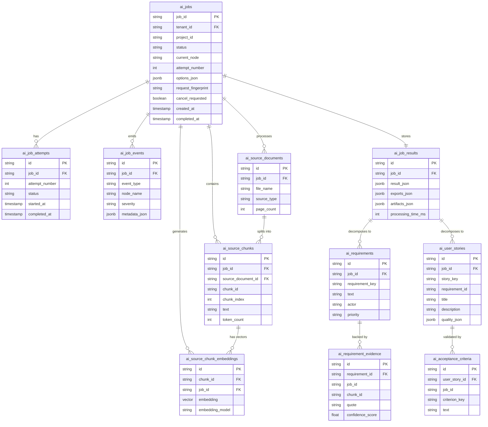

# Database Schema and Operations Guide

This document describes the database schema, entity relationships, and programmatic operations of the **Requra AI Pipeline** database hosted on **Neon**.

## 1. Neon Database Environment

The database runs on the Neon Serverless PostgreSQL platform with the following configuration:
*   **Organization**: `Requra AI` (ID: `org-icy-lake-30319553`)
*   **Project**: `requra-ai-pipeline` (ID: `delicate-king-42264771`)
*   **Region / Cloud**: AWS US West 2 (`aws-us-west-2`)
*   **Proxy Host**: `us-west-2.aws.neon.tech`
*   **Engine Version**: PostgreSQL v17
*   **Extensions**: `pgvector` (used for semantic embedding search)

---

## 2. Entity-Relationship & Architecture Overview

The database is structured into four primary logical areas:
1.  **Job & Lifecycle Control**: Job states, attempts, execution events, and cancellation/idempotency markers.
2.  **RAG Corpus**: Source documents, text chunks, and pgvector embeddings.
3.  **Extracted AI Results**: Normalized entities representing extracted requirements, user stories, acceptance criteria, coverage metrics, and quality details.
4.  **Raw Results Payload**: The full JSON document returned by the AI pipeline, serving as the source-of-truth contract.



---

## 3. Database Table Definitions

The tables are defined in the SQLAlchemy models file:
[models.py](file:///c:/ITI_GP/src/ai-pipeline/ai-service/app/store/db/models.py)

### 3.1. Job Control & Logging Tables

#### `ai_jobs`
Stores status, config options, progress metrics, and idempotency keys for every asynchronous job request.
*   **Definition**: [models.py:L54-98](file:///c:/ITI_GP/src/ai-pipeline/ai-service/app/store/db/models.py#L54-98)
*   **Columns**:
    *   `job_id` (`VARCHAR(128)`): Primary Key. Distinct job ID supplied by the client.
    *   `tenant_id` (`VARCHAR(128)`), `project_id` (`VARCHAR(128)`): Tenant and project scopes (both indexed).
    *   `status` (`VARCHAR(16)`): Execution state (`QUEUED`, `PROCESSING`, `COMPLETED`, `FAILED`, `CANCELLED`, `PARTIAL`, `REJECTED`).
    *   `current_node` (`VARCHAR(64)`): The active LangGraph node executing the job (e.g. `build_source_index`, `extract_requirements`).
    *   `progress_pct` (`INTEGER`): Job completion percent (0-100).
    *   `attempt_number` (`INTEGER`): Tracks current run attempt (resets and increments on retry).
    *   `options_json` (`JSONB`): Packed JobOptions settings (e.g., whether to generate user stories or enable embeddings).
    *   `cancel_requested` (`BOOLEAN`): Cooperative cancellation flag polled by worker nodes.
    *   `request_fingerprint` (`VARCHAR(64)`): Deterministic SHA-256 hash of the request payload to ensure idempotency.
    *   `duplicate_request_count` (`INTEGER`): Number of times the same payload/job ID was repeatedly requested.
    *   `last_duplicate_request_at` (`TIMESTAMP WITH TIME ZONE`): Last collision timestamp.
    *   `created_at`, `queued_at`, `started_at`, `completed_at`, `failed_at`, `cancelled_at`, `updated_at` (`TIMESTAMP WITH TIME ZONE`): Lifecycle timestamps.

#### `ai_job_events`
Incremental execution events emitted by pipeline nodes, useful for streaming progress logs to callers.
*   **Definition**: [models.py:L101-112](file:///c:/ITI_GP/src/ai-pipeline/ai-service/app/store/db/models.py#L101-112)
*   **Columns**:
    *   `id` (`VARCHAR(32)`): Primary Key (UUID hex).
    *   `job_id` (`VARCHAR(128)`): Foreign Key referencing `ai_jobs.job_id` (cascaded on delete).
    *   `event_type` (`VARCHAR(64)`): Event categorization (e.g., node entry/exit, warning, custom checkpoint).
    *   `node_name` (`VARCHAR(64)`): LangGraph node that spawned the event.
    *   `message` (`TEXT`): User-friendly description of the event.
    *   `severity` (`VARCHAR(16)`): Importance level (`info`, `warning`, `error`).
    *   `metadata_json` (`JSONB`): Key-value baggage related to the log.

#### `ai_job_attempts`
Records starting time, end time, and errors for every specific retry run of a job.
*   **Definition**: [models.py:L114-130](file:///c:/ITI_GP/src/ai-pipeline/ai-service/app/store/db/models.py#L114-130)
*   **Columns**:
    *   `id` (`VARCHAR(32)`): Primary Key (UUID hex).
    *   `job_id` (`VARCHAR(128)`): Foreign Key referencing `ai_jobs.job_id` (cascaded on delete).
    *   `attempt_number` (`INTEGER`): Attempt number.
    *   `status` (`VARCHAR(16)`): Status of this specific attempt.
    *   `started_at`, `completed_at`, `created_at` (`TIMESTAMP WITH TIME ZONE`): Lifecycle timestamps.
    *   `error_code` (`VARCHAR(64)`), `error_message` (`TEXT`): Failure reason.
*   **Constraints**: Unique constraint on `(job_id, attempt_number)`.

---

### 3.2. RAG (Retrieval Augmented Generation) Tables

#### `ai_source_documents`
Stores file metadata for files parsed by the pipeline. The database stores references and hashes, never the raw file contents.
*   **Definition**: [models.py:L132-149](file:///c:/ITI_GP/src/ai-pipeline/ai-service/app/store/db/models.py#L132-149)
*   **Columns**:
    *   `id` (`VARCHAR(32)`): Primary Key (UUID hex).
    *   `job_id` (`VARCHAR(128)`): Foreign key.
    *   `source_type` (`VARCHAR(32)`): File classification (e.g. `text`, `backend_document`, `backend_audio`).
    *   `file_name` (`VARCHAR(512)`), `mime_type` (`VARCHAR(128)`): Original file properties.
    *   `storage_key` (`TEXT`), `file_url` (`TEXT`): Storage path/URL.
    *   `sha256_hash` (`VARCHAR(64)`): Checksum.
    *   `page_count` (`INTEGER`): PDF/Doc page count.

#### `ai_source_chunks`
Text chunks parsed out of source documents, indexed for grounding checks and semantic retrieval.
*   **Definition**: [models.py:L151-179](file:///c:/ITI_GP/src/ai-pipeline/ai-service/app/store/db/models.py#L151-179)
*   **Columns**:
    *   `id` (`VARCHAR(32)`): Primary Key.
    *   `job_id` (`VARCHAR(128)`): Foreign key.
    *   `source_document_id` (`VARCHAR(32)`): Foreign key referencing `ai_source_documents.id`.
    *   `chunk_id` (`VARCHAR(128)`): Document-scoped chunk ID.
    *   `chunk_index` (`INTEGER`): Sequencing position of the chunk.
    *   `text` (`TEXT`): Parsed text content.
    *   `page_number` (`INTEGER`): Original document page number (if applicable).
    *   `speaker` (`VARCHAR(128)`): Speaker identifier (for audio/transcript imports).
    *   `start_time_sec` / `end_time_sec` (`DOUBLE PRECISION`): Audio timestamp offsets.
    *   `token_count` (`INTEGER`): Sub-word token size.
*   **Constraints**: Unique constraint on `(job_id, chunk_id)`.

#### `ai_source_chunk_embeddings`
Dense vector vectors generated from text chunks for semantic similarity queries.
*   **Definition**: [models.py:L181-196](file:///c:/ITI_GP/src/ai-pipeline/ai-service/app/store/db/models.py#L181-196)
*   **Columns**:
    *   `id` (`VARCHAR(32)`): Primary Key.
    *   `chunk_id` (`VARCHAR(128)`): Chunk identifier.
    *   `job_id` (`VARCHAR(128)`): Foreign key referencing `ai_jobs.job_id`.
    *   `embedding_model` (`VARCHAR(128)`): Model used to generate embeddings (e.g. `text-embedding-3-small`).
    *   `embedding` (`Vector` or `JSONB`): **Vector(1536)** column matching the model's dimensions. Uses pgvector for high-performance cosine similarity comparisons. Falls back to `JSONB` if pgvector is unavailable.

---

### 3.3. AI Extracted Entities & Quality Tables

#### `ai_job_results`
Stores the full JSON document returned by the AI pipeline. Serves as the source-of-truth payload.
*   **Definition**: [models.py:L325-339](file:///c:/ITI_GP/src/ai-pipeline/ai-service/app/store/db/models.py#L325-339)
*   **Columns**:
    *   `id` (`VARCHAR(32)`): Primary Key.
    *   `job_id` (`VARCHAR(128)`): Foreign Key. Unique constraint maps this 1:1 with jobs.
    *   `result_json` (`JSONB`): The complete serialized contract result (includes requirements, user stories, coverages, quality metrics).
    *   `exports_json` (`JSONB`): Formatted exports for external platforms.
    *   `artifacts_json` (`JSONB`): Secondary file links/outputs.
    *   `processing_time_ms` (`BIGINT`): Pipeline execution time in milliseconds.

#### `ai_requirements`
Normalized list of requirements extracted from source documents by AI nodes.
*   **Definition**: [models.py:L198-221](file:///c:/ITI_GP/src/ai-pipeline/ai-service/app/store/db/models.py#L198-221)
*   **Columns**:
    *   `id` (`VARCHAR(32)`): Primary Key.
    *   `job_id` (`VARCHAR(128)`): Foreign Key.
    *   `requirement_key` (`VARCHAR(64)`): Unique key (e.g., `REQ-001`).
    *   `text` (`TEXT`): Detailed requirement statement.
    *   `actor` (`VARCHAR(256)`): Primary persona/role associated with the requirement.
    *   `type` (`VARCHAR(32)`): Category (e.g., `Functional`, `Non-Functional`).
    *   `labels_json` (`JSONB`): Custom tags/labels.
    *   `priority` (`VARCHAR(16)`): Importance level.
    *   `confidence_score` (`DOUBLE PRECISION`): AI model confidence in the extraction.
    *   `needs_review` (`BOOLEAN`): Flag indicating verification anomalies.
    *   `deduplication_key` (`VARCHAR(128)`): Key used to identify duplicate requirements.

#### `ai_requirement_evidence`
Grounds requirements by mapping them to specific chunk IDs and quoting the verbatim text context.
*   **Definition**: [models.py:L223-236](file:///c:/ITI_GP/src/ai-pipeline/ai-service/app/store/db/models.py#L223-236)
*   **Columns**:
    *   `id` (`VARCHAR(32)`): Primary Key.
    *   `requirement_id` (`VARCHAR(32)`): Foreign Key referencing `ai_requirements.id` (cascaded).
    *   `job_id` (`VARCHAR(128)`): Job scoping link.
    *   `chunk_id` (`VARCHAR(128)`): Grounding text chunk source.
    *   `quote` (`TEXT`): Exact supporting text snippet.
    *   `confidence_score` (`DOUBLE PRECISION`): Evidential match strength.

#### `ai_user_stories`
Normalized agile user stories synthesized from extracted requirements.
*   **Definition**: [models.py:L238-256](file:///c:/ITI_GP/src/ai-pipeline/ai-service/app/store/db/models.py#L238-256)
*   **Columns**:
    *   `id` (`VARCHAR(32)`): Primary Key.
    *   `job_id` (`VARCHAR(128)`): Foreign Key.
    *   `story_key` (`VARCHAR(64)`): Standard story key (e.g., `US-001`).
    *   `requirement_id` (`VARCHAR(64)`): Source requirement key mapping.
    *   `title` (`TEXT`), `description` (`TEXT`): User story content.
    *   `priority` (`VARCHAR(16)`): Priority level.
    *   `quality_json` (`JSONB`): AI quality checklist validation.
    *   `jira_fields_json` (`JSONB`): Mapping target fields for JIRA export.

#### `ai_acceptance_criteria`
Functional validation criteria linked to user stories.
*   **Definition**: [models.py:L258-268](file:///c:/ITI_GP/src/ai-pipeline/ai-service/app/store/db/models.py#L258-268)
*   **Columns**:
    *   `id` (`VARCHAR(32)`): Primary Key.
    *   `user_story_id` (`VARCHAR(32)`): Foreign Key referencing `ai_user_stories.id`.
    *   `criterion_key` (`VARCHAR(64)`): Key (e.g. `AC-1`).
    *   `text` (`TEXT`): Gherkin/Plain verification text.
    *   `criterion_type` (`VARCHAR(32)`): Formatting type (`plain`, `gherkin`).

#### `ai_requirement_coverages`
Traceability mapping linking requirements to their matching user stories and criteria.
*   **Definition**: [models.py:L270-281](file:///c:/ITI_GP/src/ai-pipeline/ai-service/app/store/db/models.py#L270-281)
*   **Columns**:
    *   `id` (`VARCHAR(32)`): Primary Key.
    *   `job_id` (`VARCHAR(128)`): Foreign key.
    *   `requirement_id` (`VARCHAR(64)`): Source requirement key.
    *   `coverage_type` (`VARCHAR(64)`): Mapping coverage index (`full`, `partial`, `none`).
    *   `story_ids_json` (`JSONB`): List of matching story IDs.
    *   `acceptance_criteria_ids_json` (`JSONB`): List of matching AC IDs.
    *   `reason` (`TEXT`): Explanation of coverage anomalies.

#### `ai_quality_reports`
Overall metric summary scores for traceability coverage, duplicate risk, and story quality.
*   **Definition**: [models.py:L283-299](file:///c:/ITI_GP/src/ai-pipeline/ai-service/app/store/db/models.py#L283-299)
*   **Columns**:
    *   `id` (`VARCHAR(32)`): Primary Key.
    *   `job_id` (`VARCHAR(128)`): Foreign Key. Unique mapping per job.
    *   `overall_score` / `traceability_coverage` / `groundedness_score` / `story_completeness` / `acceptance_criteria_quality` (`DOUBLE PRECISION`): AI model verification scores.
    *   `duplicate_risk` (`DOUBLE PRECISION`): Probability of redundant items.
    *   `requirement_count` / `story_count` / `high_severity_issue_count` (`INTEGER`): Counters.
    *   `report_json` (`JSONB`): Nested raw quality metrics.

#### `ai_quality_issues`
Specific validation rule violations (e.g., vague criteria, missing actors) identified by quality checks.
*   **Definition**: [models.py:L301-312](file:///c:/ITI_GP/src/ai-pipeline/ai-service/app/store/db/models.py#L301-312)
*   **Columns**:
    *   `id` (`VARCHAR(32)`): Primary key.
    *   `job_id` (`VARCHAR(128)`): Foreign key.
    *   `item_id` (`VARCHAR(64)`): ID of the failed requirement or user story.
    *   `item_type` (`VARCHAR(32)`): Type of item (`requirement`, `user_story`).
    *   `severity` (`VARCHAR(16)`): Violation level (`low`, `medium`, `high`).
    *   `rule_violated` (`VARCHAR(128)`): Name of the validation rule (e.g. `USER_STORY_FORMAT`).
    *   `details` (`TEXT`): Detailed explanation and tips to fix the issue.

#### `ai_pipeline_warnings`
Non-fatal execution pipeline exceptions captured during node runs.
*   **Definition**: [models.py:L314-323](file:///c:/ITI_GP/src/ai-pipeline/ai-service/app/store/db/models.py#L314-323)
*   **Columns**:
    *   `id` (`VARCHAR(32)`): Primary key.
    *   `job_id` (`VARCHAR(128)`): Foreign key.
    *   `node_name` (`VARCHAR(64)`): The node where the warning was raised.
    *   `code` (`VARCHAR(64)`): Warning code (e.g. `SOURCE_INDEX_EMPTY`).
    *   `message` (`TEXT`): Warning explanation.

---

## 4. Functionality Operations in the Codebase

### 4.1. Job Creation & Idempotency
When a client requests a job processing run, the API checks for duplicate submissions using a SHA-256 fingerprint of the options and file content hash.

*   **Fingerprint Generation**: In [service.py:L203](file:///c:/ITI_GP/src/ai-pipeline/ai-service/app/api/service.py#L203), the request parameters are serialized and hashed.
*   **Atomic Persistence**: In [repositories.py:L101-148](file:///c:/ITI_GP/src/ai-pipeline/ai-service/app/store/db/repositories.py#L101-148), `PgJobStore.create_or_get` executes a PostgreSQL `INSERT ... ON CONFLICT (job_id) DO NOTHING` command:
    ```sql
    INSERT INTO ai_jobs (job_id, status, request_fingerprint, ...)
    VALUES (:job_id, 'QUEUED', :fingerprint, ...)
    ON CONFLICT (job_id) DO NOTHING;
    ```
    If a conflict occurs, it locks the winning row with `SELECT FOR UPDATE` to read the state safely.
*   **Duplicate Counting**: If a duplicate request arrives, `PgJobStore.mark_duplicate` (in [repositories.py:L149-159](file:///c:/ITI_GP/src/ai-pipeline/ai-service/app/store/db/repositories.py#L149-159)) increments the collision counters:
    ```sql
    UPDATE ai_jobs 
    SET duplicate_request_count = duplicate_request_count + 1, 
        last_duplicate_request_at = :now 
    WHERE job_id = :job_id;
    ```

### 4.2. RAG Corpus Parsing and Insertion
The source files are parsed into text fragments and loaded into the database for downstream grounding.
*   **Process Entrypoint**: In the worker processing pipeline, [persistence.py:L40-103](file:///c:/ITI_GP/src/ai-pipeline/ai-service/app/worker/persistence.py#L40-103) collects the parsed fragments from the state.
*   **Document Insertion**: Inserts document metadata using `save_documents` (in [repositories.py:L600-630](file:///c:/ITI_GP/src/ai-pipeline/ai-service/app/store/db/repositories.py#L600-630)) which deletes previous entries for the job ID and inserts a fresh document row.
*   **Chunk Insertion**: Bulk inserts chunk text mappings using `save_chunks` (in [repositories.py:L631-658](file:///c:/ITI_GP/src/ai-pipeline/ai-service/app/store/db/repositories.py#L631-658)):
    ```sql
    DELETE FROM ai_source_chunks WHERE job_id = :job_id;
    INSERT INTO ai_source_chunks (job_id, chunk_id, chunk_index, text, ...) 
    VALUES (:job_id, :chunk_id, :chunk_idx, :text, ...);
    ```

### 4.3. Dense Embedding Generation & Storage
If options dictate embedding support, vectors are generated for each chunk.
*   **Generation**: Done inside the `build_source_index` LangGraph node in [build_source_index.py:L26-59](file:///c:/ITI_GP/src/ai-pipeline/ai-service/app/nodes/build_source_index.py#L26-59).
*   **Insertion**: Invokes `PgEmbeddingStore.save_embeddings` (in [repositories.py:L719-738](file:///c:/ITI_GP/src/ai-pipeline/ai-service/app/store/db/repositories.py#L719-738)), wiping old embeddings for the job and inserting new vector records.

### 4.4. Hybrid Grounding Retrieval (pgvector Distance)
During requirement evidence collection, pgvector executes cosine similarity calculations.
*   **Execution**: Called in the `retrieve_evidence` LangGraph node in [retrieve_evidence.py:L131-152](file:///c:/ITI_GP/src/ai-pipeline/ai-service/app/nodes/retrieve_evidence.py#L131-152).
*   **Distance Query**: `PgEmbeddingStore.vector_search` (in [repositories.py:L753-783](file:///c:/ITI_GP/src/ai-pipeline/ai-service/app/store/db/repositories.py#L753-783)) runs a query using pgvector's `<=>` (cosine distance) operator:
    ```sql
    SELECT chunk_id, job_id, (embedding <=> :query_embedding) AS distance
    FROM ai_source_chunk_embeddings
    WHERE tenant_id = :tenant_id AND project_id = :project_id
    ORDER BY distance ASC
    LIMIT :top_k;
    ```
    This ensures strict tenant partitioning, meaning semantic recall never leaks data across project boundaries.

### 4.5. Result Decomposition & Saving
When the extraction pipeline finishes, the final results are saved and decomposed.
*   **Entrypoint**: [persistence.py:L106-131](file:///c:/ITI_GP/src/ai-pipeline/ai-service/app/worker/persistence.py#L106-131) collects the output and calls `save_result`.
*   **Raw Output Storage**: `PgResultStore.save_result` (in [repositories.py:L388-432](file:///c:/ITI_GP/src/ai-pipeline/ai-service/app/store/db/repositories.py#L388-432)) inserts the raw JSON in the `ai_job_results` table.
*   **Decomposition**: The private `_decompose` method (in [repositories.py:L434-569](file:///c:/ITI_GP/src/ai-pipeline/ai-service/app/store/db/repositories.py#L434-569)) splits the nested payload and updates individual normalized tables (`ai_requirements`, `ai_user_stories`, `ai_quality_reports`, etc.) so that they are indexed and queryable for analytics dashboards.

### 4.6. Data Expiry & Cascade Cleanup
To comply with data policies and prevent disk growth, completed jobs can be deleted.
*   **Execution**: The worker periodically invokes `PgJobStore.cleanup_expired` (in [repositories.py:L363-381](file:///c:/ITI_GP/src/ai-pipeline/ai-service/app/store/db/repositories.py#L363-381)) with a TTL window:
    ```sql
    SELECT job_id FROM ai_jobs 
    WHERE status IN ('COMPLETED', 'FAILED', 'CANCELLED', 'PARTIAL', 'REJECTED') 
      AND updated_at < :cutoff;
    ```
    SQLAlchemy's `ondelete="CASCADE"` foreign key configurations ensure that deleting a row in `ai_jobs` automatically cleans up all associated attempts, events, chunks, embeddings, requirements, stories, and results in one atomic transaction.

---

## 5. Querying the Neon Database Directly

For manual testing, debugging, or validation of the database states, developers can execute raw SQL queries against the Neon database using a command-line script.

### 5.1. Using JavaScript Query Runner
If you are working with Node.js tools in the companion workspace projects, you can use the [run-query.js](file:///c:/dev/apps/jahez/server/scripts/run-query.js) script:

*   **Script Path**: [run-query.js](file:///c:/dev/apps/jahez/server/scripts/run-query.js) (defined at [run-query.js:L1-37](file:///c:/dev/apps/jahez/server/scripts/run-query.js#L1-37)).
*   **Usage**:
    Ensure the `DATABASE_URL` is configured in your `.env` file or supplied as an argument.
    
    ```bash
    # Run the default query (shows current database name and user)
    node scripts/run-query.js

    # Run a custom query to view all active jobs
    node scripts/run-query.js "postgresql://..." "SELECT job_id, status, current_node FROM ai_jobs LIMIT 10;"
    ```

### 5.2. Using psql or Neon Console
You can also connect to the Neon database directly using any PostgreSQL client (`psql`, pgAdmin, or DBeaver) or through the Neon Web SQL Editor.
*   **Host**: `us-west-2.aws.neon.tech`
*   **SSL Mode**: Required (`sslmode=require` or `{ rejectUnauthorized: false }` programmatically).
