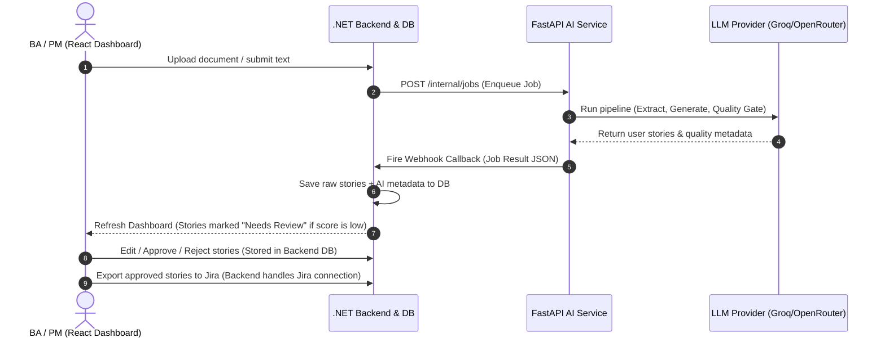

# Human-in-the-Loop Review Workflow & Regeneration

## 1. Overview

Artificial Intelligence is highly effective at extracting structure and drafting user stories from unstructured requirements, but it is not infallible. Large Language Models (LLMs) can introduce hallucinations, misinterpret business context, or generate syntactically correct but functionally incomplete user stories. To ensure production-grade specifications, **human supervision is a hard requirement**.

The **Human-in-the-Loop (HITL) Review Workflow** provides the verification gate where Business Analysts (BAs) or Product Managers (PMs) review, modify, approve, or reject AI-generated outputs before they are exported to production issue trackers like Jira or Azure DevOps.

### The Core Distinction: Intelligence Output vs. Workflow Management
A key design principle of this architecture is separating **AI-derived metadata** from **user-driven state**:
* **AI Intelligence Output**: The assessment of the content quality made by the AI *during processing* (e.g., confidence scores, rule violations, and warnings). This is static once the job completes.
* **User Workflow Management**: The lifecycle phase where humans edit, approve, reject, or export the requirements. This state changes dynamically over time based on user actions.

---

## 2. Architectural Decisions & Separation of Concerns

### Why the AI Service is Stateless (No CRUD Lifecycle)
Managing the CRUD (Create, Read, Update, Delete) state of the review lifecycle (such as setting a user story as "approved" or storing user-edited text) is **not** the responsibility of the AI Service. 

We rejected the idea of placing review state and editing endpoints in the AI Service. Doing so would violate the **Single Responsibility Principle** and introduce severe architectural anti-patterns:
1. **Stateful Coupling**: The AI Service would need a database database schema for user edits, approval histories, and permission controls.
2. **Duplicated Persistence**: Both the .NET Backend and the FastAPI AI Service would end up caching/storing user story text and statuses, leading to synchronization bugs.
3. **Scalability Obstruction**: Stateless AI services are easy to scale horizontally. Adding stateful user operations makes container scaling complex and expensive.

### Separation of State Types

To keep boundaries clean, we divide state into two distinct categories:

| State Category | Fields | Owner | Description |
|---|---|---|---|
| **AI Decision State** | `confidence_score`, `needs_review`, `quality_issues`, `warnings` | **AI Service** | Static metadata generated during pipeline execution. Tells the user *why* the AI flagged a requirement. |
| **User Workflow State** | `generated`, `needs_review`, `edited`, `approved`, `rejected`, `exported` | **.NET Backend** | Dynamic workflow statuses updated by user interactions in the database. |

---

## 3. Final Architecture Flow

The workflow utilizes a clean downstream propagation model, keeping the AI Service as a pure processor:



### Component Responsibilities
* **React Dashboard**: Renders generated stories, highlights items flagged with `needs_review=true`, and provides editing/actions forms.
* **.NET Backend & Database**: Acts as the single source of truth for the active specifications, tracks user review state, and handles external integrations (Jira, Confluence).
* **FastAPI AI Service**: Processes text, extracts requirements, generates user stories, scores quality, runs repair cycles, and returns immutable intelligence data.

---

## 4. The Single-Story Regeneration Endpoint

While the AI Service does not manage the review state, it **must** provide the intelligence to refine stories based on human feedback. To support this, we implemented the `POST /internal/stories/regenerate` endpoint.

```
                  ┌─────────────────────────────────┐
                  │          .NET Backend           │
                  └─────────────────────────────────┘
                                   │
                                   │ POST /internal/stories/regenerate
                                   ▼
┌───────────────────────────────────────────────────────────────────────┐
│                          FASTAPI AI SERVICE                           │
│                                                                       │
│  Request:                                                             │
│    - requirement_text: "System shall do X"                            │
│    - feedback: "Make it focus on email auth, not SSO"                 │
│    - original_story: "As a user..." (optional)                        │
│    - source_context: "Meeting note context..." (optional)              │
│                                                                       │
│  Processing:                                                          │
│    - Format prompt using templates/regenerate_story_v1.md             │
│    - Stateless LLM Invoke                                             │
│    - Regex JSON clean + Pydantic validation                           │
│                                                                       │
│  Response:                                                            │
│    - Newly refined UserStory JSON                                     │
└───────────────────────────────────────────────────────────────────────┐
                                   │
                                   ▼ Returns Refined Story
                  ┌─────────────────────────────────┐
                  │   Saved in Database by Backend  │
                  └─────────────────────────────────┘
```

### Purpose & Stateless Nature
When a BA/PM rejects a story and types feedback (e.g. *"Focus on authentication flow, we don't need profile management yet"*), the backend calls the regeneration endpoint. 
This is a **pure stateless inference request**. The AI Service does not look up the database, does not create background jobs, and does not save the story. It simply receives input, calls the LLM, validates the schema, and returns the result.

### Request & Response Structures

#### Request (`POST /internal/stories/regenerate`)
* **Headers**: `Authorization: Bearer <token>`
* **Body**:
```json
{
  "requirement_text": "The system shall authenticate users using email and password.",
  "requirement_type": "FR",
  "actor": "user",
  "priority": "High",
  "feedback": "Focus on email auth. Ensure we validate password complexity.",
  "original_story": "As a user, I want to authenticate, so that I can login.",
  "source_context": "Business Rule BR-10 states passwords must be at least 8 characters long."
}
```

#### Response
```json
{
  "title": "Email Authentication with Password Validation",
  "description": "As a user, I want to register and login using my email and password, so that I can securely access the system and ensure my password meets complexity rules.",
  "acceptance_criteria": [
    {
      "id": "ac_1",
      "text": "Given a user on the registration page, when they enter a password less than 8 characters, then the system rejects it and shows an error.",
      "criterion_type": "Given-When-Then"
    },
    {
      "id": "ac_2",
      "text": "Given a user with a valid email and password, when they submit the credentials, then they are authenticated successfully.",
      "criterion_type": "Given-When-Then"
    }
  ],
  "labels": ["FR"]
}
```

---

## 5. Implementation Details

### Schemas & Models
The request and response payloads are modeled via Pydantic in `app/api/schemas.py`:
* **[`RegenerateStoryRequest`](file:///d:/ITI/GP/ai-pipeline/ai-service/app/api/schemas.py#L74)**:
  - `requirement_text` (Required)
  - `requirement_type` (FR/NFR/BR)
  - `actor` / `goal` / `priority` (Optional)
  - `feedback` (Required instructions)
  - `original_story` (Optional, provides the starting point for edits)
  - `source_context` (Optional, passes supplementary business/technical context)
* **[`RegenerateStoryResponse`](file:///d:/ITI/GP/ai-pipeline/ai-service/app/api/schemas.py#L96)**:
  - `title` / `description`
  - `acceptance_criteria`: Bound with `Field(default_factory=list)` to avoid mutable default sharing bugs.
  - `labels`: Defaults to list.

### Prompt Management
Prompt templates are kept out of code in `app/prompts/templates/regenerate_story_v1.md`. 
* Uses a system instructions prompt enforcing GWT (Given-When-Then) criteria, English response, singular actors, and JSON formatting.
* Prompts are protected by snapshot hash checks in [`test_prompt_snapshots.py`](file:///d:/ITI/GP/ai-pipeline/ai-service/tests/prompts/test_prompt_snapshots.py) to prevent accidental edits from altering the production outputs without updating tests.

### Security, Timeouts & Error Handling
* **Authentication**: Guarded by `require_internal_auth` dependency. Callers must present a matching `Bearer` token.
* **Timeout Safety**: Wrapped with `asyncio.wait_for` mapped to `settings.PROVIDER_TIMEOUT_SECONDS` (default: 120s) to prevent LLM calls from hanging client requests indefinitely. Raises `504 Gateway Timeout` on trigger.
* **Parsing Safety**: The raw LLM content is cleaned of markdown fences (e.g. ` ```json ` blocks), run through `json.loads()`, and validated against `RegenerateStoryResponse`. If validation fails, it throws a `502 Bad Gateway` describing the schema mismatches rather than failing silently or returning garbage.

---

## 6. Design Decisions & Rejected Alternatives

### Rejected Alternative: LangGraph pause and resume (`interrupt()`)
Instead of a post-processing dashboard, we evaluated using LangGraph's native state persistence and the `interrupt()` function to pause the pipeline run when a requirement is ambiguous or fails validation. The run would wait for human input via a UI stepper before completing.

**Why we rejected it**:
* **Connection Overhead**: Holding background job threads and keeping connection state alive over HTTP clients is highly fragile in distributed systems.
* **State Complexity**: It would force the AI Service to become stateful (storing active thread states, checkpoints, and wait-signals), contradicting the core design principle.
* **UI Lock**: BA/PMs prefer to review all requirements in a bulk dashboard asynchronously rather than being interrupted by a blocking wizard for each issue.
