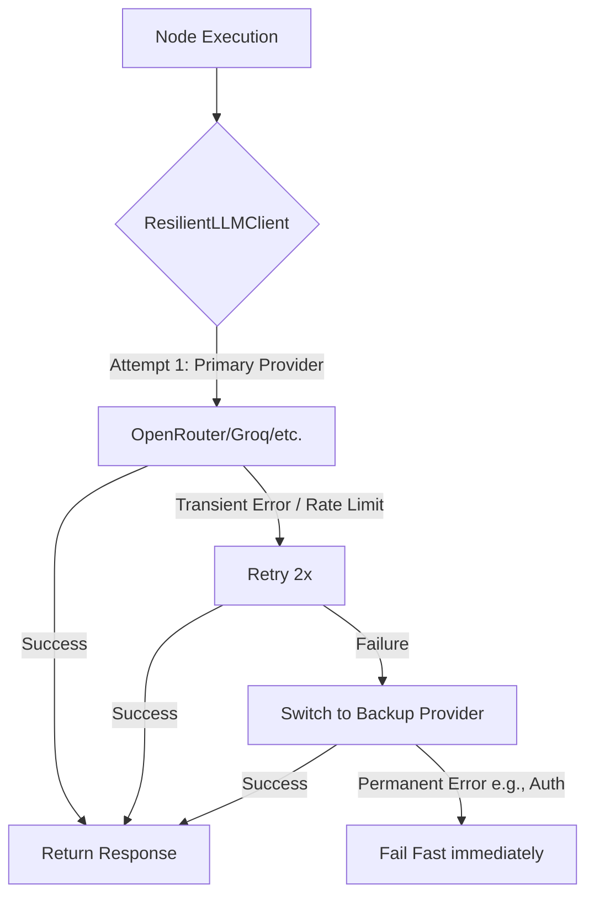
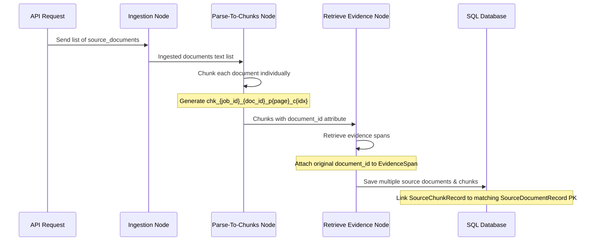

# Technical Implementation Walkthrough: LLM Fallback & Multi-Document Awareness

We have completed the implementation and end-to-end verification of two major feature enhancements in the AI Pipeline:
1. **Dynamic LLM Fallback (Gap 4)**: A resilient, multi-provider retry/routing client.
2. **Multi-Document Awareness (Gap 5)**: Full traceability of chunking, evidence, and database persistence across multiple documents.

---

## 1. Dynamic LLM Fallback (Gap 4)

### 1.1 Architecture & Design
To avoid modifying core LangChain classes directly, we created a lightweight, resilient model client wrapper called `ResilientLLMClient`. This client intercepts calls to the LLM execution layer, wraps them in a retry loop, and automatically fails over to backup providers if the primary provider fails.

### 1.2 Key Components & File Changes
* **[config.py](file:///d:/ITI/GP/ai-pipeline/ai-service/app/config.py)**:
  - Added configuration support for `LLM_FALLBACK_CHAIN`, parsed from a structured JSON list of provider and model definitions.
  - Implemented safe JSON decoding and schema validation utilities for runtime settings.
* **[llm.py](file:///d:/ITI/GP/ai-pipeline/ai-service/app/llm.py)**:
  - Created the `ResilientLLMClient` wrapper class implementing synchronous `.invoke()` and asynchronous `.ainvoke()` protocols.
  - Standardized error classification to distinguish **transient/retryable errors** (Rate Limits, Network Timeouts, Connection Failures) from **permanent failures** (Authentication Errors, Validation Failures).
  - Preserved full backward compatibility: when `LLM_FALLBACK_CHAIN` is empty or unset, the system defaults to the raw `ChatOpenAI` client.
  - Enriched execution metadata in the final message (`AIMessage.response_metadata`) containing:
    - `provider` & `model`
    - `latency_ms`
    - `token_usage` (prompt, completion, and total tokens)

---

## 2. Multi-Document Awareness (Gap 5)

### 2.1 Chunking, Traceability, & Grounding
Previously, the system assumed a single ingested file. We overhandled the entire graph execution path to trace, index, ground, and persist requirements to their individual source files when multiple documents are supplied in a job.

### 2.2 Key Components & File Changes
* **[items.py](file:///d:/ITI/GP/ai-pipeline/ai-service/app/schemas/items.py)**:
  - Declared `document_id` tracking fields on `SourceChunk` and `EvidenceSpan` Pydantic models.
* **[pipeline_state.py](file:///d:/ITI/GP/ai-pipeline/ai-service/app/schemas/pipeline_state.py) & [state.py](file:///d:/ITI/GP/ai-pipeline/ai-service/app/worker/state.py)**:
  - Extended the `PipelineState` schema definition to include `source_documents`.
  - Preserved the fetched plain text of each source document directly inside the initial state list.
* **[parse_to_chunks.py](file:///d:/ITI/GP/ai-pipeline/ai-service/app/nodes/parse_to_chunks.py)**:
  - Modified the chunker to loop over each document in `source_documents` individually.
  - Constructed deterministic chunk IDs: `chk_{job_id}_{doc_id}_p{page}_c{idx}` (or `pNone` for unpaged text).
* **[extract.py](file:///d:/ITI/GP/ai-pipeline/ai-service/app/nodes/extract.py) & [retrieve_evidence.py](file:///d:/ITI/GP/ai-pipeline/ai-service/app/nodes/retrieve_evidence.py)**:
  - Copied the `document_id` from source chunks to `EvidenceSpan` instances created during LLM extraction and lexical BM25/hybrid RAG grounding.
* **[format.py](file:///d:/ITI/GP/ai-pipeline/ai-service/app/nodes/format.py)**:
  - Resolved evidence spans to correct source document V1 metadata in the output payload.
  - Added a regex-based fallback to extract `document_id` from the `chunk_id` string if the field was lost at a serialization boundary.
* **[persistence.py](file:///d:/ITI/GP/ai-pipeline/ai-service/app/worker/persistence.py)**:
  - Modified standard DB writing so that **each document** in the request is inserted as a distinct `SourceDocumentRecord` in the database.
  - Mapped each `SourceChunkRecord`'s foreign key `source_document_id` to its corresponding document record's auto-generated primary key ID, ensuring absolute auditability at the SQL layer.

---

## 3. Walkthrough of Verification & Testing

### 3.1 Automated Tests
All unit and integration tests are compiled and execute perfectly. 
- **LLM Fallback Client Tests** (`tests/test_llm_fallback.py`):
  - Verified RateLimit errors trigger switching to fallback provider.
  - Verified Authentication errors fail fast without retries.
- **Multi-Document Awareness Tests** (`tests/nodes/test_multi_doc_awareness.py`):
  - Verified sliding window chunker handles multiple documents and outputs correct chunk IDs.
  - Verified format node maps different evidence sources correctly.
- **Total Test Count**: **314 passed** (100% green).

### 3.2 APIdog Manual Verification
We tested the multi-document endpoint manually via APIdog using local mock route files:
- Send `POST` to `/internal/jobs` with the document URLs pointing to `http://localhost:8000/mock-doc-a` and `http://localhost:8000/mock-doc-b`.
- The final response correctly references `"source_id": "doc-uuid-b"` and `"document_name": "doc-uuid-b"` for quotes extracted from the second document, and `"source_id": "doc-uuid-a"` for quotes from the first, verifying full end-to-end integration.
