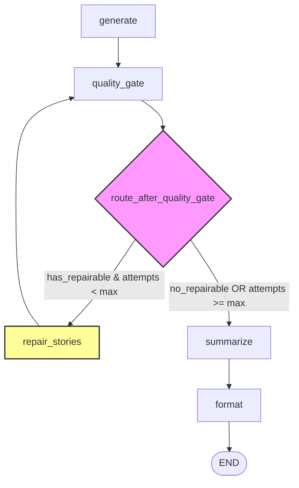

# Quality-Guided Repair Pass (Self-Correction Flow)

## 1. Overview

One-shot AI generation often suffers from minor structural or formatting failures. An LLM may generate a high-quality user story but forget to supply the minimum number of acceptance criteria, output boilerplate text (e.g. *"works as expected"*), or fail the required Agile phrasing structure ("As a..., I want..., so that...").

Simply detecting these quality issues and flagging them is not enough. If the system only flags them, it shifts the burden of structural formatting cleanup back to the human reviewer.

The **Quality-Guided Repair Pass** is a self-correction mechanism designed to automatically identify, re-prompt, and repair structurally invalid user stories before they reach the user, maintaining high output quality while keeping the system stateless.

### Quality Evaluation vs. Quality Repair
* **Quality Evaluation (`quality_gate`)**: A passive validation step. It scans requirements and user stories, checks them against structural rules, compiles a list of `QualityIssue` objects, and updates quality scores. It **never** alters the generated data.
* **Quality Repair (`repair_stories`)**: An active healing step. It reads the quality issues generated by the evaluation step, selects stories with fixable errors, calls the LLM with specific repair instructions, and updates the data.

---

## 2. Architecture & Graph Concept

The self-correction logic is implemented using a conditional loop in the LangGraph workflow:



### Why a Separate Repair Node?
Rather than combining validation and repair into a single node, we split them. This decision aligns with key software engineering principles:
1. **Single Responsibility Principle (SRP)**: `quality_gate` is strictly responsible for validation and reporting; `repair_stories` is strictly responsible for correction and LLM interactions.
2. **Observability**: Separation creates clean logging checkpoints. Operators can easily tell if a job went through a repair cycle by tracking the nodes visited (`generate → quality_gate → repair_stories → quality_gate → summarize`).
3. **Easier Testing**: The validation logic can be tested in isolation without having to mock the regeneration LLM calls, and vice-versa.
4. **Cleaner Graph Design**: Keeps the DAG topology readable and modular.

---

## 3. Repair Strategy & Controls

Self-correction loops can easily run out of control, bloating LLM costs and degrading performance. We implemented strict boundaries to contain the cycle:

### The Feature Flag (`ENABLE_QUALITY_REPAIR`)
The repair pass is gated behind the `ENABLE_QUALITY_REPAIR` boolean environment variable. When set to `false` (default), the router bypasses the repair pass entirely and goes straight to summarization. This allows operators to run raw pipelines when low latency is preferred over corrected formatting.

### Maximum Attempts (`MAX_REPAIR_ATTEMPTS = 1`)
We set the default repair budget limit to **1 attempt**. This is crucial for:
* **Preventing Infinite Loops**: If the LLM repeatedly fails validation, the loop terminates immediately after 1 retry.
* **Cost Controls**: Limits the maximum LLM token cost to exactly $2\times$ the baseline story generation cost.
* **Latency Predictability**: Prevents the user request from hanging for multiple cycles.

### Per-Story Repair (Batched & In-place)
When validation fails, we do **not** re-generate the entire list of user stories. Doing so would degrade performance, waste tokens, and risk changing user stories that already passed quality checks perfectly.

Instead:
* We identify **only the individual stories** that failed validation.
* We **batch** only the failed stories and their respective quality issues into a single repair LLM call.
* We merge the repaired stories back into the list **in-place**. All passing stories are kept **byte-for-byte identical** (preserving object memory references), guaranteeing that good outputs are never touched or altered by the repair pass.

---

## 4. Repairable vs. Non-Repairable Issues

We draw a strict line between structural mistakes (which the AI is allowed to fix) and business decisions (which must be left to the human BA/PM).

```
   ┌────────────────────────────────────────────────────────┐
   │                     QUALITY GATE                       │
   └────────────────────────────────────────────────────────┘
          │                                  │
          ▼ Repairable                       ▼ Non-Repairable
  (Structural/Formatting)                (Business Ambiguity)
┌───────────────────────────┐         ┌───────────────────────────┐
│ - Missing Acceptance Crit │         │ - Missing Evidence        │
│ - Generic Criteria        │         │ - Low-Confidence Category │
│ - Description Shape       │         │ - Semantic Conflicts      │
│ - Missing/Empty Title     │         │ - Scope Ambiguities       │
└───────────────────────────┘         └───────────────────────────┘
          │                                  │
          ▼                                  ▼
┌───────────────────────────┐         ┌───────────────────────────┐
│ Route to: repair_stories  │         │ Route to: summarize       │
│ (AI self-corrects)        │         │ (BA/PM resolves in UI)    │
└───────────────────────────┘         └───────────────────────────┘
```

* **Repairable Issues (Whitelisted)**:
  - `story_missing_acceptance`
  - `story_description_shape` / `weak_description`
  - `story_empty_title` / `missing_title`
  - `generic_acceptance_criteria` / `all_generic_acceptance_criteria`
  - `insufficient_acceptance_criteria`
* **Non-Repairable Issues (Blacklisted)**:
  - `missing_evidence`: Indicates the requirement lacks backing text in the source document.
  - `semantic_conflict_contradiction`: Indicates two requirements contradict each other. The AI must not make a business guess on which requirement wins.
  - `low_confidence_classification`: The category is ambiguous and requires human verification.

---

## 5. Node Implementation Details

### Processing Steps inside the Repair Node
1. **Filter Issues**: Scan `state["quality_issues"]`. If an issue's `item_type` is `"story"`, its `rule_violated` matches the whitelist, and the corresponding story still exists, it is marked for repair.
2. **Build Context Map**: For each failed story, we gather:
   - The original story text and acceptance criteria.
   - The specific quality issues found.
   - The original requirement text (retrieved from `classified_requirements`) for context.
3. **Execute Single LLM Batch Call**: Format the batched stories and issues using the [`repair_stories_v1.md`](file:///d:/ITI/GP/ai-pipeline/ai-service/app/prompts/templates/repair_stories_v1.md) system prompt.
4. **Clean and Parse**: Extract the JSON, validate against the Pydantic helper schema, and construct a map of `story_id → repaired_story`.
5. **In-Place Replace**: Loop through the original story list. If a story was repaired, replace it with the new object; otherwise, keep the original reference.
6. **Archive Quality Issues**: Instead of deleting resolved issues, we remove them from `state["quality_issues"]` and append them to the internal **`state["resolved_quality_issues"]`** list. Non-repairable issues are kept in the active list.
7. **Increment Attempts**: Increment `repair_attempts` counter.

### Internal-Only State Tracking
To keep the public `JobResult` contract clean of internal execution metadata, the state variables `repair_attempts` and `resolved_quality_issues` live strictly within the `PipelineState` TypedDict. They are discarded during formatting and never returned to the API client or stored as output result schema fields.

---

## 6. LangGraph & Router Integration

### Router Logic
The conditional routing is handled by [`route_after_quality_gate`](file:///d:/ITI/GP/ai-pipeline/ai-service/app/graph/router.py#L16):

```python
def route_after_quality_gate(state: PipelineState) -> str:
    if not getattr(settings, "ENABLE_QUALITY_REPAIR", False):
        return "summarize"
        
    attempts = state.get("repair_attempts", 0)
    if attempts >= getattr(settings, "MAX_REPAIR_ATTEMPTS", 1):
        return "summarize"
        
    issues = state.get("quality_issues", []) or []
    stories = state.get("user_stories", []) or []
    story_ids = {s.id for s in stories}
    
    # We only trigger repair if there's a whitelisted story issue
    # for a story that actually exists in our state.
    has_repairable = any(
        getattr(i, "rule_violated", "") in REPAIRABLE_RULES
        and getattr(i, "item_type", "") == "story"
        and any(s_id in getattr(i, "details", "") for s_id in story_ids)
        for i in issues
    )
    
    return "repair_stories" if has_repairable else "summarize"
```

### Graph Execution Limits
Because we cap `MAX_REPAIR_ATTEMPTS` to `1`, the graph can execute at most 1 cycle. The step budget (`recursion_limit`) of the LangGraph compiler is kept at the default **60 steps**, which is more than enough to cover a 14-node linear execution plus a single 2-node cycle.

---

## 7. Testing Strategy

The test suite in [`test_repair_stories.py`](file:///d:/ITI/GP/ai-pipeline/ai-service/tests/nodes/test_repair_stories.py) protects the repair mechanism against regressions:

* **`test_repair_skipped_when_disabled`**: Verifies that when the feature flag is `false`, the router goes straight to `"summarize"` even if repairable issues exist.
* **`test_repair_skipped_when_no_repairable_issues`**: Verifies that non-repairable issues (like `semantic_conflict_contradiction`) do not trigger a repair run.
* **`test_repair_max_attempts_respected`**: Ensures the loop terminates and goes to `"summarize"` once `repair_attempts` reaches `MAX_REPAIR_ATTEMPTS`.
* **`test_repair_story_must_exist`**: Ensures the router does not trigger a repair loop if the story referred to by the issue has been deleted.
* **`test_repair_replaces_only_failed_stories`** (Crucial): Asserts that good stories remain **identical objects** (verifies memory pointer reference equality `is` matches) after the repair node runs.
* **`test_repair_batches_into_single_llm_call`**: Asserts that if multiple stories fail, they are processed in a single batched LLM invocation rather than individual sequential calls.
* **`test_repair_preserves_resolved_issues`**: Asserts that repaired issues are successfully archived to `resolved_quality_issues` while keeping non-repairable ones in `quality_issues`.

---

## 8. Final Architecture Summary

Below is the complete system dataflow combining the AI Service Pipeline (with its optional quality repair cycle) and the Backend User Review workflow:

```mermaid
graph LR
    %% Styles
    classDef db fill:#e1f5fe,stroke:#01579b,stroke-width:2px;
    classDef node fill:#fff,stroke:#333,stroke-width:1px;
    classDef opt fill:#fffde7,stroke:#fbc02d,stroke-width:1.5px;
    
    subgraph AI Service Pipeline (FastAPI)
        ingest(Ingest)
        chunk(Chunk)
        extract(Extract)
        conflict(Conflict Detect)
        ground(Evidence Grounding)
        gen(Generate)
        qgate(Quality Gate)
        repair(Repair Node)
        sum(Summarize)
        fmt(Format)
        
        ingest --> chunk --> extract --> conflict --> ground --> gen --> qgate
        qgate -->|Has repairable issues| repair
        repair -->|Revalidate| qgate
        qgate -->|Pass / Max reached| sum --> fmt
    end

    subgraph Backend User Workflow (.NET)
        callback[Receive Webhook Callback]
        save[Save to Database]
        db[(SQL DB)]
        review{Review Dashboard}
        export[Export to Jira]
        
        fmt -->|HTTP POST JSON| callback
        callback --> save
        save --> db
        db --> review
        review -->|Approve/Edit| export
    end

    class db db;
    class repair opt;
```
