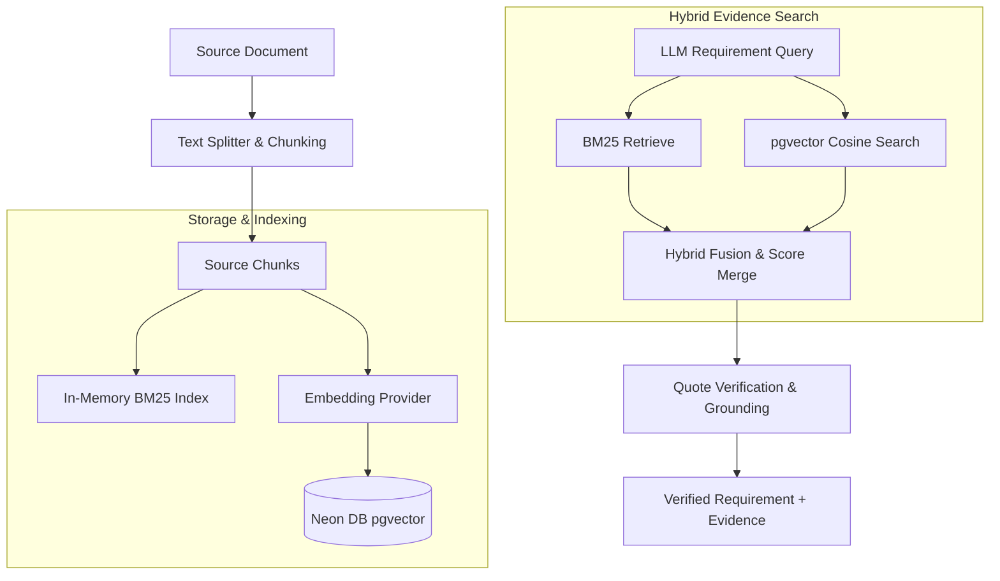

# RAG Grounding and Redis Architecture Guide

This document describes how **Retrieval-Augmented Generation (RAG)** operations and **Redis background queues** are structured and implemented in the **Requra AI Pipeline** codebase.

---

## 1. RAG (Retrieval-Augmented Generation) Operations

The RAG module operates during the document ingestion and evidence retrieval phases of the LangGraph execution flow. Its primary purpose is to ensure that requirements extracted by LLMs are grounded in original source documents, preventing hallucinations.



### 1.1. Ingestion, Parser & Chunking
When a job is submitted, text is parsed and divided into sequential sub-document text fragments (chunks). 
*   **Operations**: Captures page numbers, speaker metadata, character ranges, and token counts. 
*   **File References**: 
    *   Ingested data chunk preparation: [persistence.py:L40-103](file:///c:/ITI_GP/src/ai-pipeline/ai-service/app/worker/persistence.py#L40-103)
    *   Db repository methods: [repositories.py:L600-658](file:///c:/ITI_GP/src/ai-pipeline/ai-service/app/store/db/repositories.py#L600-658)

### 1.2. BM25 Lexical Keyword Search
An in-memory lexical index using Okapi BM25 scores is constructed for each job run. This index scores and ranks text chunks based on the occurrence of keyword terms.
*   **Operations**: Computes term frequencies across the document corpus. Used as a baseline for keyword-based grounding.
*   **File References**:
    *   BM25 Retriever logic: [lexical_retriever.py:L1-84](file:///c:/ITI_GP/src/ai-pipeline/ai-service/app/rag/lexical_retriever.py#L1-84)
    *   Index instantiation and lookup: [source_index.py:L1-60](file:///c:/ITI_GP/src/ai-pipeline/ai-service/app/rag/source_index.py#L1-60)

### 1.3. Dense Embedding Generation
If embeddings are enabled (`enable_embeddings` is set to `true`), the pipeline creates 1536-dimensional dense vectors for all document chunks.
*   **Operations**: Translates text into vector spaces using the configured model (e.g. OpenAI's `text-embedding-3-small`).
*   **File References**:
    *   Embedding provider setup: [embeddings.py:L1-67](file:///c:/ITI_GP/src/ai-pipeline/ai-service/app/rag/embeddings.py#L1-67)
    *   LangGraph Node handling: [build_source_index.py:L26-59](file:///c:/ITI_GP/src/ai-pipeline/ai-service/app/nodes/build_source_index.py#L26-59)
    *   PostgreSQL/pgvector persistence: [repositories.py:L719-738](file:///c:/ITI_GP/src/ai-pipeline/ai-service/app/store/db/repositories.py#L719-738)

### 1.4. Hybrid Retrieval & Score Fusion
When verifying extracted requirements, the system executes **Hybrid Retrieval** (merging lexical BM25 and vector pgvector searches).
*   **Operations**: Queries pgvector using a cosine distance `<=>` operator to capture semantic similarity, and merges those results with keyword matches.
*   **File References**:
    *   Reciprocal Rank Fusion / Merging algorithm: [hybrid.py:L1-93](file:///c:/ITI_GP/src/ai-pipeline/ai-service/app/rag/hybrid.py#L1-93)
    *   Execution in evidence lookup: [retrieve_evidence.py:L131-152](file:///c:/ITI_GP/src/ai-pipeline/ai-service/app/nodes/retrieve_evidence.py#L131-152)

### 1.5. Evidence Grounding Verification
After candidates are retrieved, their associated citation quotes must pass verification checks.
*   **Operations**: Computes sequence alignment ratios and sentence similarity to check that the LLM-extracted quotes exist word-for-word in the document chunks.
*   **File References**:
    *   Quote verification math & verification scores: [scoring.py:L1-105](file:///c:/ITI_GP/src/ai-pipeline/ai-service/app/rag/scoring.py#L1-105)

---

## 2. Redis Operations

In production, **Redis** is used exclusively for job queueing, asynchronous worker dispatching, and transient caching. It does not store long-term, authoritative states (which are kept in Neon DB).

```
   API HTTP Request
         │
         ▼
 ┌───────────────┐
 │  dispatch_job │
 └───────┬───────┘
         │
         ├───────────────────────┐
         ▼                       ▼
  [Redis Input Cache]       [RQ Enqueue]
  Saves payload (TTL)      Pushes job_id
         │                       │
         └───────────┬───────────┘
                     ▼
                 ┌───────┐
                 │ Redis │
                 └───┬───┘
                     ▼
             ┌───────────────┐
             │ RQ Worker run │ (app.worker.main)
             └───────┬───────┘
                     ▼
             Loads state & run
```

### 2.1. In-Process vs. Queue Dispatching
To simplify API routing, a single dispatch interface abstracts whether jobs execute immediately inside the HTTP thread (for dev/testing) or asynchronously in the background (for production).
*   **Operations**: Checks `REDIS_URL`. If present, uses Redis; otherwise, submits via an in-process BackgroundTask runner.
*   **File References**:
    *   Dispatch router: [dispatch.py:L25-59](file:///c:/ITI_GP/src/ai-pipeline/ai-service/app/worker/dispatch.py#L25-59)
    *   Queue factory: [factory.py:L1-26](file:///c:/ITI_GP/src/ai-pipeline/ai-service/app/queue/factory.py#L1-26)

### 2.2. Background Job Queue (RQ)
Production queueing uses **RQ (Redis Queue)**, a lightweight Python queueing library built on Redis.
*   **Operations**: Pushes the `job_id` to the `ai_jobs` list in Redis. Workers running `python -m app.worker.main` fetch the job ID and run the LangGraph pipeline asynchronously.
*   **File References**:
    *   RQ Enqueue wrapper: [redis_queue.py:L34-76](file:///c:/ITI_GP/src/ai-pipeline/ai-service/app/queue/redis_queue.py#L34-76)
    *   Worker loop and job entry: [main.py:L37-76](file:///c:/ITI_GP/src/ai-pipeline/ai-service/app/worker/main.py#L37-76)

### 2.3. Transient Input Cache (TTL)
When enqueuing large text documents, transmitting full payloads directly through queue arguments is inefficient. Instead, payloads are temporarily cached in Redis.
*   **Operations**: Serializes and caches the input text or file bytes in Redis under the key `aijob:input:{job_id}` with a 24-hour expiration (TTL). When a worker starts a job, it pulls the payload from this cache.
*   **File References**:
    *   `stash_input` / `load_input` functions: [state.py:L86-124](file:///c:/ITI_GP/src/ai-pipeline/ai-service/app/worker/state.py#L86-124)

### 2.4. Startup Health Probing
The application probes the Redis server during startup to check network connection health.
*   **Operations**: Executes a ping command against Redis and records connectivity status.
*   **File References**:
    *   Redis connection probe: [startup.py:L280-289](file:///c:/ITI_GP/src/ai-pipeline/ai-service/app/startup.py#L280-289)
