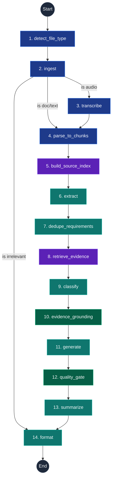
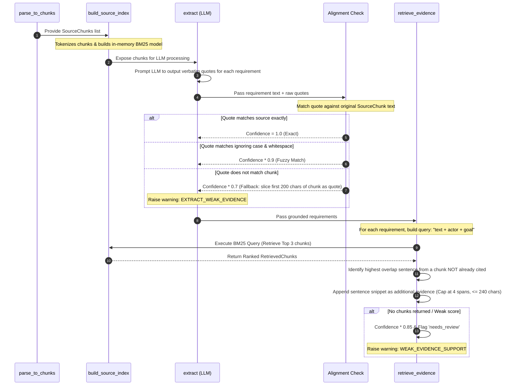

# Requra AI Pipeline — RAG-Grounded MVP Architecture & Change Log

This document provides a comprehensive technical guide explaining the architectural transition, core Retrieval-Augmented Generation (RAG) concepts, and file-level changes introduced in the Requra AI pipeline from commit `40bd675a1b8088f425844e5d9375d85ff7e4c872` (the baseline) up to the current HEAD.

---

## 1. Core Philosophy: RAG for Grounding, Not Chat

In typical LLM applications, RAG is synonymous with conversational QA search bots ("Chat with your PDF"). In the **Requra AI Pipeline**, RAG serves a different and more rigorous function: **Source Grounding and Traceability**.

```
Unstructured Data ---> Chunking & BM25 Indexing ---> LLM Grounded Extraction ---> Deduplication & Lexical Alignment ---> Quality Gate Scoring ---> Traceable User Stories & Exports
```

### Key Differences from Conversational RAG:
* **No Chat Interface:** The pipeline is a deterministic, async execution flow. It takes unstructured inputs (briefs, meeting transcripts, PDFs) and outputs structured, validated software requirements and user stories.
* **Deterministic Retrieval:** To ensure reproducible CI/CD testing, the RAG retriever is process-local, in-memory, and uses a deterministic lexical algorithm (**BM25**). It does not depend on external databases, hosted embeddings, or network APIs.
* **Bi-directional Traceability:** RAG connects every generated user story to its source requirement, and every requirement to the exact coordinates (page number, speaker, timestamp, verbatim quote) of the source file.
* **Groundedness Scoring:** The system calculates a mathematical score representing how much of the LLM's output is directly supported by verbatim text in the source document.

---

## 2. Graph Pipeline Architecture

The pipeline is modeled as an acyclic `StateGraph` using **LangGraph**. It consists of **14 nodes** executing sequentially. The compiled graph is configured with a `recursion_limit` of **60** to allow the linear chain to propagate all state updates without hitting default LangGraph step budget limits.

### Compiled LangGraph Flow


### Node Reference Table

| # | Node Name | Purpose | Key Inputs/Outputs |
|---|---|---|---|
| 1 | `detect_file_type` | Inspects headers/extensions to detect file type. | Outputs `file_type` (pdf/docx/audio/text) |
| 2 | `ingest` | Extracts raw text, normalizes whitespace, masks PII, and filters out non-useful text. | Outputs `raw_text`, `is_useful`, `relevance_score` |
| 3 | `transcribe` | Transcribes audio bytes to text with timestamp markers. | Active only for audio. Outputs `raw_text` / `chunks` |
| 4 | `parse_to_chunks` | Breaks documents into `SourceChunk`s (overlapping paragraphs, PDF pages, or speaker turns). | Outputs `chunks` with coordinates |
| 5 | **`build_source_index`** | **[NEW]** Indexes chunks into an in-memory lexical retriever for the job. | Outputs `source_index_id` & `retrieval_stats` |
| 6 | `extract` | Uses LLM to extract requirements. Validates verbatim quotes and assigns initial confidence. | Outputs `extracted_requirements` |
| 7 | **`dedupe_requirements`** | **[NEW]** Merges overlapping, near-duplicate requirements to avoid downstream redundancy. | Merges and re-IDs `extracted_requirements` |
| 8 | **`retrieve_evidence`** | **[NEW]** Performs queries against the BM25 index to find and append supporting quotes. | Enriches `extracted_requirements` with evidence |
| 9 | `classify` | Classifies requirements into labels (FR, NFR, BR, Constraint, etc.). | Outputs `classified_requirements` |
| 10 | `evidence_grounding` | Programmatically verifies that cited quotes actually exist inside the source chunks. | Updates `quality_issues` with warnings |
| 11 | `generate` | Transforms requirements into formatted User Stories with Given-When-Then criteria. | Outputs `user_stories` |
| 12 | **`quality_gate`** | **[NEW]** Computes numerical metrics (traceability, groundedness) and flags critical warnings. | Outputs `quality_report` & `quality_issues` |
| 13 | `summarize` | Creates a structured executive summary including key decisions, open questions, and scope. | Outputs `summary` |
| 14 | `format` | Collates all outputs into a versioned JSON contract (`JobResult`) and prepares Excel/Jira exports. | Outputs `job_result` |

---

## 3. RAG & Grounding Concepts: Under the Hood

### 3.1. In-Memory Lexical Indexing (BM25)
The retrieval engine implements a dependency-free, deterministic variant of the **Okapi BM25** algorithm.

1. **Tokenization:** Text is lowercased, split into alphanumeric words, and cleared of small English stopwords (e.g., *the*, *a*, *and*, *with*).
2. **Deterministic IDF Scoring:** The Inverse Document Frequency (IDF) is calculated using a strictly positive formula:
   $$\text{IDF}(q_i) = \ln\left(1 + \frac{N - n(q_i) + 0.5}{n(q_i) + 0.5}\right)$$
   Where $N$ is the total number of document chunks, and $n(q_i)$ is the number of chunks containing the word $q_i$.
   * *Why this formula?* The standard BM25 IDF can become negative for terms that appear in more than half of the documents in a corpus. In small corpora (like a 2-page brief split into 4 chunks), common terms quickly trigger negative weights. The always-positive formula ensures that even if a term appears in every chunk, its score contribution remains positive.
3. **BM25 Core Function:**
   $$\text{Score}(D, Q) = \sum_{i=1}^{n} \text{IDF}(q_i) \cdot \frac{f(q_i, D) \cdot (k_1 + 1)}{f(q_i, D) + k_1 \cdot \left(1 - b + b \cdot \frac{|D|}{\text{avgdl}}\right)}$$
   * Tuning parameters: $k_1 = 1.5$ (term frequency saturation), $b = 0.75$ (document length normalization).
   * Stable Tie-Breaker: Chunks with identical lexical scores are ordered by their original document index (`start_char` offset) to prevent flaky retrieval orders.

### 3.2. Verification & Retrieval Sequence Diagram
When requirements are extracted by the LLM, they are grounded using a hybrid approach of **Direct Extraction Alignment** and **Lexical RAG Search**:



### 3.3. Requirement Deduplication
During extraction, chunks are processed in parallel or in sequence. Overlapping windows and repetitive document topics often lead to identical requirements being extracted multiple times.

The `dedupe_requirements` node cleans this redundancy using a token-based **Jaccard Similarity** calculation:
$$\text{Jaccard}(A, B) = \frac{|A \cap B|}{|A \cup B|}$$

#### Merge Workflow:
* If Jaccard Score $\ge 0.8$ (or normalized text matches exactly): **Merge**.
* **Union Evidence:** Source quotes and chunk IDs from both duplicates are combined (unioned) so that grounding coverage is never lost.
* **Resolve Conflicting Fields:**
  * Confidence: Take $\max(\text{confidence}_A, \text{confidence}_B)$.
  * Priority: Take the stronger priority ($\text{Critical} > \text{High} > \text{Medium} > \text{Low}$).
  * Labels: Union all candidate classifications.
* **Actor Conflict Check:** If requirement $A$ and requirement $B$ are lexically similar but specify **different actors** (e.g., "The Customer shall view invoices" vs. "The Administrator shall view invoices"), they are **not merged**. They are kept separate and flagged with a warning code `POSSIBLE_DUPLICATE_REVIEW` for human inspection.

---

## 4. Chronological Change Log (Commit-by-Commit)

The following sections list the chronological commits and file diffs implementing this transition.

### 4.1. [Commit `b352e44`] fix(api): harden async job lifecycle and status contract
* **Goal:** Safe, predictable async API handling, validation of caller-provided job IDs, and system status health reporting.
* **Key Changes:**
  * Created a formal `JobStore` abstract interface and a concrete thread-safe `MemoryJobStore` implementation in [job_store.py](file:///c:/ITI_GP/src/ai-pipeline/ai-service/app/services/job_store.py) to manage pipeline job status lifecycles.
  * Added a `/ready` endpoint in [main.py](file:///c:/ITI_GP/src/ai-pipeline/ai-service/app/main.py) which returns a 200/503 check based on LLM API provider availability.
  * Sanitized and validated user-supplied job IDs against the regex `^[A-Za-z0-9._-]{1,128}$` to prevent path traversal or malformed strings.
  * Wrapped the legacy progress updates to keep the store and client polling in sync.

### 4.2. [Commit `24b2cc4`] feat(rag): add in-memory source index and lexical retrieval
* **Goal:** Establish the foundation of the lexical RAG retriever.
* **Key Changes:**
  * Created `app/rag/scoring.py` containing the core BM25 scorer, tokenizers, stopword filters, and corpus stats calculators.
  * Created `app/rag/lexical_retriever.py` containing `LexicalRetriever`, which ranks and returns top-k chunks with stable tie-breaking.
  * Created `app/rag/source_index.py` which manages a FIFO process-local index registry (capped at 256 active jobs to prevent memory leaks).
  * Created `build_source_index_node` in [build_source_index.py](file:///c:/ITI_GP/src/ai-pipeline/ai-service/app/nodes/build_source_index.py) to integrate index compilation into the LangGraph flow, routing chunk indexes to the registry.

### 4.3. [Commit `8672649`] feat(extract): strengthen grounded extraction and JSON repair
* **Goal:** Prevent LLM hallucinations, support JSON repairs, and stop raw document leaks in standard logs.
* **Key Changes:**
  * Created a strict prompt template `extract_requirements_v2.md` enforcing JSON response format and requiring verbatim quotes.
  * Added `loads_with_llm_repair` in `app/utils/json_parsing.py` to intercept unparseable LLM output and request a quick format fix rather than failing the execution.
  * Implemented strict whitespace-insensitive quote alignment checks via `align_quote_with_kind()`.
  * Added confidence score penalization (1.0 for exact matches, 0.9 for fuzzy, 0.7 for fallback snippets).
  * Shielded production logs from document leakage by moving raw LLM inputs/outputs to `DEBUG` loggers wrapped behind a new environment variable `DEBUG_LLM_IO`.

### 4.4. [Commit `a41a38b`] feat(requirements): dedupe extracted requirements before classification
* **Goal:** Merge duplicate entries while preserving source references.
* **Key Changes:**
  * Created `dedupe_requirements_node` in [dedupe_requirements.py](file:///c:/ITI_GP/src/ai-pipeline/ai-service/app/nodes/dedupe_requirements.py).
  * Wired the node after `extract` and before `retrieve_evidence` in [pipeline.py](file:///c:/ITI_GP/src/ai-pipeline/ai-service/app/graph/pipeline.py).
  * **Critical Bug Fix:** Tied a graph config `recursion_limit: 60` in `build_pipeline()`. The introduction of the 12th node caused LangGraph to exceed its default recursion limit (25) due to BSP super-step propagation. Increasing the limit solved the crash.

### 4.5. [Commit `e6761cd`] feat(rag): retrieve supporting evidence for requirements
* **Goal:** Strengthen traceability by appending extra context snippets to requirements before classification.
* **Key Changes:**
  * Created `retrieve_evidence_node` in [retrieve_evidence.py](file:///c:/ITI_GP/src/ai-pipeline/ai-service/app/nodes/retrieve_evidence.py) to run BM25 search queries for each requirement.
  * Extracted the best sentence snippet matching the query terms.
  * Appended the snippet as an `EvidenceSpan` if it belonged to a chunk not already cited. Capped evidence collections at 4 per requirement (maximum 240 characters) to prevent JSON bloating.
  * Penalized confidence (factor of 0.85) and flagged `needs_review` if a requirement had zero grounded quotes AND zero relevant search hits.

### 4.6. [Commit `4ba8dce`] feat(generate): validate and repair generated stories
* **Goal:** Improve User Story quality, avoid generic fallback descriptions, and enforce testability.
* **Key Changes:**
  * Created a prompt template `generate_user_stories_v2.md` enforcing detailed Given-When-Then (GWT) acceptance criteria.
  * Created `story_validator.py` containing helper functions `validate_story` and `find_duplicate_story_ids` to flag missing titles, weak descriptions, duplicate stories, or generic criteria.
  * Overhauled the fallback story generation in [generate.py](file:///c:/ITI_GP/src/ai-pipeline/ai-service/app/nodes/generate.py). If the LLM fails, the system programmatically generates type-aware User Stories with at least two specific GWT acceptance criteria tailored to the requirement type (Functional, Non-Functional, or Business Rule), avoiding generic placeholders.

### 4.7. [Commit `804d8d2`] feat(quality): add groundedness and traceability scoring
* **Goal:** Calculate numerical quality scores and add an optional quality report in the V1 contract.
* **Key Changes:**
  * Created `app/services/quality_scoring.py` containing the mathematical scoring rules.
  * Integrated scoring computations in `quality_gate_node` ([quality_gate.py](file:///c:/ITI_GP/src/ai-pipeline/ai-service/app/nodes/quality_gate.py)).
  * Added `quality_report` as an additive field in `JobResult` (in [items.py](file:///c:/ITI_GP/src/ai-pipeline/ai-service/app/schemas/items.py)).

### 4.8. [Commit `6f7ad05`] feat(output): polish summary and export-ready rows
* **Goal:** Correct mapping of user story types, enrich spreadsheet exports with quality data, and inject an artifact digest into summaries.
* **Key Changes:**
  * In [format.py](file:///c:/ITI_GP/src/ai-pipeline/ai-service/app/nodes/format.py), mapped User Story types from requirement labels (FR $\rightarrow$ Functional, NFR/Constraint/Assumption $\rightarrow$ Non-Functional, BR $\rightarrow$ Business) instead of defaulting everything to "Functional".
  * Enriched spreadsheet rows for Excel/Jira exports with requirement IDs, confidence, labels, quality scores, and source quotes.
  * Fed an aggregate digest of requirements and stories into the `summarize` node prompt to ground the executive summary in the generated outcomes.

### 4.9. [Commit `98623a8`] test(pipeline): add MVP regression fixtures and evaluation harness
* **Goal:** Introduce quality regression testing and run performance thresholds.
* **Key Changes:**
  * Added 5 test fixtures (project brief, meeting transcript, irrelevant text, duplicates, and NFRs) in `tests/fixtures/`.
  * Created `scripts/evaluate_pipeline.py` which executes the pipeline against these fixtures and validates requirements coverage, deduplication, and quality criteria.
  * Added a regression test suite `tests/test_mvp_quality.py`.
  * Fixed a bug in `format_node` where an irrelevant text rejection was misreported as `failed` instead of `rejected` due to error-handling precedence.

### 4.10. [Commit `d724957`] docs(pipeline): document RAG-grounded MVP production flow
* **Goal:** Deliver final documentation.
* **Key Changes:**
  * Added architecture overviews, node references, contract annotations, and README setup guides.

---

## 5. Metric Formula Reference (Quality Gate)

The quality gate generates a `QualityReportV1` containing six metrics:

### 5.1. Groundedness Score
Measures the proportion of verbatim quotes that exist in the source document.
$$\text{Groundedness} = \frac{1}{|R|} \sum_{r \in R} \text{quote\_support\_score}(r)$$
Where $\text{quote\_support\_score}(r)$ is the fraction of requirement $r$'s quotes successfully matched in the source text. If no retrieval was executed, it defaults to $1.0$ if the requirement has evidence, and $0.0$ if it has none.

### 5.2. Traceability Coverage
Measures the proportion of generated user stories that link back to at least one source requirement.
$$\text{Traceability} = \frac{|\{s \in S \mid \text{source\_requirement\_ids}(s) \neq \emptyset\}|}{|S|}$$

### 5.3. Story Completeness
Measures the proportion of user stories containing a title, a valid description, and at least two acceptance criteria.
$$\text{Completeness} = \frac{|\{s \in S \mid \text{is\_complete}(s)\}|}{|S|}$$

### 5.4. Acceptance Criteria Quality
Measures the proportion of acceptance criteria that are descriptive rather than generic boilerplate.
$$\text{AC Quality} = \frac{|\{c \in C_{\text{all}} \mid \neg\text{is\_generic}(c)\}|}{|C_{\text{all}}|}$$
* *Generic criteria* are flagged if they contain phrases like "works as expected", "implemented as specified", or are less than 15 characters long.

### 5.5. Duplicate Risk
Measures the proportion of duplicate user stories (identical titles and descriptions).
$$\text{Duplicate Risk} = \frac{|\text{Duplicate Stories}|}{|S|}$$

### 5.6. Overall Quality Score
The arithmetic mean of the five dimensions:
$$\text{Overall Score} = \frac{\text{Traceability} + \text{Groundedness} + \text{Completeness} + \text{AC Quality} + (1.0 - \text{Duplicate Risk})}{5}$$

---

## 6. How to Run & Verify

To verify that the RAG-grounded pipeline passes all automated regression gates and performance thresholds:

### 1. Run All Unit & Integration Tests
Ensure the python environment is active, then run:
```bash
poetry run pytest
```
*Expected output: 212 tests passing, 0 failures.*

### 2. Run the Quality Evaluation Harness
Run the deterministic pipeline evaluator over the fixtures:
```bash
poetry run python scripts/evaluate_pipeline.py
```
This script validates:
* Grounding correctness on `meeting_transcript.txt` and `simple_project_brief.txt`.
* Deduplication of redundant lines in `duplicate_requirements.txt` (merging 3 items).
* Rejection routing on `irrelevant_text.txt` (`status="rejected"`).
* Traceability and AC Quality on all runs.
