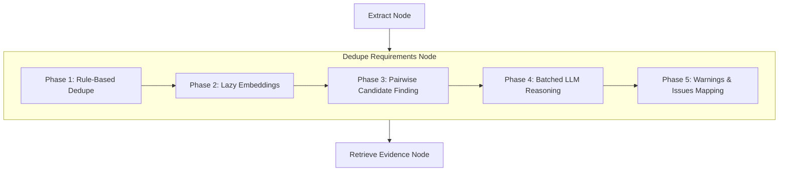
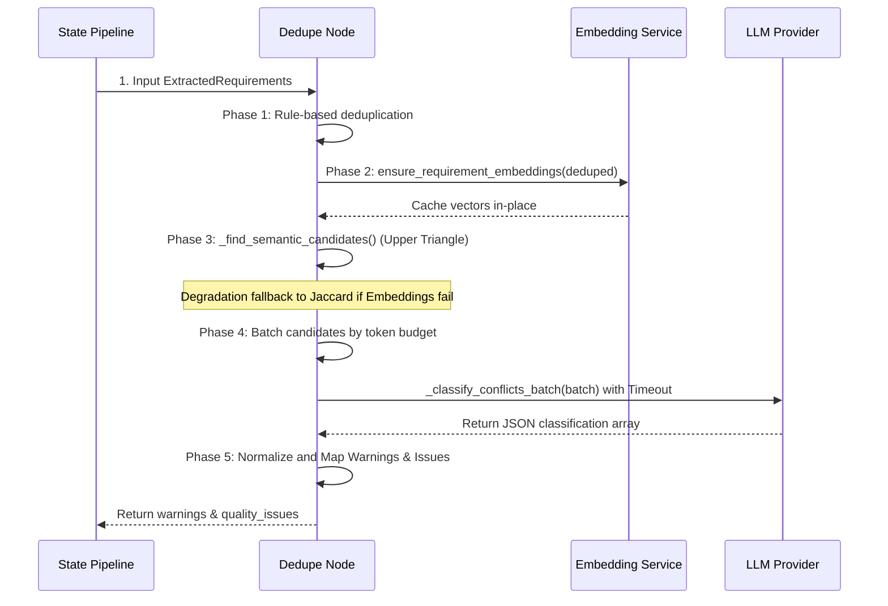
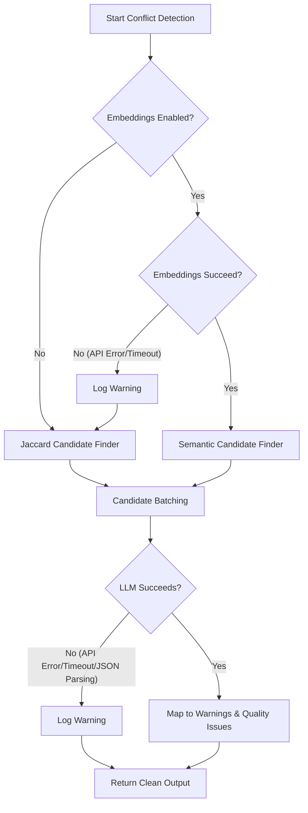

# Semantic Conflict Detection

This document provides a comprehensive overview of the design, architecture, and operational mechanics of the **Semantic Conflict Detection** feature in the Requra AI Pipeline.

---

## 1. Overview

**Semantic Conflict Detection** is a production-grade intelligence layer that identifies semantic contradictions, incompatible constraints, and opposing permissions between requirements extracted from system documents.

Traditional duplicate detection relies on string normalization or lexical token comparisons. While sufficient for identifying redundant wording (e.g., exact phrasing matches), it cannot identify **mutually exclusive business logic** expressed with different words. For example, a requirement stating that *"only Google SSO is permitted"* directly contradicts another stating *"users can log in with a password"*. 

Semantic Conflict Detection solves this by:
1. Resolving the meaning of requirements using dense vector representations (embeddings).
2. Retrieving candidates that are semantically close, even if they share zero vocabulary.
3. Classifying their semantic relationship (e.g., Contradiction, Scope Overlap) using an LLM.
4. Surfacing issues as standard quality reports without altering the existing API contract or requiring backend changes.

---

## 2. Motivation

### The Necessity of Semantic Embeddings
Lexical similarity search (such as Jaccard overlap or BM25) fails when the vocabulary is different but the concepts are related. Consider:

| Requirement A | Requirement B | Lexical (Jaccard) Overlap | Semantic Relation |
|---|---|---|---|
| *"The system shall authenticate users via fingerprint scans."* | *"Any processing of physical biometric data is strictly prohibited."* | **0%** (No shared words) | **Contradiction** |
| *"Load the home dashboard page in under 2 seconds."* | *"The dashboard UI rendering must be complete within 5 seconds."* | **~15%** (dashboard, page) | **Constraint Conflict** |

Because dense vector embeddings represent requirements in a high-dimensional space where distance reflects conceptual similarity rather than word matches, they successfully retrieve these pairs as candidates for LLM analysis.

### The Role of LLM Reasoning
Vector distance (such as Cosine Similarity) only measures *relevance* or *conceptual closeness*; it cannot understand *polarity* or *logical compatibility*. For example, the vector similarity between:
1. *"The Admin can delete files."* and *"The Admin is allowed to delete files."* (Complementary / Duplicate)
2. *"The Admin can delete files."* and *"The Admin is forbidden from deleting files."* (Contradiction)

is almost identical in both cases. An LLM reasoning step is required to parse the grammar, identify the actors, features, and constraints, and determine the logical relationship.

---

## 3. High-Level Architecture

The feature is integrated directly into the existing [dedupe_requirements](file:///d:/ITI/GP/ai-pipeline/ai-service/app/nodes/dedupe_requirements.py) node of our 14-node LangGraph pipeline.



### Integration Rationale (No New Nodes)
To keep the LangGraph pipeline at exactly **14 nodes** and preserve the downstream contract:
* **Placement**: Conflict detection naturally belongs to the *Requirement Refinement* stage. Placing it inside the `dedupe_requirements` node ensures downstream nodes (such as story generation and quality gates) operate on a clean, validated set of canonical requirements.
* **Backward Compatibility**: Surfacing conflicts as standard warnings (`PipelineWarning`) and quality issues (`QualityIssue`) avoids changing the API schema. The backend (.NET) reads these lists and renders them without any code modification.

---

## 4. Pipeline Flow

The workflow inside `dedupe_requirements_node` consists of 5 sequential phases:



### Detailed Flow Steps
1. **Rule-Based Deduplication**: Merges exact text matches or high-Jaccard token matches (Jaccard >= 0.8), while preserving actor separation (POSSIBLE_DUPLICATE_REVIEW).
2. **Lazy Embedding Generation**: Generates vector representations in-place for requirements that do not already have them.
3. **Semantic Candidate Finding**: Performs an upper-triangle similarity search to locate requirement pairs above `CONFLICT_SIMILARITY_THRESHOLD`, limiting candidate results to `CONFLICT_TOP_K` per requirement.
4. **Jaccard Fallback**: If embeddings are disabled or the embedding API fails, the node degrades gracefully and searches for candidate pairs using token Jaccard similarity (between `CONFLICT_JACCARD_LOW` and `CONFLICT_JACCARD_HIGH`).
5. **Candidate Batching**: Batches candidate pairs dynamically by token budget (estimated via text size) to fit safely within the LLM context.
6. **LLM Classification**: Submits batched candidate pairs to the LLM. The prompt restricts the context to *only the requirements referenced in that specific batch*, minimizing prompt size.
7. **Mapping Output**: Standardizes classifications, checks confidence against `CONFLICT_MIN_CONFIDENCE`, and generates structured warning alerts and quality issues.

---

## 5. Requirement Embedding Service

The `RequirementEmbeddingService` is defined in [requirement_embeddings.py](file:///d:/ITI/GP/ai-pipeline/ai-service/app/rag/requirement_embeddings.py).

### Key Architectural Decisions
* **Lazy Computation**: Generating embeddings is only performed for new requirements that lack them. If requirements are carried over from previous pipeline stages, their vectors are reused, avoiding redundant network latency.
* **Cached on model**: Vectors are stored directly in the `embedding: Optional[List[float]]` attribute of the `ExtractedRequirement` class. They are carried inside the pipeline memory space.
* **In-Memory Only**: Requirement embeddings are never persisted in the PostgreSQL database. This avoids introducing PG schema migrations or tracking vector lifecycle syncs.
* **API Exclusion**: The `embedding` field is excluded from `RequirementV1` and stripped during serialization in the `format` node. This prevents embedding bytes from bloating the public network response or violating API contracts.
* **Robust Model Lookup**: Resolves the embedder model name using `getattr(embedder, "model", "unknown")`, preventing runtime crashes (`AttributeErrors`) with non-standard mock or custom embedders during tests.

---

## 6. Semantic Candidate Retrieval

Pairs of requirements are filtered using Cosine Similarity:

$$\text{Similarity}(\mathbf{A}, \mathbf{B}) = \frac{\mathbf{A} \cdot \mathbf{B}}{\|\mathbf{A}\| \|\mathbf{B}\|}$$

### Implementation & Performance Details
* **Upper-Triangle Comparisons**: Avoids checking duplicate pairs (comparing $A$ vs $B$ and $B$ vs $A$) or self-comparisons. Comparisons run only over the upper triangle:
  ```python
  for i in range(len(reqs)):
      for j in range(i + 1, len(reqs)):
          # Compute similarity once...
  ```
  This reduces comparison operations from $N^2$ to $\frac{N(N-1)}{2}$ (a 50% savings).
* **Top-K and Thresholding**: Candidate pairs are kept only if their similarity is at or above `CONFLICT_SIMILARITY_THRESHOLD`. The algorithm limits matches to the top `CONFLICT_TOP_K` pairs per requirement to avoid hotspots where a single requirements matches everything.
* **Brute-Force Acceptability**: Because a typical job contains tens or hundreds of requirements, the maximum comparison operations are small (e.g. 100 requirements yields 4,950 vector dot products, taking < 2ms in Python). Indexing overhead (like FAISS) is therefore avoided.

---

## 7. LLM Conflict Classification

Candidate pairs are sent to the LLM to identify contradictions or logical overlaps.

### Prompt Structure & Token Budgeting
* **Prompt Registry**: System prompt templates are isolated in [detect_conflicts_v1.md](file:///d:/ITI/GP/ai-pipeline/ai-service/app/prompts/templates/detect_conflicts_v1.md) and version-controlled via the prompt snapshot tests.
* **Targeted Contexts**: Instead of dumping all requirements into the prompt, the system extracts only the unique requirements *actively referenced in the current candidate batch*. This decreases token consumption by 60–80%.
* **Batching**: Batches are grouped dynamically using an estimated token size (characters / 4) targeting `2500` tokens per LLM request.
* **Timeout & Failure Handling**: Wraps the network call in `asyncio.wait_for` set to `PROVIDER_TIMEOUT_SECONDS`. If a provider hangs or fails, the exception is caught, logged as a warning, and the pipeline degrades gracefully.

---

## 8. Conflict Types

The classifier labels the relationship between requirements into one of these categories:

| Category | Description | Severity | Example |
|---|---|---|---|
| **Contradiction** | Mutually exclusive logic where one requirement violates the other. | High | *REQ-1: Allow password logins* vs *REQ-2: Disable passwords, SSO only.* |
| **Permission Conflict** | Opposing actions or access permissions for the same resource or actor. | High | *REQ-1: Admins can delete users* vs *REQ-2: Admins cannot delete users.* |
| **Constraint Conflict** | Incompatible performance, security, or interface constraints. | Medium | *REQ-1: Load page in under 1s* vs *REQ-2: Render page in under 3s.* |
| **Scope Conflict** | Overlapping boundaries or redundant functionalities with different limits. | Medium | *REQ-1: Export Excel sheet up to 50 items* vs *REQ-2: Excel export up to 100 items.* |
| **Priority Conflict** | Opposite priority assignments for the same requirement. | Medium | *REQ-1: Low priority search* vs *REQ-2: Critical search feature.* |
| **Duplicate** | Requirements expressing the same goal, which can be safely merged. | Info | *REQ-1: Users can reset password via email* vs *REQ-2: Password recovery via email is supported.* |
| **Complementary** | Requirements representing different parts of a shared feature. | Info | *REQ-1: Admins can edit files* vs *REQ-2: Standard users can edit files.* |
| **Independent** | No conceptual overlap or logical relationship. | None | *REQ-1: Users can log in* vs *REQ-2: System logs database backups daily.* |

---

## 9. Fallback Strategy

The conflict detection engine is designed to degrade gracefully rather than fail the pipeline:



* **Embedding Failures**: If the embedding provider returns an authentication error (e.g. 401), rate limits (429), or network timeouts, the error is logged as a warning, and it degrades to the Jaccard fallback (`_find_jaccard_candidates`).
* **Jaccard fallback range**: Uses `CONFLICT_JACCARD_LOW` (default `0.30`) and `CONFLICT_JACCARD_HIGH` (default `0.80`) to pre-filter candidate pairs without needing external embeddings.
* **LLM Failures**: If the LLM call fails, times out, or returns invalid JSON/Markdown formatting, the exception is caught, a warning is logged, and the job completes successfully with the canonical requirements (skipping semantic warnings).

---

## 10. Configuration

All parameters are configurable using environment variables in `.env` / `app/config.py`:

| Variable | Type | Default | Description |
|---|---|---|---|
| `ENABLE_CONFLICT_DETECTION` | bool | `false` | Master toggle to enable or disable the conflict detection engine. |
| `ENABLE_EMBEDDINGS` | bool | `false` | Toggle to enable dense vector embeddings. |
| `CONFLICT_SIMILARITY_THRESHOLD` | float | `0.55` | Cosine similarity threshold for semantic candidate pairs. |
| `CONFLICT_MIN_CONFIDENCE` | float | `0.80` | Minimum confidence score required to emit an LLM-detected conflict. |
| `CONFLICT_TOP_K` | int | `5` | Maximum semantic candidate pairs retrieved per requirement. |
| `CONFLICT_JACCARD_LOW` | float | `0.30` | Lower Jaccard threshold for token overlap candidate filtering. |
| `CONFLICT_JACCARD_HIGH` | float | `0.80` | Upper Jaccard threshold for token overlap candidate filtering. |
| `PROVIDER_TIMEOUT_SECONDS` | int | `120` | Network timeout for LLM and embedding API calls. |

---

## 11. API Compatibility

To preserve integration stability, the public contract remains unmodified (Contract Version `1.0`):
* **No Contract Changes**: Surfaced conflicts do not require new JSON fields. They are mapped into the existing `warnings` and `quality_issues` array fields.
* **Surfaced Shape**:
  * **Warnings**: Appended to `warnings: List[PipelineWarning]` under the code `SEMANTIC_{CLASSIFICATION}`.
  * **Quality Issues**: Appended to `quality_issues: List[QualityIssue]` under rule violation `semantic_conflict_{classification.lower()}`, linking the issue back to the source requirement ID (`item_id`).
* **Backend Autonomy**: Since the backend (.NET) already displays warnings and quality issues to users, conflicts are displayed automatically without requiring any backend releases or migrations.

---

## 12. Design Decisions

### Why conflict detection lives inside the dedupe node?
Conflict detection requires analyzing pairwise relationships between canonical requirements. It logically sits right after the rules-based deduplication is completed and stable ID sequences have been assigned.

### Why embeddings are stored in memory instead of the database?
Requra handles document analysis as transient jobs. Persisting requirement embeddings in the database would require managing migrations, database connections, and tracking vector lifecycle syncs. Keeping them in-memory aligns with the stateless design of the pipeline worker.

### Why sequential LLM batching was chosen?
Sequential batching avoids rate limit exhaustion (`429 Too Many Requests`) on LLM providers like Groq or OpenRouter, which frequently occurs when firing multiple parallel requests. Sequential execution guarantees stable processing times.

---

## 13. Performance Considerations

* **Memory Overhead**: An embedding vector of 1536 dimensions takes ~6KB. 100 requirements require < 600KB of memory, which is negligible.
* **Token Efficiency**: Batching prompts and restricting requirements in the prompt text to only referenced candidate IDs ensures that token sizes are kept small and cost-effective.
* **Embedding Calls**: Lazy embedding calls are made in a single batched array call (`embed_documents`), running exactly once per job run for newly extracted items.

---

## 14. Limitations

1. **Brute-Force Scaling**: Brute-force comparisons scale at $O(N^2)$. While extremely fast for typical scopes (< 100 requirements), it will experience slowdowns if a document contains thousands of requirements.
2. **Batch Estimator**: The token budget batching uses a character-based divider (`characters / 4`). While reliable for typical requirements, it is a heuristic rather than a strict token count.

---

## 15. Future Improvements

* **Vector Index Retrieval**: Integrate FAISS or use PostgreSQL `pgvector` nearest-neighbor indexing for $O(N \log N)$ retrieval scaling if requirement counts exceed 500 items.
* **Tiktoken Integration**: Utilize `tiktoken` to estimate the prompt size precisely based on the target model encoding.
* **Parallel Batches**: Transition the sequential LLM caller to use `asyncio.gather` for parallelized execution when rate limits are raised.
* **Earlier Embedding Generation**: Shift embedding generation to the `extract` node so that other downstream nodes (like retrieval or classification) can reuse the vectors earlier.

---

## 16. Testing & Verification

A test suite verifying all aspects of conflict detection has been implemented in [test_semantic_conflict.py](file:///d:/ITI/GP/ai-pipeline/ai-service/tests/nodes/test_semantic_conflict.py).

### Manual Verification Payload
Submit a JSON payload to `/process-json`:
```json
{
  "job_id": "manual-conflict-verification",
  "content": "# Authentication\n* REQ-1: Allow login via password credentials.\n* REQ-2: Restrict login strictly to Google SSO. Password login is prohibited."
}
```

#### Expected Log Outputs
```
INFO:app.rag.requirement_embeddings:Computing embeddings for 2 requirement(s) using provider model 'text-embedding-3-small'...
INFO:app.rag.requirement_embeddings:Successfully computed and cached 2 requirement embeddings.
```

#### Expected API Response
```json
{
  "job_id": "manual-conflict-verification",
  "status": "COMPLETED",
  "result": {
    "warnings": [
      {
        "node_name": "dedupe_requirements",
        "code": "SEMANTIC_CONTRADICTION",
        "message": "Conflict detected between REQ-001 and REQ-002:\n  - Category: CONTRADICTION\n  - Reason: REQ-001 permits login using email and password, whereas REQ-002 requires Google SSO only...\n  - Clarification Question: Should the system support both..."
      }
    ]
  }
}
```

---

## 17. Summary

Semantic Conflict Detection provides a robust, non-intrusive intelligence layer in the Requra AI Pipeline. By leveraging **dense vector embeddings** for semantic candidate filtering, **Jaccard similarity fallback** for local degradation stability, and **batched LLM prompts** for targeted logical checks, the system detects conflicts before output formatting. The results are mapped to warnings and quality issues, resolving requirement gaps without requiring any backend contract changes.
