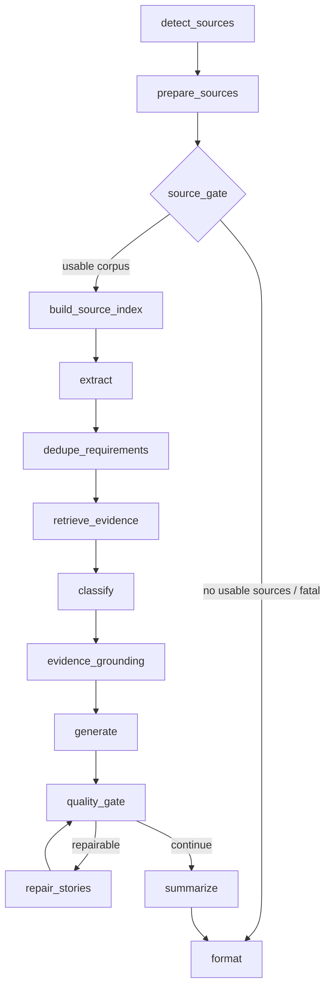

# Requra.AI — Reliable Mixed Audio + Document Processing Plan

**Status:** Implementation Plan  
**Target Repository:** `Requra/ai-pipeline`  
**Primary API:** `POST /internal/process`  
**Architecture Area:** FastAPI + Redis/RQ + Worker + LangGraph + PostgreSQL/pgvector  
**Goal:** Allow one logical AI analysis job to reliably process heterogeneous project sources such as PDF, DOCX, TXT, and audio while preserving source provenance, idempotency, retries, partial-failure handling, grounding, and existing downstream RAG behavior.

---

## 1. Executive Decision

Requra should support:

```text
ONE analysis job
    +
MANY heterogeneous project sources
    =
ONE shared evidence corpus
    ->
ONE requirement extraction / RAG / grounding / story-generation pipeline
```

Example:

```text
requirements.pdf
meeting.mp3
technical-notes.docx
stakeholder-notes.txt
        |
        v
POST /internal/process
        |
        v
one durable AI job
        |
        v
per-source preparation
        |
        +--> PDF/DOCX/TXT -> extract -> normalize -> mask -> relevance -> chunks
        |
        +--> Audio -> validate -> STT -> clean -> mask -> relevance -> chunks
        |
        v
merge provenance-rich chunks
        |
        v
build_source_index
        |
        v
extract
        |
        v
dedupe_requirements
        |
        v
retrieve_evidence
        |
        v
classify
        |
        v
evidence_grounding
        |
        v
generate
        |
        v
quality_gate / repair
        |
        v
summarize
        |
        v
format
```

The modality-specific part of the system must end **before** the shared retrieval and requirements-analysis stages.

Do **not** solve this by submitting documents and audio as separate AI jobs and merging final results afterward.

Do **not** solve this by only deleting the current mixed-upload `400` guard.

---

# 2. Why the Current Pipeline Cannot Safely Accept Mixed Sources

The current implementation already supports multiple documents, but heterogeneous processing is blocked by several job-wide assumptions.

## 2.1 `/internal/process` rejects mixed uploads

Current behavior validates each uploaded stream independently, then rejects:

```python
input_types = {item["file_type"] == "audio" for item in validated_inputs}
if len(input_types) > 1:
    raise HTTPException(
        status_code=400,
        detail="mixed document and audio uploads are not supported; submit them as separate jobs",
    )
```

It also rejects multiple audio files.

Removing these checks alone is insufficient.

---

## 2.2 `CreateJobRequest.input_type` describes the entire job with one modality

Current input types are:

```text
text
backend_document
backend_transcript
backend_audio
```

There is no first-class heterogeneous source job.

A mixed job therefore needs a new job-level type:

```text
backend_sources
```

The individual source type remains stored per source.

---

## 2.3 The graph routes the whole job as audio or non-audio

Current routing effectively does:

```text
file_type == audio
    -> transcribe
else
    -> parse_to_chunks
```

That is a whole-job decision and cannot represent:

```text
PDF + MP3 + DOCX
```

Each source must be processed according to its own detected type, then all successful chunks must converge before `build_source_index`.

---

## 2.4 `transcribe_node` consumes global `raw_bytes`

The current audio path assumes one global byte stream and one global audio format.

Mixed-source support requires transcription to become source-local:

```python
await transcribe_source(source, job_id=...)
```

instead of assuming:

```python
state["raw_bytes"]
state["audio_format"]
```

represent the only binary source in the job.

---

## 2.5 Audio provenance currently depends on the first source document

The current transcription-result mapping obtains provenance from the first source document.

That becomes unsafe in a mixed job because:

```text
source_documents[0]
```

may be a PDF while the transcription came from an MP3 later in the list.

Every audio transcription must explicitly carry the audio source's own:

- `document_id`
- filename
- MIME type
- language
- speaker information
- start/end timestamps

---

## 2.6 `parse_to_chunks` skips document chunking if chunks already exist

The current node contains a pass-through behavior similar to:

```text
if chunks already exist:
    return
```

This works for the current single-audio flow because transcription already produced the only chunks needed.

It is incorrect for a mixed job:

```text
audio -> transcript chunks exist
PDF   -> still needs document chunks
DOCX  -> still needs document chunks
```

Chunking must become source-local and additive during source preparation.

---

## 2.7 Worker recovery validates all sources against one job-wide modality

The current worker recovery logic expects all downloaded backend sources to match:

```text
backend_document -> all document-like
backend_audio    -> all audio
```

`backend_sources` must instead:

1. download every source;
2. validate each source independently;
3. preserve detected source type;
4. reconstruct `raw_inputs[]`;
5. pass the full source collection to the source-preparation stage.

---

# 3. Target Domain Model

## 3.1 Job-level input type

Add:

```python
BACKEND_SOURCES = "backend_sources"
```

Keep existing types for compatibility:

```text
backend_document
backend_audio
backend_transcript
text
backend_sources
```

### Mapping rule

```text
only documents       -> backend_document
only one audio        -> backend_audio
heterogeneous sources -> backend_sources
```

If multiple-audio support is not enabled immediately, `backend_sources` may initially allow:

```text
N documents + 1 audio
```

while the internal design remains capable of supporting more audio sources later.

---

## 3.2 Canonical source input

Introduce or formalize a source-level structure.

Example:

```python
class SourceInput(TypedDict):
    document_id: str
    filename: str
    file_type: str
    mime_type: str
    sha256_hash: str
    raw_bytes: bytes
    audio_format: str | None
    language: str | None
```

`raw_inputs[]` should become the canonical binary-source representation for all file jobs.

Legacy state fields such as:

```text
raw_bytes
file_type
audio_format
```

may remain temporarily for compatibility with existing endpoints/tests, but new mixed processing must not depend on them.

---

## 3.3 Processed source result

Add an internal source-processing result model.

Example:

```python
class ProcessedSource(TypedDict):
    document_id: str
    filename: str
    source_type: str

    status: str
    # ready | rejected | failed

    chunks: list[SourceChunk]

    relevance_score: float | None
    pii_stats: dict[str, int] | None

    error_code: str | None
    error_message: str | None
```

This gives the job enough information to:

- merge usable chunks;
- report source-level failures;
- calculate partial status;
- preserve source-specific observability.

---

# 4. Target LangGraph Architecture

## 4.1 Recommended graph



---

## 4.2 Important implementation choice

For the current codebase, **do not introduce true LangGraph fan-out yet**.

The project currently uses state list replacement semantics and has compatibility logic around an older LangGraph execution model.

Implement concurrency **inside** `prepare_sources_node()` using bounded `asyncio` concurrency.

This avoids:

- reducer bugs;
- duplicate chunk accumulation;
- parallel state merge ambiguity;
- LangGraph version-specific `Send` behavior;
- difficult cancellation semantics.

A future LangGraph upgrade may convert source preparation into a map/reduce subgraph.

---

# 5. Source Preparation Design

Create a new orchestration layer.

Recommended layout:

```text
ai-service/app/services/source_processing/
    __init__.py
    models.py
    document.py
    audio.py
    processor.py

ai-service/app/nodes/
    prepare_sources.py
```

Reuse existing logic where possible rather than duplicating extraction/transcription code.

---

## 5.1 Document processor

For:

```text
PDF
DOCX
TXT
supported text/document formats
```

run:

```text
bytes
  ->
signature/type validation
  ->
text extraction
  ->
normalization
  ->
optional PII masking
  ->
per-source relevance
  ->
source-aware chunking
  ->
ProcessedSource
```

Preserve:

- `document_id`
- page number
- paragraph index
- heading
- section
- character offsets
- language

---

## 5.2 Audio processor

For audio:

```text
bytes
  ->
signature validation
  ->
ffmpeg/system validation
  ->
provider transcription
  ->
fallback transcription if needed
  ->
transcript cleaning
  ->
PII masking
  ->
per-source relevance
  ->
audio semantic reconstruction
  ->
ProcessedSource
```

Preserve:

- audio source `document_id`
- speaker
- `start_time_sec`
- `end_time_sec`
- language
- ASR confidence where available

The STT provider fallback behavior should remain.

---

# 6. Bounded Concurrency

Use bounded source concurrency.

Conceptual implementation:

```python
source_semaphore = asyncio.Semaphore(settings.SOURCE_PROCESS_CONCURRENCY)

async def process_one(source):
    async with source_semaphore:
        return await process_source(source)

results = await asyncio.gather(
    *(process_one(source) for source in sources),
    return_exceptions=True,
)
```

Do not use unlimited `asyncio.gather()`.

---

## 6.1 Separate STT concurrency

Audio providers may already parallelize long audio internally.

Add a dedicated bound such as:

```text
SOURCE_PROCESS_CONCURRENCY
STT_CONCURRENCY
```

Suggested conservative defaults for MVP:

```text
SOURCE_PROCESS_CONCURRENCY=3
STT_CONCURRENCY=2
```

Exact production values should be tuned from provider limits and load testing.

---

## 6.2 Initial multiple-audio policy

Recommended first release:

```text
documents: multiple
audio: maximum one per job
mixed: supported
```

Example supported:

```text
PDF + PDF + DOCX + MP3
```

This gives the required mixed-source feature without immediately multiplying STT cost and rate-limit complexity.

The architecture itself must not hard-code the assumption that audio can only ever be one source.

---

# 7. `/internal/process` Contract Changes

Keep the existing multipart shape.

Example:

```text
POST /internal/process

files = requirements.pdf
files = meeting.mp3
files = architecture.docx

document_ids = req-source
document_ids = meeting-source
document_ids = architecture-source

job_id = analysis-123
project_id = project-456
tenant_id = tenant-789
language = mixed
```

The existing positional relationship remains:

```text
files[i] <-> document_ids[i]
```

---

## 7.1 Validation remains strict

Before job creation, continue validating each source independently:

- empty payload -> `400`
- unsupported signature -> `415`
- source too large -> `413`
- duplicate source ID -> `400`
- mismatch between files and document IDs -> `400`
- malformed metadata -> `400`

Do not defer deterministic request-validation failures to the worker.

---

## 7.2 New job-type mapping

After validation:

```python
has_audio = any(item["file_type"] == "audio" for item in validated_inputs)
has_documents = any(item["file_type"] != "audio" for item in validated_inputs)

if has_audio and has_documents:
    mapped_input_type = "backend_sources"
elif has_audio:
    mapped_input_type = "backend_audio"
else:
    mapped_input_type = "backend_document"
```

For the initial MVP, keep:

```python
if audio_count > 1:
    reject or guard behind configuration
```

but document this as an operational limit, not an architectural requirement.

---

## 7.3 Dispatch

Mixed jobs should dispatch all sources via:

```text
raw_inputs[]
```

Do not dispatch mixed jobs through:

```text
raw_bytes
```

for the audio plus a separate document path.

The worker should receive one coherent source manifest.

---

# 8. `/internal/jobs` Compatibility

The durable job API should also understand:

```text
input_type = backend_sources
```

For backend-owned sources, `source_documents[]` remains the source manifest.

Example conceptual JSON:

```json
{
  "job_id": "analysis-123",
  "project_id": "project-456",
  "tenant_id": "tenant-789",
  "input_type": "backend_sources",
  "source_documents": [
    {
      "document_id": "req-source",
      "filename": "requirements.pdf",
      "file_type": "pdf",
      "file_url": "..."
    },
    {
      "document_id": "meeting-source",
      "filename": "meeting.mp3",
      "file_type": "audio",
      "file_url": "..."
    }
  ]
}
```

The AI worker must still verify actual bytes/signatures after downloading them.

Never trust caller-provided MIME or source type as security authority.

---

# 9. Worker Recovery Changes

Modify worker recovery for `backend_sources`.

Current logic should evolve from:

```text
whole job expected as document
or
whole job expected as audio
```

to:

```text
for every source reference:
    download
    inspect actual bytes
    enforce per-source size/type limits
    build one raw_inputs entry
```

Return:

```python
raw_inputs = [
    {
        "document_id": ...,
        "filename": ...,
        "raw_bytes": ...,
        "file_type": detected_type,
        "mime_type": detected_mime,
        "audio_format": detected_subtype,
        ...
    }
]
```

The worker should be able to recover mixed jobs when Redis input cache is unavailable, provided the backend-owned durable source references still exist.

---

# 10. Redis and Durability

The existing transient input cache can continue carrying `raw_inputs[]`.

Important rule:

> Redis must remain a transient transport/recovery cache, not the permanent owner of original source binaries.

Production-reliable flow:

```text
Frontend
   ->
Backend
   ->
durable backend/object file storage
   ->
AI job source references
   ->
Redis/RQ dispatch
   ->
AI worker
```

If a compatibility multipart request places raw bytes into Redis, those bytes may expire.

Therefore mixed retry behavior is most reliable when the original source is recoverable from backend-owned storage.

---

# 11. Chunk Merge Boundary

After source preparation:

```python
all_chunks = []
for result in processed_sources:
    if result["status"] == "ready":
        all_chunks.extend(result["chunks"])
```

The final merged corpus must preserve source identity.

Never concatenate all source text and then lose source boundaries.

Downstream nodes should see one:

```text
chunks[]
```

collection containing both:

### Document chunk

```text
document_id=req-source
page_number=7
text=...
```

### Audio chunk

```text
document_id=meeting-source
speaker=2
start_time_sec=245.8
end_time_sec=268.2
text=...
```

This is the central data contract that enables reliable grounding.

---

# 12. RAG Behavior

The existing shared pipeline should continue once chunks are merged.

```text
chunks[]
  ->
BM25
  ->
optional embeddings
  ->
hybrid retrieval
  ->
requirements
  ->
grounding
```

BM25 does not need separate indexes for audio and documents.

After transcription, audio is simply another evidence source with different provenance coordinates.

The retriever should continue to be job/project/tenant scoped.

---

# 13. Cross-Source Requirement Behavior

One reason mixed sources should be one job is to allow:

```text
PDF:
"The system must support password reset."

Meeting:
"The reset token should expire after 15 minutes."

Technical Notes:
"Password reset emails must be auditable."
```

The pipeline can then produce one coherent requirement/story set while citing evidence from multiple source types.

`dedupe_requirements` should continue operating after all sources have joined the same corpus.

Do not deduplicate independently per source.

---

# 14. Relevance Changes

Move relevance to the source level.

Current multi-document behavior can allow one early source to influence a combined snippet.

Recommended:

```text
source A -> relevance
source B -> relevance
source C -> relevance
```

Each source becomes:

```text
ready
rejected
failed
```

Then derive job-level usefulness from all source results.

---

## 14.1 Suggested source-gate rules

```text
0 ready + processing failures
    -> FAILED

0 ready + all sources irrelevant
    -> REJECTED

>= 1 ready + >= 1 failed
    -> continue, mark eventual result PARTIAL

>= 1 ready + some irrelevant
    -> continue with warnings

all ready
    -> normal processing
```

---

# 15. Partial Failure Semantics

Use existing durable statuses.

| Case | Recommended outcome |
|---|---|
| All sources processed | `COMPLETED` |
| Some sources fail, usable corpus remains | `PARTIAL` |
| All sources fail technically | `FAILED` |
| All valid sources are irrelevant | `REJECTED` |
| User cancels | `CANCELLED` |

A single STT failure must not automatically destroy a job when valid documents remain.

A single corrupt document must not destroy a job when a usable transcript remains.

---

# 16. Source-Level Warnings

Record source-level failures in warnings/events without leaking raw source content.

Examples:

```text
SOURCE_PROCESSING_FAILED
SOURCE_REJECTED_IRRELEVANT
STT_PRIMARY_PROVIDER_FAILED
STT_FALLBACK_USED
DOCUMENT_EXTRACTION_FAILED
```

Recommended metadata:

```json
{
  "document_id": "meeting-source",
  "source_type": "audio",
  "error_code": "STT_ALL_PROVIDERS_FAILED"
}
```

Do not log:

- raw audio;
- raw document text;
- prompt text;
- credentials;
- full provider payloads.

---

# 17. PII Consistency

Document and audio-derived text should have consistent downstream masking behavior.

For audio:

```text
raw audio
  ->
STT provider
  ->
transcript
  ->
PII masking
  ->
RAG / extraction / chat models
```

The STT provider necessarily sees the audio, but downstream language-model providers should receive masked transcript text when PII masking is enabled.

Aggregate PII stats across processed sources.

---

# 18. Idempotency

The existing request fingerprint already considers source document identity and processing options.

Requirements:

1. `backend_sources` must be included in fingerprint handling.
2. Mixed multipart requests must fingerprint every source.
3. Source ordering should not accidentally change the fingerprint for the same logical set.
4. Changing any source's hash should change the fingerprint.
5. Existing homogeneous document/audio request fingerprints should remain compatible where possible.

Required behavior:

```text
same job_id + same PDF + same MP3
    -> idempotent existing job

same job_id + same PDF + changed MP3
    -> 409

same job_id + changed PDF + same MP3
    -> 409
```

If normalization rules change, bump the fingerprint version deliberately.

---

# 19. Persistence

The current schema is already close to what is needed.

Each source should continue to persist in the source-document manifest.

Each chunk must map to the correct persisted source document.

Required persistence relationship:

```text
ai_job
  |
  +-- ai_source_document: PDF
  |      |
  |      +-- PDF chunks
  |
  +-- ai_source_document: audio
  |      |
  |      +-- transcript chunks
  |
  +-- ai_source_document: DOCX
         |
         +-- DOCX chunks
```

Do not create a synthetic source document called `combined-input`.

Preserve individual source identity throughout storage and final result formatting.

---

# 20. Progress Reporting

Add a new progress stage such as:

```text
detect_sources
prepare_sources
build_source_index
...
```

The UI/backend does not need per-source progress for the first release, but worker events should make source preparation observable.

Possible progress allocation:

```text
detect_sources       5%
prepare_sources      10-30%
build_source_index   35%
extract              45%
dedupe               55%
retrieve             62%
classify             70%
grounding            76%
generate             85%
quality              90%
summarize            95%
format               100%
```

Within `prepare_sources`, optional internal events can identify which source started/completed.

---

# 21. Exact Code Areas to Change

## API

### `ai-service/app/api/internal.py`

Change:

- accept heterogeneous repeated `files`;
- remove mixed-source rejection after the pipeline supports it;
- keep strict per-source validation;
- count audio sources;
- derive `backend_sources`;
- dispatch mixed payloads through `raw_inputs[]`;
- preserve current single-file compatibility.

---

### `ai-service/app/api/schemas.py`

Add:

```text
backend_sources
```

to the job input type contract.

Update schema descriptions and validation.

---

## Store/domain

### `ai-service/app/store/models.py`

Add:

```python
BACKEND_SOURCES = "backend_sources"
```

to `InputType`.

No DB enum migration should be required if `ai_jobs.input_type` remains a string column.

---

## Pipeline state

### `ai-service/app/schemas/pipeline_state.py`

Add or formalize:

```text
processed_sources
source_processing_stats
partial_source_failure
```

Make `raw_inputs[]` the canonical multi-source binary input.

Retain legacy fields only for backward compatibility.

---

## Detection

### `ai-service/app/nodes/detect_file_type.py`

Refactor from:

```text
detect all
then reject if heterogeneous
```

to:

```text
detect every source independently
normalize every source
preserve type
return source collection
```

Still reject unsupported/unsafe individual streams.

---

## Document processing

### `ai-service/app/nodes/ingest.py`

Extract reusable functions for:

- document extraction;
- normalization;
- PII masking;
- source relevance.

Avoid whole-job rejection from inside reusable source processing.

---

## Audio processing

### `ai-service/app/nodes/transcribe.py`

Extract:

```python
async def transcribe_source(...)
```

It must accept an explicit source and explicit `document_id`.

Preserve:

- provider fallback;
- long-audio chunk handling;
- timestamps;
- diarization where available;
- cleaned transcript.

Do not use `source_documents[0]` for source attribution.

---

## Chunking

### `ai-service/app/nodes/parse_to_chunks.py`

Extract source-local chunk functions.

Do not globally return just because audio chunks already exist.

A source processor should be able to call:

```python
chunk_document(source)
```

without depending on job-global `chunks`.

---

## New source orchestrator

### `ai-service/app/nodes/prepare_sources.py`

Responsibilities:

1. receive normalized source collection;
2. classify source processor;
3. process sources with bounded concurrency;
4. capture source-level failure without crashing entire job;
5. merge successful chunks;
6. aggregate relevance;
7. aggregate PII stats;
8. emit warnings;
9. mark partial-source failure;
10. return one unified chunk collection.

This node becomes the modality convergence point.

---

## Graph

### `ai-service/app/graph/pipeline.py`

Replace the whole-job:

```text
ingest -> audio? transcribe : parse
```

decision with:

```text
detect_sources
    ->
prepare_sources
    ->
source_gate
    ->
build_source_index
```

Keep the downstream requirement graph unchanged unless tests reveal a genuine contract issue.

---

### `ai-service/app/graph/router.py`

Add source-gate routing.

Remove the assumption that one `state.file_type` determines the entire job path.

---

## Worker recovery

### `ai-service/app/worker/state.py`

Add handling for `backend_sources`.

Download every referenced source independently and build `raw_inputs[]`.

Do not enforce one expected modality for heterogeneous jobs.

---

## Job runner

### `ai-service/app/worker/runner.py`

Add progress mapping for:

```text
detect_sources
prepare_sources
```

Persist chunks after source preparation.

Ensure incremental persistence does not duplicate chunks.

---

## Fingerprinting

### `ai-service/app/services/fingerprint.py`

Validate:

- new `backend_sources` type;
- source set normalization;
- changed-file conflicts;
- stable order behavior.

Only bump fingerprint version if normalization behavior changes incompatibly.

---

# 22. Tests Required

## 22.1 API mixed success

```text
PDF + MP3
-> 202
```

```text
DOCX + TXT + MP3
-> 202
```

---

## 22.2 Provenance E2E

Run:

```text
PDF + DOCX + audio
```

through:

```text
endpoint
-> dispatch
-> worker
-> real detection
-> document extraction
-> mocked STT if needed
-> prepare_sources
-> chunk persistence
-> result
```

Assert:

```text
PDF chunks -> PDF document_id
DOCX chunks -> DOCX document_id
audio chunks -> audio document_id
audio chunks -> timestamps/speaker where supplied
```

---

## 22.3 RAG corpus

Assert one source index receives chunks from all usable source types.

---

## 22.4 Partial source failures

Required cases:

```text
PDF success + STT failure
-> PARTIAL
-> PDF still processed
```

```text
audio success + corrupt DOCX
-> PARTIAL
-> audio still processed
```

```text
irrelevant TXT + useful PDF + useful audio
-> continue
-> warning for irrelevant source
```

```text
all technical failures
-> FAILED
```

```text
all irrelevant
-> REJECTED
```

---

## 22.5 Idempotency

```text
same PDF + same MP3 + same job_id
-> idempotent
```

```text
changed MP3
-> 409
```

```text
changed PDF
-> 409
```

```text
same set, reordered multipart sources
-> confirm intended deterministic fingerprint behavior
```

---

## 22.6 Worker recovery

Test:

```text
Redis cache absent
+
backend source references available
+
PDF + MP3
->
worker reconstructs both
```

Also test integrity/signature mismatch after download.

---

## 22.7 Cancellation

Cancel while source preparation is running.

Expected:

- no downstream extraction begins;
- job becomes `CANCELLED`;
- already persisted source/chunk artifacts remain internally consistent.

---

## 22.8 STT fallback

Test:

```text
primary fails
fallback succeeds
```

Expected:

- audio source becomes usable;
- warning recorded;
- entire job does not become failed.

---

## 22.9 Existing regression suite

All existing:

- document-only;
- audio-only;
- text;
- transcript;
- idempotency;
- cancellation;
- persistence;
- RAG;
- quality;
- API contract

tests must remain green.

Do not regress existing homogeneous behavior while adding mixed processing.

---

# 23. Current Test Changes

The current compatibility suite explicitly tests that mixed document/audio uploads return `400`.

Replace that expectation with a mixed-source success test after the new pipeline is implemented.

Keep tests for:

- empty source;
- unsupported source;
- oversized source;
- duplicate document IDs.

---

# 24. Configuration

Add configuration with safe defaults.

Suggested:

```text
SOURCE_PROCESS_CONCURRENCY=3
STT_CONCURRENCY=2
MAX_AUDIO_SOURCES_PER_JOB=1
ENABLE_MIXED_SOURCE_JOBS=true
```

If feature-flagged rollout is desired:

```text
ENABLE_MIXED_SOURCE_JOBS=false
```

in production until integration testing passes.

---

# 25. Observability

Add safe events such as:

```text
SOURCE_PROCESSING_STARTED
SOURCE_PROCESSING_COMPLETED
SOURCE_PROCESSING_FAILED
SOURCE_REJECTED
STT_FALLBACK_USED
MIXED_SOURCE_CORPUS_READY
```

Useful metadata:

```text
document_id
source_type
duration_ms
chunk_count
provider
error_code
```

Do not include raw content.

---

# 26. Security Requirements

Mixed-source support must preserve current security boundaries.

Required:

- service-token protection on `/internal/*`;
- signature inspection rather than trusting client MIME;
- file-size limits per source;
- backend download allowlisting/SSRF protection;
- SHA-256 verification where available;
- no raw source logging;
- no raw LLM I/O in production;
- tenant/project scoping preserved in persistence and retrieval.

Do not allow a new mixed path to bypass existing source-download validation.

---

# 27. Production Reliability Rule

`POST /internal/process` should support mixed multipart uploads.

However, the strongest production ownership model remains:

```text
client
  ->
backend
  ->
backend-owned durable source storage
  ->
AI source references
  ->
AI job
```

This lets jobs recover after:

- worker restart;
- queue retry;
- Redis cache expiration;
- delayed retry.

The AI service should not become the permanent owner of uploaded binaries.

---

# 28. Implementation Phases

## Phase 1 — Domain and Contract Preparation

Implement:

- `backend_sources`;
- source processing result model;
- pipeline state fields;
- configuration;
- contract/OpenAPI updates.

Exit criteria:

- application starts;
- existing tests still pass;
- no runtime behavior changed yet.

---

## Phase 2 — Extract Reusable Source Processors

Refactor existing:

- document extraction;
- relevance;
- PII masking;
- chunking;
- audio transcription

into source-local functions.

Exit criteria:

- old document/audio node tests still pass;
- source processors have direct unit tests.

---

## Phase 3 — `prepare_sources`

Implement bounded source concurrency and merge behavior.

Exit criteria:

- synthetic mixed state produces one merged provenance-safe chunk corpus;
- one failed source does not erase successful sources.

---

## Phase 4 — Graph Integration

Change:

```text
detect -> ingest/router -> transcribe/parse
```

to the unified source-preparation path.

Exit criteria:

- document-only and audio-only jobs still pass;
- mixed source pipeline works without compatibility endpoint changes.

---

## Phase 5 — API Enablement

Update `/internal/process`.

Remove mixed rejection.

Map mixed jobs to `backend_sources`.

Exit criteria:

```text
PDF + MP3 -> 202
```

and result completes successfully.

---

## Phase 6 — Worker Recovery

Implement heterogeneous backend reference recovery.

Exit criteria:

- mixed job succeeds even without transient Redis bytes when backend source recovery is available.

---

## Phase 7 — Partial Failure + Observability

Implement source-level warnings, partial outcome calculation, and progress/events.

Exit criteria:

- tested `PARTIAL`, `FAILED`, `REJECTED`, `COMPLETED` matrix.

---

## Phase 8 — Full Regression + Documentation

Run complete test suite.

Update:

- OpenAPI;
- architecture docs;
- API docs;
- AI pipeline docs;
- environment example;
- operational notes.

Remove stale statements saying mixed inputs are unsupported.

---

# 29. Definition of Done

The feature is complete only when all items below are true.

- [ ] `/internal/process` accepts one document plus one audio source in the same request.
- [ ] `/internal/process` accepts multiple documents plus one audio source.
- [ ] Mixed jobs create one durable AI job.
- [ ] Mixed jobs preserve every source's own identity.
- [ ] Audio transcript chunks reference the correct audio source.
- [ ] Document chunks are not skipped when audio chunks already exist.
- [ ] All successful source chunks enter one shared source index.
- [ ] Requirement extraction runs once over the unified corpus.
- [ ] Cross-source deduplication works.
- [ ] Evidence grounding can cite both document and audio evidence.
- [ ] Audio citations preserve timestamps/speaker metadata when available.
- [ ] Document citations preserve page/paragraph metadata where available.
- [ ] PII masking is applied consistently after transcription.
- [ ] One failed source can yield `PARTIAL` instead of destroying a usable job.
- [ ] All-source technical failure yields `FAILED`.
- [ ] All-source irrelevance yields `REJECTED`.
- [ ] Duplicate mixed submission is idempotent.
- [ ] Changing any source under the same job ID yields `409`.
- [ ] Worker can recover mixed backend-owned sources after Redis cache loss.
- [ ] Cancellation remains correct.
- [ ] Existing document-only behavior remains correct.
- [ ] Existing audio-only behavior remains correct.
- [ ] Full automated test suite passes.
- [ ] Generated OpenAPI reflects the new contract.
- [ ] Architecture documentation reflects the real implementation.
- [ ] No raw source content is added to logs/events.

---

# 30. Non-Goals for This Change

Do not expand scope into unrelated work.

This feature does **not** require:

- real-time streaming transcription;
- live meeting incremental AI generation;
- new frontend architecture;
- direct Jira creation;
- changing downstream story-generation prompts without evidence;
- replacing BM25;
- requiring embeddings;
- permanent AI-side binary storage;
- true LangGraph distributed fan-out;
- multi-job aggregation;
- redesigning the entire persistence model.

---

# 31. Future Follow-Up

After the mixed-source MVP is stable:

1. upgrade LangGraph to a modern supported version;
2. evaluate true map/reduce source-processing subgraphs;
3. support multiple concurrent audio sources safely;
4. add provider-aware global STT rate limiting;
5. add durable per-source processing status if UI requires it;
6. add checkpoint/resume for expensive source preparation;
7. improve prompt-injection controls across uploaded source content;
8. add scheduled retention cleanup;
9. add durable callback retry/outbox if callbacks become operationally critical.

---

# 32. Final Architecture Principle

The key abstraction is:

```text
SOURCE
    ->
PROVENANCE-RICH CHUNKS
    ->
SHARED EVIDENCE PIPELINE
```

Not:

```text
AUDIO PIPELINE
DOCUMENT PIPELINE
then merge final AI answers
```

Requra's AI layer should reason over a unified project evidence corpus while always being able to answer:

> Which exact source, page, paragraph, speaker, or timestamp supported this generated requirement?

That is the architecture that supports reliable requirements extraction, grounding, traceability, and future cross-source conflict analysis.
